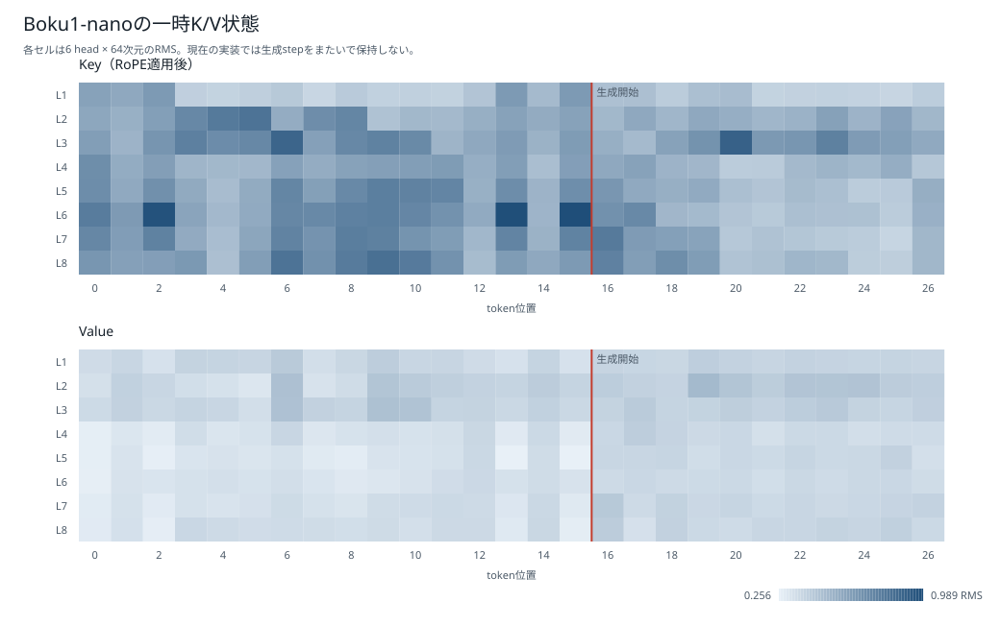
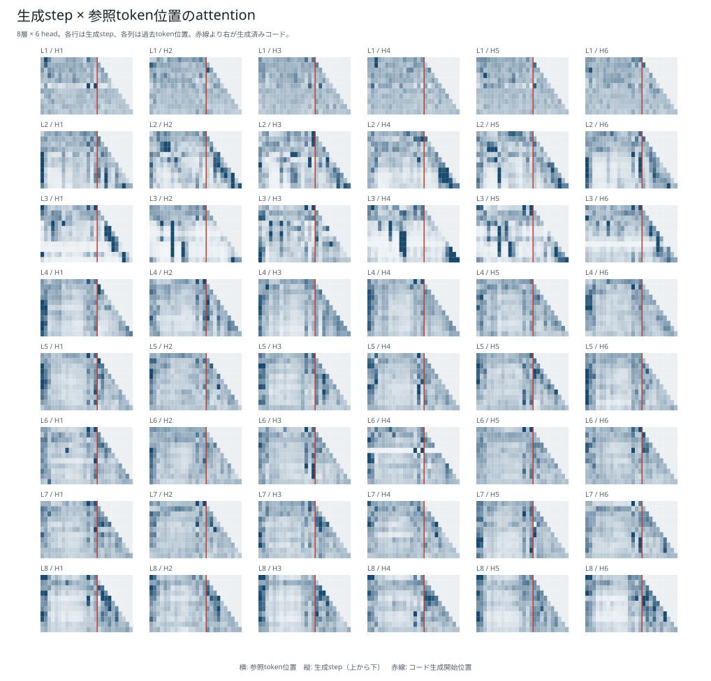

# Boku1-nano 発表ドキュメント

日本語指示から限定的なPythonコードを生成する、約15.7Mパラメータの小規模言語モデル

- 想定発表時間: 20～25分
- Webデモ: [Boku1-nano Webデモ](https://yuuono.github.io/bokunano/)
- 詳細な数値と根拠: [`boku1_nano_presentation_facts.md`](boku1_nano_presentation_facts.md)

この文書は、各節の「画面に出す内容」をスライドの要点として使い、「話す内容」を発表原稿として使う構成にしている。

---

## 1. 成果物とデモ

### 画面に出す内容

- Boku1-nano: 日本語の限定的な指示からPython関数を生成
- 15,735,168 parameters
- 3エポック版と10エポック版を公開
- ブラウザだけでONNX推論
- 正式評価: **84,434 / 84,550問合格**

[デモを開く](https://yuuono.github.io/bokunano/)

### 話す内容

今回は、Boku1-nanoという小規模言語モデルを作りました。

このモデルは、整数リストに対する日本語の指示を受け取り、`solve(xs, k)`という形式のPython関数を生成します。モデルもBPEトークナイザも既存のものを移植せず、ランダム初期値から学習しています。

最初に完成物をお見せします。Webデモでは、自由な日本語を入力し、その解釈を確認してから、3エポック版または10エポック版のBoku1-nanoでコードを生成できます。

最終的に採用した3エポック版は、正式評価84,550問中84,434問に合格しました。合格率は99.8628%です。ただし、この数字は一般的なPython生成能力ではなく、24種類の操作と最大3操作の組合せに限定した評価結果です。

### デモ操作

1. 自由入力欄へ次を入力する。

   ```text
   全部プラスの値に直してから、大きい順に並べて
   ```

2. `QwenでCNLに翻訳`を押す。
3. 次のCNLと操作順を確認する。

   ```text
   整数リストxsから各要素の絶対値を取り、値を降順に並べるsolve関数を書いてください。
   ```

4. 3エポックモデルでコードを生成する。
5. 同じCNLを10エポックモデルでも試す。
6. `Qwenに渡すプロンプトを見る`を開く。

初回のQwen読込みは約543 MiBあるため、会場回線やWebGPUが不安定な場合はCNLを直接入力してBoku1-nanoだけを実演する。

---

## 2. Webデモの処理経路

### 画面に出す内容

```text
自由な日本語
    ↓
Qwen3-0.6B: CNLへ翻訳
    ↓
JavaScript: 24操作・最大3操作の文法検査
    ↓
人が解釈結果を確認
    ↓
Boku1-nano ONNX: Pythonコード生成
```

| 担当 | 役割 |
| --- | --- |
| Qwen3-0.6B | 自由な日本語をCNLへ翻訳 |
| JavaScript | CNLの形式を検査 |
| Boku1-nano | CNLからPythonコードを生成 |

### 話す内容

デモでは、自由な日本語をBoku1-nanoへ直接渡しているわけではありません。

最初に、ブラウザ内のQwen3-0.6Bが自由な日本語をControlled Natural Language、つまりCNLへ翻訳します。JavaScriptは、出力が許可された24操作、最大3操作、決められた文型になっているかだけを検査します。JavaScriptが入力の意味を解釈してコードやCNLを組み立てるわけではありません。

検査済みCNLと操作順を画面へ出し、ユーザーが解釈を確認した後に、Boku1-nano ONNXがPythonコードを生成します。入力例にも固定コードを割り当てておらず、自由入力と同じ推論経路を通ります。

ここで重要なのは、自由な日本語の正規化とコード生成を分離していることです。自由文の理解はQwen、限定言語からのコード生成はBoku1-nanoが担当します。

---

## 3. Boku1-nanoが解く問題

### 画面に出す内容

```python
def solve(xs: list[int], k: int) -> list[int]:
    ...
```

| 分類 | 件数 | 例 |
| --- | ---: | --- |
| 抽出 | 10 | 偶数、奇数、`>= k`、負数、ゼロ |
| 変換 | 8 | `+k`、2倍、符号反転、絶対値、二乗 |
| 並べ替え | 3 | 昇順、降順、現在順の反転 |
| 切り出し | 3 | 先頭`k`個、末尾`k`個、1個おき |

### 話す内容

対象は、整数リスト`xs`と整数`k`を受け取り、整数リストを返す`solve`関数です。

基本操作は24種類です。内訳は、条件に合う値を残す抽出が10種類、各要素を変更する変換が8種類、並べ替えが3種類、切り出しが3種類です。

Boku1-nanoは一般的なPythonコーディングモデルではありません。外部I/O、任意ライブラリ、クラス、一般的なアルゴリズム問題を対象にせず、この固定領域だけを扱います。

---

## 4. 意味ASTを先に作る

### 画面に出す内容

```json
{
  "sequence": [
    {"filter": ["even"]},
    {"map": ["add_k"]}
  ]
}
```

```text
1操作: 24
2操作: 24 × 23 = 552
3操作: 24 × 23 × 22 = 12,144
合計: 12,720
```

### 話す内容

日本語やPythonコードを作る前に、問題の意味を表す意味ASTを定義しました。

例では、最初に偶数だけを残し、その後で各要素へ`k`を加えます。`sequence`配列の順番が、そのまま処理順です。「偶数を残してから`k`を加える」と「`k`を加えてから偶数を残す」は別の仕様として扱います。

24操作から1～3操作を、同じ操作を重複させず、順序付きで並べました。その結果、1操作が24件、2操作が552件、3操作が12,144件、合計12,720件の意味ASTになります。

意味ASTを先に決めることで、日本語指示、正解コード、期待出力、データ分割を同じ意味仕様から作れます。これがプロジェクト全体の中心です。

---

## 5. 意味ASTの分割とデータ漏洩対策

### 画面に出す内容

| 集合 | 意味AST数 |
| --- | ---: |
| 組合せ汎化 | 670 |
| 訓練 | 9,646 |
| 検証 | 1,202 |
| 通常テスト | 1,202 |

- 組合せ汎化用の5操作対を最初に隔離
- 残りをSHA-256順で決定的に分割
- 同じ意味ASTをtrain・validation・normal間で共有しない

### 話す内容

日本語やコードを生成した後でランダムに分けると、同じ意味の表記違いが訓練と評価へ入る可能性があります。そのため、最初に意味ASTの段階で分割しました。

まず、組合せ汎化テスト用として、5個の操作対を含む670件を隔離しました。たとえば「偶数抽出と降順」や「絶対値と1個おき」の組合せです。対象の操作対が訓練AST内で共起しないようにしています。

残った12,050件は、1操作、2操作、3操作ごとに正規化した意味ASTのSHA-256順へ並べ、訓練9,646件、検証1,202件、通常テスト1,202件へ決定的に分けました。割合は全体で約80対10対10ですが、24個の単独操作はすべて訓練へ入れているため、各操作数で完全に同じ比率ではありません。

このように、先に意味を分離してから日本語とコードを作ることが、最も重要な漏洩対策です。

---

## 6. 参照インタプリタ

### 画面に出す内容

```text
意味AST + xs + k
       ↓
参照インタプリタ
       ↓
期待する整数リスト
```

| 処理 | 参照側 | 生成コード側 |
| --- | --- | --- |
| 抽出 | `itertools.compress`など | 内包表記、forループ |
| 昇順 | heapを反復処理 | `sorted` |
| 反転 | `deque.pop` | `[::-1]`、`reversed` |
| 切り出し | `itertools.islice`など | slice構文 |

### 話す内容

意味ASTが正解を表していても、生成コードが正しいかを判定する仕組みが必要です。そこで、意味ASTを直接実行して期待結果を返す参照インタプリタを作りました。

ここで大切なのは、コード生成器と参照インタプリタを同じ実装にしないことです。同じテンプレートを使うと、両方に同じバグが入ったときに誤りを検出できません。

参照インタプリタはコード文字列やPython ASTを生成せず、`eval`、`exec`、`compile`も使いません。たとえば、生成コード側が昇順へ`sorted`を使うのに対し、参照側はheapを使います。生成コード側がslice構文を使うのに対し、参照側は`itertools.islice`や`deque`を使います。

ただし、整数の加算や乗算などの基本演算は、Python整数演算を信頼プリミティブとして共有します。完全に別の言語処理系を作ったわけではありません。独立性は、操作列、選択、順序、境界、切り出しの実装経路で確保しています。

参照インタプリタ自体も、24単独操作の既知の期待値と、12,720意味ASTすべてに対する8種類の入力で検証しました。

---

## 7. 正解コードの生成と検証

### 画面に出す内容

```text
意味AST + style_spec
        ↓
自作テンプレートでコード候補を生成
        ↓
構文 → Safe-AST → signature → 実行 → 重複除外
        ↓
検証済み正解コード
```

1コードにつき、境界9件 + ランダム32件 = **41入力**で確認

### 話す内容

正解コードはQwenへ作らせていません。インターネットやGitHubのコードも収集していません。意味ASTと`style_spec`を入力にして、自作テンプレートからコード候補を生成しました。

候補は、Python構文、禁止構文を含まないSafe-AST、固定`solve(xs, k)`シグネチャを確認します。その後、実際にコードを隔離実行し、参照インタプリタと41入力すべてで結果が一致するか、入力`xs`を変更していないか、timeoutしていないかを検査します。最後にコード全文の完全重複を除外します。

この検証を通ったコードだけを正解コードとしてデータセットへ入れました。

---

## 8. `style_spec`と`code_style`

### 画面に出す内容

`semantic_ast`は「何をするか」、`style_spec`は「どう書くか」を表す。

```python
def solve(xs: list[int], k: int) -> list[int]:
    return [x * 2 for x in xs if x % 2 == 0]
```

```python
def solve(xs: list[int], k: int) -> list[int]:
    result: list[int] = []
    for value in xs:
        if value % 2 == 0:
            result += [value * 2]
    return result
```

#### `code_style`の4分類

| `code_style` | 意味 |
| --- | --- |
| `expression_comprehension` | 一時変数を使わず、式を直接`return`する |
| `staged_comprehension` | 内包表記・組み込み関数・スライスの結果を一時変数へ代入する |
| `staged_loop` | 結果用一時変数と通常の`for`ループを使う |
| `mixed` | 複数操作の中で内包表記と`for`ループを混在させる |

#### `style_spec`の主な候補

| 項目 | 候補 | 何が変わるか |
| --- | --- | --- |
| `layout` | `single_return` / `multi_statement` | 直接returnするか、複数文へ分けるか |
| `collection_form` | `list_comprehension` / `for_loop` / `mixed` / `null` | 抽出・変換を内包表記、ループ、混合のどれで書くか |
| `temporary_form` | `direct_return` / `fresh_names` / `reused_names` | 一時変数なし、操作ごとに別名、変数名再利用 |
| `name_set` | `configured` | 変数名を生成器の設定済み候補から選んだことを示す |
| `comments` | `none` / `present` | 操作説明コメントを付けるか |
| `local_annotations` | `false` / `true` | ローカル変数へ`list[int]`を付けるか |
| `condition_direction` | `normal` / `swapped` / `null` | `x <= k`か、同値な`k >= x`か |
| `element_name` | `x` / `value` / `null` | 要素変数名 |
| `result_name` | `result` / `output` / `null` | 結果変数名 |
| `square_form` | `multiply` / `power` / `null` | `x * x`か`x ** 2`か |
| `ascending_form` | `default` / `reverse_false` / `null` | `sorted(xs)`か`sorted(xs, reverse=False)`か |
| `descending_form` | `reverse_keyword` / `sort_then_slice` / `null` | `sorted(..., reverse=True)`か`sorted(...)[::-1]`か |
| `reverse_form` | `slice_notation` / `reversed_call` / `null` | `[::-1]`か`list(reversed(...))`か |
| `slice_form` | `implicit_start` / `explicit_zero` / `implicit_step` / `explicit_empty_step` / `null` | `[:k]`と`[0:k]`などの表記差 |
| `operation_styles` | 操作ごとの設定リスト | 各操作の表記、変数名、比較方向を操作順に保存する |

候補は自由に直積するのではなく、操作と両立するものだけを使う。たとえば`single_return`では`temporary_form=direct_return`かつローカル型注釈なし、`for_loop`は複数文形式だけで使用する。`operation_styles`には、上表のうち各操作固有の`collection_form`、変数名、比較方向、式形式を操作順に保存する。

### 話す内容

`style_spec`は処理内容ではなく、同じ処理をどのようなPythonの書き方で表現するかを指定する情報です。一方、`code_style`は詳細設定を4種類へ大きくまとめた集計用ラベルです。

たとえば、内包表記かforループか、一時変数を使うか、型注釈やコメントを付けるか、変数名をどうするか、比較式の左右を入れ替えるか、スライスを`[:k]`と書くか`[0:k]`と書くかを表します。

二つの例はどちらも「偶数だけを残して2倍する」コードです。意味は同じですが、表面的なコードは違います。モデルが特定の一つのテンプレートだけを暗記しないよう、複数の構造的変種を作りました。

候補には、1行returnと複数文、内包表記とforループ、一時変数名の再利用、コメント、ローカル型注釈、比較式の左右、二乗・並べ替え・スライスの表記差があります。候補同士には両立条件があり、意味ASTと互換性のある組合せだけを決定的に列挙します。

`code_style`は、直接returnする`expression_comprehension`、一時変数を使う`staged_comprehension`、通常ループを使う`staged_loop`、内包表記とループが混ざる`mixed`の4種類です。名称に`comprehension`を含む形式でも、操作によっては`sorted`、`reversed`、スライスを使用します。

---

## 9. 日本語指示の生成

### 画面に出す内容

```text
意味AST
  ├─ 承認済み表現辞書 + ルール → 日本語指示
  └─ Qwen3-4B-AWQ → 同じ意味の言い換え
```

- 教師: `Qwen/Qwen3-4B-AWQ`
- コード生成には使用しない
- 重み・tokenizer・logitを学生モデルへ移植しない
- 最終表現辞書: 545表現
  - train: 522
  - test-only: 23

### 話す内容

日本語指示は二段階で作りました。

最初に、各単独操作について、文末で使う終止形と、後ろへ操作をつなぐ接続形の表現辞書を作ります。たとえば「偶数だけを残す」と「偶数だけを残し」の組です。Qwen3-4B-AWQで候補を生成し、重複やJSON形式を確認しながら複数roundで拡張しました。

初回は24操作ごとに30候補、合計720候補を生成しました。追加roundを含め、最終的に545表現を採用し、訓練用522表現とtest-only 23表現へ分けました。

次に、この辞書を意味ASTの順序どおりに連結し、定型文へ入れてルール指示を作ります。その後、訓練意味ASTごとに10件を選び、意味、比較境界、定数、操作順を変えないようQwenへ言い換えさせました。

Qwenは日本語表現の候補と言い換えにだけ使っています。正解コードは作らせていません。学生モデルへQwenの重み、tokenizer、embedding、logitを移植していないため、通常の重み蒸留ではありません。

---

## 10. 教師Qwenへ渡したプロンプト

### 画面に出す内容

```text
次の指示文を$count件言い換えてください。

意味AST:
$semantic_ast

操作の正準な意味と順番:
$operation_sequence

変更してはいけない事項:
$must_preserve_ja

元の指示文:
$source_instruction

意味と処理順を完全に保った候補だけをJSONで返してください。
```

### 話す内容

言い換えプロンプトには、元の日本語だけでなく、意味AST、操作の正準な意味と順番、変更してはいけない事項も入れています。

system messageでは、操作の追加、削除、統合、並べ替えを禁止しています。また、比較境界、定数、対象位置、`xs`、`k`、`solve`の役割を変えないよう指示し、Pythonコードや実装方法を追加させません。出力はJSONだけに制限しています。

生成条件は、`temperature=0.9`、`top_p=0.8`、`top_k=20`、最大256 tokenです。96,460件を対象にし、96,390件が採用可能な候補になり、70件は生成失敗でした。この工程がデータ作成で最も時間がかかり、約2時間32分でした。

完全なプロンプトは[`prompts/japanese_instruction_generation/`](../../prompts/japanese_instruction_generation/)に保存しています。

---

## 11. 訓練データの分布

### 画面に出す内容

| 操作数 | レコード数 |
| ---: | ---: |
| 1 | 460 |
| 2 | 8,680 |
| 3 | 183,760 |
| 合計 | 192,900 |

| 日本語指示の由来 | 件数 |
| --- | ---: |
| ルール生成を維持 | 96,510 |
| 教師Qwenによる言い換え | 96,390 |

| `code_style` | 件数 |
| --- | ---: |
| `expression_comprehension` | 4,458 |
| `staged_comprehension` | 66,058 |
| `staged_loop` | 27,341 |
| `mixed` | 95,043 |

### 話す内容

日本語指示を作成した後の最終訓練データは192,900件です。操作数1、2、3を均等にはしていません。訓練splitに含まれる意味ASTごとに原則20件を作った結果、1操作460件、2操作8,680件、3操作183,760件になりました。

1操作は24種類なので、本来は24掛ける20で480件を目標にしていました。ただし、6意味ASTで日本語指示を20件まで用意できず、最終的に460件です。余ったコード候補20件は、理由付きで不採用記録へ分けています。

日本語指示は、各訓練意味ASTから固定seedで10件ずつ選んだ96,460件をQwenの言い換え対象にし、成功した96,390件を置き換えました。残る96,510件はルール生成文を維持しています。

コード形式も均等化していません。構造変種生成器が意味ASTと両立する`style_spec`を列挙した結果、`mixed`が95,043件で最も多く、次いで`staged_comprehension`が66,058件、`staged_loop`が27,341件、`expression_comprehension`が4,458件です。

---

## 12. データセットの保存形式

### 画面に出す内容

- JSON Lines: 1行 = 1学習レコード
- 訓練: 192,900件
- 展開後: 742,098,087 bytes
- ZIP: 79,184,641 bytes

```json
{
  "instruction_ja": "先頭k個を切り取るsolve関数を書いてください。",
  "semantic_ast": {"sequence": [{"slice": ["take_first_k"]}]},
  "reference_code": "def solve(...): ...",
  "code_style": "staged_comprehension",
  "style_spec": {"layout": "multi_statement"},
  "verification": {"syntax_ok": true, "tests_passed": true}
}
```

### 話す内容

日本語指示と検証済みコードを結合し、最終データをJSON Linesで保存します。1行が、日本語指示、意味AST、正解コード、コード形式、検証結果、生成来歴を持つ一つのレコードです。

実際のレコードには、`record_id`、`spec_id`、意味・文章・コードのSHA-256、生成seed、生成器version、教師モデルのrevisionなども入っています。

`spec_id`は意味仕様を識別するIDで、コードの書き方を表すIDではありません。コードの書き方は`code_style`と`style_spec`で表します。

訓練JSONLは192,900件、展開後約742 MBです。Gitでは約79 MBのZIPを正本として管理しています。

---

## 13. BPEトークナイザ

### 画面に出す内容

```text
byte単位から開始
    ↓
頻出する隣接記号ペアを数える
    ↓
頻出ペアを一つのtokenへ結合
    ↓
語彙数2,048まで反復
```

| 項目 | 値 |
| --- | ---: |
| 方式 | ByteLevel BPE |
| 語彙数 | 2,048 |
| minimum frequency | 5 |
| max token length | 24 |
| 学習コーパス | 384,629件、85,304,155 bytes |

### 話す内容

トークナイザも訓練データだけから新規学習しました。BPEはByte Pair Encodingの略で、最初はbyte単位の小さな記号から始め、頻繁に隣り合う記号のペアを一つのtokenへまとめる処理を繰り返します。

たとえばPythonコードで繰り返し現れる`return`や、日本語でよく現れる語のbyte列は、結合を繰り返すことで少ないtoken数で表現できるようになります。ByteLevelから始めるため、原理上は未知の文字もbyte列として扱えます。

学習へ入れたのは、訓練レコードの`instruction_ja`と`reference_code`だけです。日本語指示は完全重複1,171件を除いて191,729件、Pythonコードは192,900件、合計384,629件、約85.3 MBです。評価データ、test-only表現、意味AST、ID、ハッシュは入れていません。

語彙数は特殊token込みで2,048、minimum frequencyは5、最大token長は24です。完成系列の最大長は94 tokenで、256 tokenを超えた例は0件、unknown tokenとencode/decodeの不一致も0件でした。

---

## 14. 作成したモデル

### 画面に出す内容

| 項目 | 値 |
| --- | ---: |
| アーキテクチャ | Decoder-only Transformer |
| 語彙数 | 2,048 |
| 層数 | 8 |
| hidden size | 384 |
| Attention head数 | 6 |
| KV head数 | 6 |
| FFN size | 1,024 |
| 最大系列長 | 256 |
| 位置表現 | RoPE |
| 正規化 | RMSNorm |
| 活性化 | SwiGLU |
| 総パラメータ数 | 15,735,168 |

### 話す内容

BPEトークナイザを固定した後に、Boku1-nano本体を作ります。Boku1-nanoは、8層のDecoder-only Transformerです。hidden sizeは384、Attention head数は6、FFN sizeは1,024、最大系列長は256です。総パラメータ数は15,735,168、約15.7Mです。

Attentionは通常のMulti-Head Attentionで、Grouped Query Attentionではありません。入力embeddingと出力headは共有していません。位置表現にはRoPE、正規化にはRMSNorm、活性化にはSwiGLUを使っています。

既存のモデル重み、embedding、tokenizer、logitは引き継いでいません。全パラメータをseed `20260925`からランダム初期化しました。

### K/V内部状態とKVキャッシュ



Boku1-nanoは最大256 token、8層、6 headという狭い構成です。各層では、tokenごとに6 head掛ける64次元のKeyとValueを作ります。

ただし、現在の実装には生成stepをまたいでK/Vを保持するKVキャッシュはありません。ブラウザ版は、新しいtokenを1個生成するたびに、それまでの入力系列全体を再計算します。図は3エポックモデルのforward中に一時的に作られたK/VのRMSであり、永続キャッシュの内容ではありません。

将来BF16またはFP16のKVキャッシュを追加した場合、1 token当たり12 KiB、256 token上限でも約3.0 MiBです。今回の27 token例では、現行方式がQKV projectionへ累計258 token位置を通すのに対し、キャッシュを使う仮想実装では27 token位置で済みます。これは計算量の比較であり、実測速度が9.56倍になるという意味ではありません。

さらに、11生成stepすべてについて各層・各headの最後のQueryを保存し、`softmax(QK^T / sqrt(64))`でattentionを復元しました。行和の確認だけでなく、復元した`attention @ V`とfused attention本体の出力を88組で比較し、最大絶対誤差は4.77 × 10^-7、最小コサイン類似度は0.99999982でした。

日本語指示はattention総量では11 step平均37.58%ですが、10 tokenあるため1 token当たり3.76%です。一様分布の期待値に対して0.76倍であり、制御tokenの1.20倍、生成済みコードの1.25倍より弱くなっています。ただしLayer 3 Head 2は平均73.05%を日本語指示へ向け、`abs(`を出すstepでは「絶対値」が全head平均でも参照上位2位でした。一部headが日本語条件を担当し、他のheadが構文や生成済みコードを担当していると読めます。attentionは参照の観測であり、出力の因果関係を証明する値ではありません。



図中の赤い縦線より左がprompt、右が生成済みコードです。

詳細は[「Boku1-nanoのK/V内部状態とKVキャッシュ可視化」](../results/boku_nano_kv_cache_visualization.md)に、全48 layer-headの図、生成token別上位5参照、領域比率、Key／Value類似度、参照の多い・少ないtokenをまとめています。

---

## 15. 学習データの系列とloss

### 画面に出す内容

```text
<|bos|><|task|>
{instruction_ja}
<|code|>
{reference_code}<|eos|>
```

```text
入力として使用: 日本語指示 + コード + EOS
loss対象:                    コード + EOS
```

| 学習量 | 1エポック | 3エポック | 10エポック |
| --- | ---: | ---: | ---: |
| 系列全体 | 6.94M | 20.82M | 69.39M |
| loss対象 | 3.75M | 11.24M | 37.46M |

### 話す内容

各レコードは、タスク開始token、日本語指示、コード開始token、正解コード、EOSを一つの系列にします。

日本語指示もモデル入力に含めますが、lossはコード開始tokenの後ろ、つまり正解コードとEOSだけで計算します。モデルには日本語指示を条件として読ませ、回答部分だけを教師信号にする設計です。

1エポックは6,939,466系列tokenで、loss計算対象は3,746,067 tokenです。3エポックでは20,818,398系列token、loss対象11,238,201 tokenです。10エポックでは69,394,660系列token、loss対象37,460,670 tokenです。

---

## 16. 学習条件と所要時間

### 画面に出す内容

| 項目 | 値 |
| --- | ---: |
| optimizer | AdamW |
| 学習率 | 3e-4 → 3e-5 |
| schedule | 5% linear warmup + cosine decay |
| weight decay | 0.1 |
| batch size | 512 |
| dtype | bfloat16 |
| GPU | RTX 5090 |
| ログ | 20 optimizer stepごと |
| 最大GPU演算使用率 | 92%（同条件の再計測） |
| 最大device VRAM | 16,274 MiB / 32,607 MiB、約49.9%（同条件の再計測） |

| 実行 | 時間 |
| --- | ---: |
| 3エポック最終stepまで | 79.564秒 |
| 10エポック | 190.719秒 |
| 教師言い換え | 2時間32分18.493秒 |

### 話す内容

optimizerはAdamWです。学習率は最初の5%をlinear warmupし、その後3e-4から3e-5へcosine decayします。weight decayは0.1、batch sizeは512、RTX 5090上でbfloat16を使いました。

3エポックは最終optimizer stepまで約79.6秒でした。ただし、最終validation後のモデル保存だけがNumPy不足で失敗したため、Epoch 3 checkpointから別実行で復旧保存しています。この復旧保存には32.3秒かかりました。

10エポックはランダム初期値から独立して学習し、約190.7秒でした。モデル学習よりも、教師Qwenによる96,460件の言い換えの方が長く、約2時間32分かかっています。

意味AST生成、コード候補生成、BPE学習などは経過秒数を保存していないため、データ生成全体の正確な合計時間は未計測です。

元の訓練ログには最大GPU使用率と訓練時VRAMが保存されていませんでした。そこで2026年9月28日に、元モデルを上書きせず、同じ3エポック設定を一時領域で再実行し、`nvidia-smi`を0.1秒間隔で792回サンプリングしました。最大GPU演算使用率は92%、GPU使用中424サンプルの平均は81.08%、95パーセンタイルは89%でした。最大device VRAMは16,274 MiBで、総量32,607 MiBの約49.9%です。

このVRAM値は`nvidia-smi`が示すdevice全体の使用量であり、PyTorchの`max_memory_allocated`ではありません。再計測の実行時間は監視負荷を含め100.533秒だったため、元ログの学習時間79.564秒とは分けて扱います。

---

## 17. lossの推移

### 画面に出す内容

| Epoch | Train loss | Validation loss |
| ---: | ---: | ---: |
| 1 | 0.423421 | 0.418147 |
| 2 | 0.401642 | 0.398529 |
| 3 | 0.394078 | 0.393880 |


### 話す内容

3エポックの範囲では、train lossとvalidation lossがどちらも低下しています。Validation lossは0.4181、0.3985、0.3939と改善しました。

Train lossはエポック平均ではなく、原則として直近20 optimizer stepの区間平均です。一方、Validation lossは各エポック末に固定validation 24,040件全体で計算しています。集計方法が異なるため、二つの値の差ではなく、それぞれの時系列を見ます。

### 20 stepごとの推移


step 20では6.1502でしたが、step 200で0.4837まで急速に低下しました。その後も緩やかに改善し、最終step 1,131では0.3941です。

---

## 18. 評価方法

### 画面に出す内容

BLEU・文字列一致より、**実行結果**を重視する。

```text
生成コード
  ↓ ast.parse
  ↓ Safe-AST
  ↓ solve signature
  ↓ 隔離実行・timeout
  ↓ 全hidden testで参照結果と一致
合格
```

### 話す内容

同じ機能を持つPythonコードには複数の書き方があります。そのため、参照コードとの文字列一致やBLEUを主指標にはしていません。

まずPythonとして構文解析できるか、禁止構文がないか、`solve(xs, k)`を正しく定義しているかを確認します。その後、コードを隔離実行し、例外、timeout、入力変更がなく、全hidden testで参照インタプリタと同じ結果を返すかを見ます。

各問題は、コード候補作成時に使用した41入力とは異なる20件以上のhidden入力で評価します。通常、組合せ、言い換え、反復では各64入力、境界値では30～31入力です。

---

## 19. 5種類の評価テスト

### 画面に出す内容

| テスト | 問題数 | 確認すること |
| --- | ---: | --- |
| 通常 | 24,040 | 未学習の通常AST |
| 組合せ汎化 | 13,400 | 訓練から隔離した5操作対 |
| 日本語言い換え | 30 | 未学習の日本語表現 |
| 同一操作の反復 | 23,040 | 同じ操作を2・3回続ける |
| 境界値 | 24,040 | 空、極値、重複、`k`境界 |

正式評価合計: **84,550問**

### 話す内容

通常テストでは、訓練と異なる通常テスト用の意味ASTを評価します。

組合せ汎化テストでは、各操作は単独で学習していますが、指定した5操作対は一緒に訓練へ出ていません。既知の部品を未知の順序で組み合わせられるかを見ます。

日本語言い換えテストでは、意味自体は学習済みの単独操作ですが、訓練へ入れていない30表現を使います。

同一操作の反復テストは追加した発展評価です。元の12,720意味ASTでは同じ操作を一つのAST内で繰り返さないため、「2倍して、もう一度2倍する」のような1,152意味ASTを別に作りました。

境界値テストでは、通常テストと同じ意味ASTと指示を使い、実行入力だけを空リスト、1要素、極値、重複値、`k`境界へ変えます。

---

## 20. 3エポックモデルの評価結果

### 画面に出す内容

| テスト | 合格 | 合格率 |
| --- | ---: | ---: |
| 通常 | 24,038 / 24,040 | 99.9917% |
| 組合せ汎化 | 13,397 / 13,400 | 99.9776% |
| 日本語言い換え | 24 / 30 | 80.0000% |
| 同一操作の反復 | 22,937 / 23,040 | 99.5530% |
| 境界値 | 24,038 / 24,040 | 99.9917% |
| **合計** | **84,434 / 84,550** | **99.8628%** |

### 話す内容

3エポックモデルは84,550問中84,434問に合格し、不合格は116件でした。

Syntax-valid、Safe-AST、Signature-valid、Executableはすべて84,546件、99.9953%です。構文エラーは4件でした。残る112件はコードを例外なく実行できたものの、少なくとも一つのhidden testで結果が違いました。timeoutとEOS未生成は0件です。

通常、組合せ汎化、境界値は99.97%以上ですが、日本語言い換えは30件中24件、80%です。また、不合格116件中103件は同一操作の反復テストに集中しました。

言い換えテストで使用した30件の全文指示と、3エポック・10エポックの各合否は[付録D](#付録d-日本語言い換えテスト全30件)にすべて掲載しています。

---

## 21. できなかったこと

### 画面に出す内容

- 同じ操作を続けたときに、一つを落とす
- 反復時にPython構文を壊す
- 「奇数を除く」で偶数ではなく奇数を残す
- 「その数と自らをかける」を`value * k`と解釈
- 「最初のk個」を末尾`k`個として生成
- `>= k`と`> k`を取り違える
- 指示にないsortやfilterを追加する

### 話す内容

成功例だけでなく、できなかった内容も分類しました。

最大の弱点は同一操作の反復です。同じ操作を2回または3回続けたとき、一つを落としたり、構文を壊したりしました。

未学習の日本語表現では、「奇数を除く」「偶数を除く」の否定表現で意味を反転しました。「その数と自らをかける」を二乗ではなく`value * k`と解釈した例や、「最初のk個」を末尾の`xs[-k:]`として生成した例もあります。

比較境界では、`>= k`と`> k`の取り違えがありました。また、正しい処理に余分なsortやfilterを追加する例もありました。

この結果から、候補数を増やすよりも、未学習の言い換え表現と同一操作反復を追加する方が改善につながると考えています。

---

## 22. 学習前との比較

### 画面に出す内容

固定430問で比較

| 指標 | ランダム初期 | 3エポック |
| --- | ---: | ---: |
| Validation loss | 7.759890 | 0.393880 |
| Syntax-valid | 0 / 430 | 428 / 430 |
| pass@1 | 0 / 430 | 424 / 430 |
| pass@5 | 0 / 430 | 425 / 430 |

### 話す内容

同じ構造、同じBPEトークナイザ、同じ初期化seedで再現した学習前ランダムモデルと、固定430問で比較しました。

ランダム初期モデルは430件すべてでPython構文を生成できず、pass@1とpass@5は0件でした。3エポックモデルはpass@1で424件、pass@5で425件です。

これにより、モデル構造や評価器だけで偶然高い点が出たのではなく、学習によってコード生成能力を獲得したことを確認できます。

pass@5で改善したのは、「最初のk個を取り出す」という日本語言い換えの1件だけでした。探索候補を増やす効果は限定的でした。

---

## 23. 3エポックと10エポックの比較

### 画面に出す内容

| 指標 | 3エポック | 10エポック |
| --- | ---: | ---: |
| Validation loss | 0.393880 | 0.408651 |
| Syntax-valid | 99.9953% | 99.7055% |
| Executable | 99.9953% | 99.6866% |
| pass@1 | 99.8628% | 98.2354% |

**採用: 3エポック版**

### 話す内容

学習量を増やせば必ず良くなるのかを確認するため、同じ設定で10エポック版もランダム初期値から学習しました。

結果は、10エポック版の方が悪くなりました。Validation lossは0.393880から0.408651へ悪化し、pass@1は84,434件から83,058件へ1,376件低下しました。

低下のうち1,194件は同一操作の反復テストです。このため、Webデモには比較用として両方を置いていますが、完成モデルとしては3エポック版を採用します。

---

## 24. ONNXとブラウザ推論

### 画面に出す内容

- Boku1-nano ONNX: 各約60.4 MiB
- 3エポック・10エポックを選択可能
- PyTorchとONNXのlogitsを比較
- greedy生成token列の完全一致を確認
- WebGPU優先、Boku1-nanoはWASM fallbackあり

### 話す内容

二つの学習済みモデルをONNXへ変換し、GitHub Pages上で推論できるようにしました。

変換時にはONNX形式検査だけでなく、PyTorch版とのlogits比較と、複数プロンプトに対するgreedy生成token列の完全一致を確認しています。

Boku1-nanoはWebGPUを優先し、利用できない場合はWASMへ切り替えます。Firefox headlessのWASM試験では、3エポック・10エポックの両方で、2操作・3操作のコード生成を確認しました。

一方、自由文をCNLへ翻訳するQwen3-0.6BはWebGPU必須です。Qwen処理後にWorkerを終了してモデルを解放し、その後Boku1-nanoを読み込むことで、二つのモデルを同時にGPUメモリへ保持しない構成にしています。

---

## 25. 再現性と来歴

### 画面に出す内容

- Python 3.12.12 + `uv.lock`
- model、tokenizer、datasetのSHA-256を保存
- seedと設定ファイルを固定
- 生の評価JSONLとmanifestを保存
- 標準再実行では新しい人手承認は不要
- Qwen revisionとLICENSEを保存

### 話す内容

データ生成から評価までの順番とコマンドは、一つの再実行手順書へまとめています。

Pythonは3.12.12、依存関係は`uv.lock`で固定しています。データZIP、tokenizer、モデル、評価設定にはSHA-256を保存し、seed、software version、生成来歴もmanifestへ残しています。

標準手順では、固定済みの表現辞書、検証済みコードZIP、教師言い換えZIPを使うため、新しい人手承認は不要です。教師言い換えから再生成する場合だけ、Hugging Faceから固定revisionのQwen3-4B-AWQを取得します。

Qwen3はApache License 2.0ですが、そのことだけで教師生成文や最終データを含む全成果物の第三者権利が自動的に保証されるわけではありません。使用モデル、revision、prompt、生成条件、LICENSE、第三者成果物を記録しています。

再実行手順は[`docs/procedures/boku_nano_end_to_end_reproduction.md`](../procedures/boku_nano_end_to_end_reproduction.md)、第三者成果物は[`THIRD_PARTY.md`](../../THIRD_PARTY.md)にあります。

---

## 26. まとめ

### 画面に出す内容

1. 意味ASTを中心に、データ生成から評価まで構成した
2. tokenizerと15.7Mモデルをランダム初期値から学習した
3. 文字列一致ではなくhidden testの実行結果で評価した
4. 3エポック版は84,434 / 84,550問に合格した
5. 未学習表現と同一操作反復が今後の改善対象

### 話す内容

Boku1-nanoでは、24操作の意味ASTを最初に定義し、参照インタプリタ、正解コード、日本語指示、BPEトークナイザ、Transformer、hidden test評価までを一つの意味仕様でつなぎました。

モデルとtokenizerはランダム初期値から作り、3エポック版は正式評価84,550問中84,434問に合格しました。一方で、未学習の否定表現や方向表現、同じ操作の反復に弱いことも分かりました。

学生には、完成モデルだけを見せるのではなく、意味AST、正解判定、データ漏洩防止、トークナイザ、モデル学習、実行評価という順番で、どこに設計上の判断があるかを説明します。

---

## 27. 学生へ提示する実装順

### 画面に出す内容

```text
1. 24操作と意味AST
2. 参照インタプリタ
3. 正解コード生成
4. 実行検証
5. 日本語指示生成
6. BPEトークナイザ
7. Decoder-only Transformer
8. モデル学習
9. hidden test評価
10. ONNX・ブラウザ推論
```

### 話す内容

学生諸君には、まず24種類の基本操作と意味ASTの定義を起点として、参照インタプリタ、正解コード生成、実行検証、日本語指示生成、BPEトークナイザ学習、Transformer実装、モデル学習、hidden test評価、ブラウザ推論の順に実装方法を提示する予定です。

この順番にする理由は、モデル学習より先に「何が正解か」「どのデータを学習へ入れてよいか」を決める必要があるからです。モデルだけを先に作るのではなく、仕様、正解判定、データ、tokenizer、学習、評価の順で積み上げます。

---

# 付録A: 発表時に間違えやすい数値

| 誤りやすい説明 | 正しい内容 |
| --- | --- |
| 評価は約90%、10%失敗 | 99.8628%合格、116 / 84,550件、0.1372%不合格 |
| 10エポックと20エポック | 3エポックと10エポック |
| hidden size 348 | hidden size 384 |
| 15Mちょうど | 15,735,168 parameters、約15.7M |
| 採用表現454件 | 採用表現545件、train 522、test-only 23 |
| `spec_id`はコード形式 | `spec_id`は意味仕様ID。コード形式は`code_style`と`style_spec` |
| JavaScriptが自然言語を理解 | 自由文理解はQwen。JavaScriptはCNLの文法検査だけ |
| Qwenが正解コードを生成 | 正解コードは自作テンプレート。Qwenは日本語表現だけ |
| 3エポックの学習時間は約112秒 | 最終stepまで79.564秒。復旧保存32.284秒は別実行 |
| 操作数1・2・3は均等 | 均等化していない。460、8,680、183,760件 |

---

# 付録B: 想定質問

## Q. これは一般的なコード生成モデルですか

いいえ。24操作、最大3操作、固定`solve(xs, k)`シグネチャという限定領域のモデルです。高い合格率はこの領域内の値です。

## Q. Qwenを使っているならフルスクラッチではないのでは

Qwenは日本語表現候補と言い換え、Webデモの自由文正規化に使っています。Boku1-nanoの重み、embedding、tokenizerはランダム初期値から学習し、Qwenの重みやlogitは移植していません。

## Q. なぜ参照コードとの文字列一致を使わないのですか

同じ機能を持つ別実装も正解だからです。全hidden入力で参照インタプリタと同じ結果を返すかを主要な合格条件にしています。

## Q. なぜ3エポック版を採用したのですか

10エポック版はValidation lossと5テストすべてのpass@1が悪化したためです。特に同一操作の反復テストで性能が低下しました。

## Q. コード生成がルールベースに見えませんか

正解データ作成はルールとテンプレートですが、Webデモのコード生成は学習済みBoku1-nano ONNXのgreedy推論です。入力例にも固定コードを割り当てていません。

## Q. データ生成全体に何時間かかりましたか

確実に記録されている教師言い換えは約2時間32分です。意味AST、コード候補、BPEなどは工程別の経過秒数を保存していないため、データ生成全体の正確な合計時間は未計測です。

## Q. BPEの設定は最適ですか

今回の設定でunknown token 0件、最大系列94 token、round-trip不一致0件を確認しています。ただし、minimum frequencyや最大token長を変えた比較実験は行っていないため、最適値とは断定しません。

---

# 付録C: 根拠文書

| 内容 | 文書 |
| --- | --- |
| 詳細ファクト | [`boku1_nano_presentation_facts.md`](boku1_nano_presentation_facts.md) |
| モデル概要 | [`MODEL_CARD.md`](../cards/MODEL_CARD.md) |
| データ概要 | [`DATASET_CARD.md`](../cards/DATASET_CARD.md) |
| 意味AST | [`atomic_semantic_asts.md`](../specifications/atomic_semantic_asts.md) |
| AST分割 | [`ast_split_policy.md`](../policies/ast_split_policy.md) |
| 参照インタプリタ | [`reference_interpreter.md`](../specifications/reference_interpreter.md) |
| コード生成 | [`python_code_generation_policy.md`](../policies/python_code_generation_policy.md) |
| BPE | [`bpe_tokenizer_training_results.md`](../results/bpe_tokenizer_training_results.md) |
| 3エポック学習 | [`boku_nano_three_epoch_training_results.md`](../results/boku_nano_three_epoch_training_results.md) |
| K/V内部状態 | [`boku_nano_kv_cache_visualization.md`](../results/boku_nano_kv_cache_visualization.md) |
| 正式評価 | [`boku_nano_3epoch_evaluation_results.md`](../results/boku_nano_3epoch_evaluation_results.md) |
| 言い換えテスト全30件 | [`paraphrase_test_instruction_results.md`](../results/paraphrase_test_instruction_results.md) |
| ランダム比較 | [`boku_nano_evaluation_metrics_and_random_baseline.md`](../results/boku_nano_evaluation_metrics_and_random_baseline.md) |
| Webデモ | [`boku_nano_onnx_web_demo.md`](../procedures/boku_nano_onnx_web_demo.md) |
| 再実行 | [`boku_nano_end_to_end_reproduction.md`](../procedures/boku_nano_end_to_end_reproduction.md) |

---

# 付録D: 日本語言い換えテスト全30件

正式評価に使った全文指示とモデル別合否をすべて示す。合格条件は64件のhidden入力すべてへの合格である。主評価はgreedyのpass@1で、3エポックpass@5は比較実験として併記する。

| No. | 期待する処理 | 使用した全文指示 | 3ep pass@1 | 3ep pass@5 | 10ep pass@1 |
| ---: | --- | --- | --- | --- | --- |
| 1 | 偶数だけを残す | 整数リストxsから偶数を分離するsolve関数を書いてください。 | 合格 | 合格 | 合格 |
| 2 | 偶数だけを残す | 整数リストxsから2で割り切れる値を残すsolve関数を書いてください。 | 不合格 | 不合格 | 不合格 |
| 3 | 偶数だけを残す | 整数リストxsから奇数を除くsolve関数を書いてください。 | 不合格 | 不合格 | 不合格 |
| 4 | 奇数だけを残す | 整数リストxsから奇数を分類して残すsolve関数を書いてください。 | 合格 | 合格 | 合格 |
| 5 | 奇数だけを残す | 整数リストxsから2で割り切れない値を残すsolve関数を書いてください。 | 不合格 | 不合格 | 不合格 |
| 6 | 奇数だけを残す | 整数リストxsから偶数を除くsolve関数を書いてください。 | 不合格 | 不合格 | 不合格 |
| 7 | `k`より大きい値だけを残す | 整数リストxsと整数kを受け取り、kを超過する値を残すsolve関数を書いてください。 | 合格 | 合格 | 合格 |
| 8 | `k`より大きい値だけを残す | 整数リストxsと整数kを受け取り、kを超過する値を切り出すsolve関数を書いてください。 | 合格 | 合格 | 合格 |
| 9 | `k`以上の値だけを残す | 整数リストxsと整数kを受け取り、k以上の要素を維持するsolve関数を書いてください。 | 合格 | 合格 | 不合格 |
| 10 | `k`より小さい値だけを残す | 整数リストxsと整数kを受け取り、k以上じゃない値だけを残すsolve関数を書いてください。 | 合格 | 合格 | 合格 |
| 11 | `k`以下の値だけを残す | 整数リストxsと整数kを受け取り、k以下のものを保持するsolve関数を書いてください。 | 合格 | 合格 | 合格 |
| 12 | `k`の倍数だけを残す | 整数リストxsと整数kを受け取り、kの倍数を特定して残すsolve関数を書いてください。 | 合格 | 合格 | 合格 |
| 13 | 正の値だけを残す | 整数リストxsから正の値に限定するsolve関数を書いてください。 | 合格 | 合格 | 合格 |
| 14 | 負の値だけを残す | 整数リストxsから負の数を抜き出すsolve関数を書いてください。 | 合格 | 合格 | 合格 |
| 15 | ゼロだけを残す | 整数リストxsから零を残すsolve関数を書いてください。 | 合格 | 合格 | 不合格 |
| 16 | 各要素に`k`を加える | 整数リストxsと整数kを受け取り、各要素にkをプラスするsolve関数を書いてください。 | 合格 | 合格 | 合格 |
| 17 | 各要素から`k`を引く | 整数リストxsと整数kを受け取り、各数値からkを減らすsolve関数を書いてください。 | 合格 | 合格 | 合格 |
| 18 | 各要素に`k`を掛ける | 整数リストxsと整数kを受け取り、各要素にkを掛けるsolve関数を書いてください。 | 合格 | 合格 | 合格 |
| 19 | 各要素に`k`を掛ける | 整数リストxsと整数kを受け取り、kを掛けるsolve関数を書いてください。 | 合格 | 合格 | 合格 |
| 20 | 各要素を2倍する | 整数リストxsから各要素を二倍にするsolve関数を書いてください。 | 合格 | 合格 | 合格 |
| 21 | 各要素を3倍する | 整数リストxsから全部を3倍するsolve関数を書いてください。 | 合格 | 合格 | 合格 |
| 22 | 各要素の符号を反転する | 整数リストxsから数の正負を入れ替えるsolve関数を書いてください。 | 合格 | 合格 | 合格 |
| 23 | 各要素の絶対値を取る | 整数リストxsから絶対値を算出するsolve関数を書いてください。 | 合格 | 合格 | 合格 |
| 24 | 各要素を二乗する | 整数リストxsからその数と自らをかけるsolve関数を書いてください。 | 不合格 | 不合格 | 不合格 |
| 25 | 値を昇順に並べる | 整数リストxsから値を最小から最大へ並べるsolve関数を書いてください。 | 合格 | 合格 | 合格 |
| 26 | 値を降順に並べる | 整数リストxsから大きい値が先になるように並べるsolve関数を書いてください。 | 合格 | 合格 | 不合格 |
| 27 | 現在の要素順を反転する | 整数リストxsから順序をさかさにするsolve関数を書いてください。 | 合格 | 合格 | 合格 |
| 28 | 先頭から`k`個を取る | 整数リストxsと整数kを受け取り、最初のk個を取り出すsolve関数を書いてください。 | 不合格 | 合格 | 不合格 |
| 29 | 末尾から`k`個を取る | 整数リストxsと整数kを受け取り、後ろからk個を拾うsolve関数を書いてください。 | 合格 | 合格 | 合格 |
| 30 | 先頭から1個おきに取る | 整数リストxsから先頭から1個おきに取るsolve関数を書いてください。 | 合格 | 合格 | 合格 |

3エポック版のpass@1不合格はNo.2、3、5、6、24、28の6件である。10エポック版はこの6件にNo.9、15、26を加えた9件が不合格だった。各失敗の生成コードと原因は[言い換えテスト全件結果](../results/paraphrase_test_instruction_results.md)に記録している。
