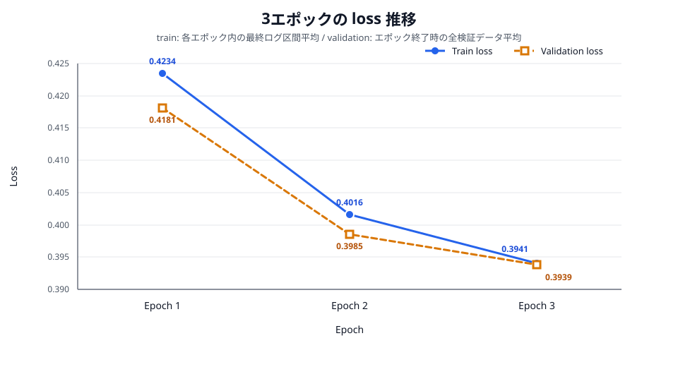
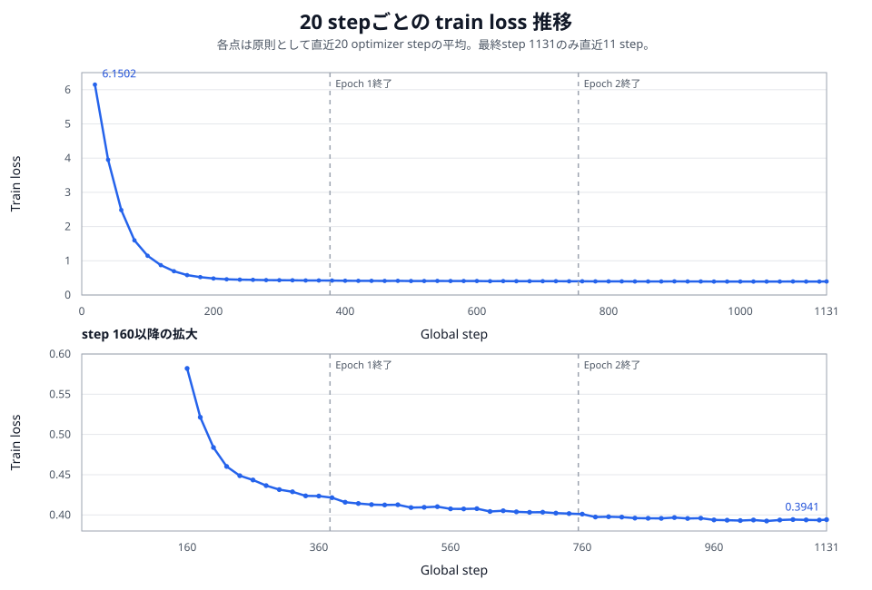

# Boku1-nano 発表用ファクト集

この文書は、実装者本人でなくてもBoku1-nanoを説明できるように、デモの見せ方、設計意図、データ形式、生成プロンプト、学習条件、所要時間、評価結果、制約、根拠ファイルを一つにまとめたものである。

記録に存在しない時間は推測せず「未計測」とした。発表では、最初に成果物とデモを見せ、その後で「どう作ったか」「何を評価したか」を説明する。

## 1. 最初に見せる成果物とデモ

### 1.1 冒頭で伝える結論

> Boku1-nanoは、日本語の限定的な指示から`solve(xs, k)`形式のPythonコードを生成する、小型のDecoder-only Transformerです。モデルもBPEトークナイザも既存モデルから移植せず、ランダム初期値から学習しました。完成モデルは15,735,168パラメータで、3エポック版と10エポック版をブラウザ上で動かせます。3エポック版は正式評価84,550問中84,434問に合格し、10エポック版より良い結果でした。

- Webデモ: [Boku1-nano Webデモ](https://yuuono.github.io/bokunano/)
- 推奨モデル: 3エポック版
- 比較用モデル: 10エポック版
- 全文書の入口: [`docs/README.md`](../README.md)
- Model Card: [`docs/cards/MODEL_CARD.md`](../cards/MODEL_CARD.md)
- Dataset Card: [`docs/cards/DATASET_CARD.md`](../cards/DATASET_CARD.md)

### 1.2 3分間のデモ手順

1. Webデモを開き、モデル選択欄に3エポック版と10エポック版があることを示す。
2. 自由入力欄へ「全部プラスの値に直してから、大きい順に並べて」と入力する。
3. `QwenでCNLに翻訳`を押し、次のようなControlled Natural Language（CNL）が表示されることを示す。

   ```text
   整数リストxsから各要素の絶対値を取り、値を降順に並べるsolve関数を書いてください。
   ```

4. CNLと「絶対値化 → 降順」の操作順を人が確認してから、3エポック版でコードを生成する。
5. 同じCNLを10エポック版でも生成し、二つの学習済みモデルを切り替えられることを示す。
6. `Qwenに渡すプロンプトを見る`を開き、自由入力に固定コードを割り当てるUIではなく、プロンプトを使ったQwen推論とBoku1-nano ONNX推論であることを示す。

初回のQwen翻訳では約543 MiBのモデルを取得する。会場回線やWebGPUが不安定な場合は、上記CNLを直接入力してBoku1-nanoだけを実演する。Boku1-nano本体は各モデル約60.4 MiBである。

### 1.3 デモで説明する役割分担

| 担当 | 役割 | コードを生成するか |
| --- | --- | --- |
| ブラウザ内Qwen3-0.6B | 自由な日本語を、許可された形式のCNLへ翻訳する | しない |
| JavaScript | CNLが24操作・最大3操作・定型文法に合うか検査する | しない |
| Boku1-nano ONNX | 検査済みCNLからPython関数を生成する | する |

JavaScriptは自由文の意味を解釈してCNLを作らず、Qwenの出力を検査するだけである。入力例にもCNLやコードを固定で返す分岐はない。デモの詳しい構成は[`docs/procedures/boku_nano_onnx_web_demo.md`](../procedures/boku_nano_onnx_web_demo.md)にある。

## 2. 発表で使える完成説明

> はい。Boku1-nano SLMを実装する宿題の正解例は、できています。正解例として、24種類の整数リスト操作を意味ASTで定義し、参照インタプリタ、自動生成した正解コード、合成した日本語指示、訓練データだけから学習したBPEトークナイザを用いて、Decoder-only Transformerをランダム初期値から学習する方針で作成しました。実行例はBoku1-nano Webデモで確認できます。
>
> 完成したBoku1-nanoは、語彙数2,048、8層、hidden size 384、Attention head数6、FFN size 1,024、最大系列長256、総パラメータ数15,735,168、約15.7Mのモデルです。訓練データは192,900件で、1エポック当たり6,939,466系列トークンです。3エポックモデルは20,818,398系列トークン、10エポックモデルは69,394,660系列トークンを学習しました。コード部分とEOSだけを数えたloss計算対象は、それぞれ11,238,201トークンと37,460,670トークンです。
>
> 学生諸君には、まず24種類の基本操作と意味ASTの定義を起点として、参照インタプリタ、正解コード生成、実行検証、日本語指示生成、BPEトークナイザ学習、Transformer実装、モデル学習、hidden test評価、ブラウザ推論の順に実装方法を提示する予定です。

## 3. 何を作ったモデルなのか

Boku1-nanoの対象は、整数リスト`xs`と整数`k`を受け取って整数リストを返す、次の固定シグネチャの関数である。

```python
def solve(xs: list[int], k: int) -> list[int]:
    ...
```

対象操作は次の24種類である。

| 分類 | 件数 | 操作 |
| --- | ---: | --- |
| 抽出 | 10 | 偶数、奇数、`> k`、`>= k`、`< k`、`<= k`、`k`の倍数、正、負、ゼロ |
| 変換 | 8 | `+k`、`-k`、`×k`、2倍、3倍、符号反転、絶対値、二乗 |
| 並べ替え | 3 | 昇順、降順、現在順の反転 |
| 切り出し | 3 | 先頭`k`個、末尾`k`個、先頭から1個おき |

1～3操作を順序付きで組み合わせ、同じ操作を一つの意味AST内で重複させない場合、全体は次の12,720仕様になる。

```text
1操作: 24
2操作: 24 × 23 = 552
3操作: 24 × 23 × 22 = 12,144
合計: 12,720
```

たとえば「偶数を残して`k`を加える」と「`k`を加えてから偶数を残す」は結果が異なり得るため、別の意味ASTとして扱う。仕様の正本は[`docs/specifications/atomic_semantic_asts.md`](../specifications/atomic_semantic_asts.md)である。

### 説明時に必ず付ける限定

Boku1-nanoは一般的なPythonコーディングモデルではない。24操作、1～3操作、固定シグネチャという狭い合成領域を学習したモデルである。高いテスト合格率を、一般的な自然言語理解や任意のプログラム生成能力として説明してはいけない。

## 4. なぜ意味ASTから始めるのか

意味ASTは、日本語やPythonコードより先に「何をする問題か」を機械可読に固定するための中間表現である。

```json
{
  "sequence": [
    {"filter": ["even"]},
    {"map": ["add_k"]}
  ]
}
```

同じ意味ASTを次のすべての共通の根拠にする。

- 参照インタプリタで期待結果を計算する。
- 複数の構造を持つ正解Pythonコードを生成する。
- 複数の日本語指示を生成する。
- train、validation、各testへ仕様単位で分割する。
- hidden testで生成コードの実行結果を比較する。
- 意味仕様の漏洩を検査する。

これにより、「日本語とコードがたまたま対になっている」のではなく、意味を基準にデータ生成と評価をつなげられる。

## 5. データセットをどのような形で持っているか

### 5.1 保存形式と規模

最終データはJSON Lines形式で、1行が1学習例である。大容量のため、正本はZIPとしてGit管理している。

| 成果物 | 内容 | 件数 | サイズ |
| --- | --- | ---: | ---: |
| `final_train_dataset_records_2026-09-25.zip` | 訓練JSONL 1ファイル | 192,900 | 79,184,641 bytes |
| ZIP内`final_dataset_records.jsonl` | 展開後の訓練JSONL | 192,900 | 742,098,087 bytes |
| `final_evaluation_dataset_records_2026-09-25.zip` | 評価JSONL 6ファイル | 108,590 | 36,108,156 bytes |

評価ZIPの内訳は、validation 24,040件、通常テスト24,040件、組合せ汎化13,400件、日本語言い換え30件、同一操作の反復23,040件、境界値24,040件である。validationを除く正式評価は84,550件である。

### 5.2 1レコードの例

実レコードには多数のID、ハッシュ、来歴情報がある。説明時には次の簡略形を見せるとよい。

```json
{
  "record_id": "record-...",
  "spec_id": "combined-000022",
  "instruction_ja": "整数リストxsと整数kを受け取り、先頭k個を切り取るsolve関数を書いてください。",
  "semantic_ast": {
    "sequence": [
      {"slice": ["take_first_k"]}
    ]
  },
  "reference_code": "def solve(xs: list[int], k: int) -> list[int]:\n    result: list[int] = xs[0:k]\n    return result\n",
  "code_style": "staged_comprehension",
  "style_spec": {
    "layout": "multi_statement",
    "local_annotations": true,
    "slice_form": ["explicit_zero"]
  },
  "split": "train",
  "tests": ["build-verification-v1-seed-0-boundary-9-random-32"],
  "verification": {
    "syntax_ok": true,
    "ast_safe": true,
    "signature_ok": true,
    "tests_passed": true,
    "input_unchanged": true,
    "timeout": false
  }
}
```

`style_spec`は処理内容ではなく、同じ意味のコードをどう書くかを指定する情報である。たとえば、forループか内包表記か、一時変数を使うか、型注釈やコメントを付けるか、変数名、比較の向き、スライスを`[:k]`と書くか`[0:k]`と書くかを表す。

`code_style`は詳細設定を次の4種類へまとめた集計用ラベルである。

| `code_style` | 意味 |
| --- | --- |
| `expression_comprehension` | 一時変数を使わず、式を直接`return`する |
| `staged_comprehension` | 内包表記・組み込み関数・スライスの結果を一時変数へ代入する |
| `staged_loop` | 結果用一時変数と通常の`for`ループを使う |
| `mixed` | 複数操作の中で内包表記と`for`ループを混在させる |

`style_spec`に現れる主な項目と候補は次のとおりである。

| 項目 | 候補 |
| --- | --- |
| `layout` | `single_return` / `multi_statement` |
| `collection_form` | `list_comprehension` / `for_loop` / `mixed` / `null` |
| `temporary_form` | `direct_return` / `fresh_names` / `reused_names` |
| `name_set` | `configured` |
| `comments` | `none` / `present` |
| `local_annotations` | `false` / `true` |
| `condition_direction` | `normal` / `swapped` / `null` |
| `element_name` | `x` / `value` / `null` |
| `result_name` | `result` / `output` / `null` |
| `square_form` | `multiply` / `power` / `null` |
| `ascending_form` | `default` / `reverse_false` / `null` |
| `descending_form` | `reverse_keyword` / `sort_then_slice` / `null` |
| `reverse_form` | `slice_notation` / `reversed_call` / `null` |
| `slice_form` | `implicit_start` / `explicit_zero` / `implicit_step` / `explicit_empty_step` / `null` |
| `operation_styles` | 操作ごとの設定リスト |

これらは自由な直積ではない。`single_return`なら`temporary_form=direct_return`かつローカル型注釈なし、通常の`for_loop`なら複数文形式、というように、意味ASTと両立する組合せだけを生成する。

各レコードには、意味、文章、コードのSHA-256、生成seed、生成器version、教師モデル由来の有無、実行検証結果が残る。実入力41件を全レコードへ複製せず、`tests`から共有テスト集合を参照する。

### 5.3 正解コードはどのように作ったか

正解コードはQwenやインターネットから取得していない。自作テンプレートが意味ASTと`style_spec`からコード候補を生成し、各候補を次の順で検証した。

1. `ast.parse`によるPython構文検査
2. 禁止構文を除くSafe-AST検査
3. 固定`solve(xs, k)`シグネチャ検査
4. 参照インタプリタとの出力一致
5. 入力`xs`を変更していないことの確認
6. timeout確認
7. 完全重複の除外

コード作成時は、境界9件と固定seedのランダム32件、合計41入力を使った。最終評価では、これと異なるhidden入力を使う。

## 6. 日本語指示をどう作ったか

### 6.1 二つの生成経路

1. 承認済みの単独操作表現辞書を意味ASTの順に連結し、定型文へ入れるルール生成
2. ルール生成文の一部を、意味と操作順を変えずにQwen3-4B-AWQで言い換える教師生成

訓練データ作成に使った教師モデルは`Qwen/Qwen3-4B-AWQ`、revisionは`74d4bd2bd4bff9cafc9345221320bffb08b406a3`である。Qwenは日本語表現の候補と言い換えにだけ使い、正解コードを生成していない。Qwenの重み、tokenizer、embedding、logit、内部状態を学生モデルへ移植していない。

### 6.2 単独操作表現の生成プロンプト

完全なプロンプトは次のファイルに固定している。

- [`atomic_expression_system.txt`](../../prompts/japanese_instruction_generation/atomic_expression_system.txt)
- [`atomic_expression_user.txt`](../../prompts/japanese_instruction_generation/atomic_expression_user.txt)
- [`atomic_expression_user_with_references.txt`](../../prompts/japanese_instruction_generation/atomic_expression_user_with_references.txt)

system promptでは、次の条件を与える。

- 一つの操作について、文末用の`expression_ja`と後続操作へつなぐ`connective_expression_ja`を対で出す。
- 比較境界、定数、対象位置、入力順序を変えない。
- 別操作を追加しない。
- 実装方法やPythonコードに触れない。
- 日本語以外、Markdown、思考過程を出さない。
- 指定したJSONだけを返す。

実際のuser promptテンプレートは次の形である。

```text
次の単一操作について、日本語表現を$count件生成してください。

操作ID: $operation_id
意味AST: $semantic_ast
正準な意味: $canonical_meaning_ja
厳守事項: $must_preserve_ja

すでに生成済みの次の終止形・接続形の組は出力しないでください。
$existing_expressions

各候補はexpression_jaとconnective_expression_jaの二つだけを持つJSONオブジェクトにしてください。
```

初回は24操作ごとに30候補、合計720候補を生成した。その後の拡張roundを含め、最終的に545表現を採用し、train辞書522件、test-only辞書23件へ分けた。初回720候補のQwen呼び出しは150回だった。

### 6.3 訓練指示の言い換えプロンプト

完全なプロンプトは次のファイルにある。

- [`paraphrase_system.txt`](../../prompts/japanese_instruction_generation/paraphrase_system.txt)
- [`paraphrase_user.txt`](../../prompts/japanese_instruction_generation/paraphrase_user.txt)

system promptは、操作の追加・削除・統合・並べ替えを禁止し、比較境界、定数、対象位置、`xs`、`k`、`solve`の役割を保つよう求める。Python実装を加えず、JSONだけを返す。

実際のuser promptテンプレートは次の形である。

```text
次の指示文を$count件言い換えてください。

意味AST:
$semantic_ast

操作の正準な意味と順番:
$operation_sequence

変更してはいけない事項:
$must_preserve_ja

元の指示文:
$source_instruction

意味と処理順を完全に保った候補だけをJSONで返してください。
```

言い換え時の主な生成条件は、`max_new_tokens=256`、`temperature=0.9`、`top_p=0.8`、`top_k=20`、`repetition_penalty=1.05`である。96,460件を対象に生成し、候補96,390件を採用、生成失敗は70件だった。

### 6.4 訓練データの分布

| 操作数 | レコード数 |
| ---: | ---: |
| 1 | 460 |
| 2 | 8,680 |
| 3 | 183,760 |
| 合計 | 192,900 |

操作数1、2、3は均等化していない。訓練splitの意味AST数を保ち、各意味ASTから原則20件ずつ採用した結果である。少数区分の複製や、3操作を減らす再抽出は行っていない。

日本語指示は、ルール生成を維持した96,510件と、教師モデルによる承認済み言い換えへ置き換えた96,390件で構成する。コード形式は、式・内包表記4,458件、混合95,043件、段階的内包表記66,058件、段階的ループ27,341件である。

### 6.5 WebデモのCNL翻訳プロンプト

デモのQwen3-0.6Bには追加学習を行わない。system messageへ24操作の意味、接続形、終止形、CNL文法と4件のfew-shot例を入れる。冒頭と主要規則は次のとおりである。

```text
あなたは自由な日本語をBoku1-nano用Controlled Natural Languageへ翻訳する正規化器です。
追加説明、Markdown、JSON、Pythonコード、思考過程は出力せず、完成したCNLを必ず1行だけ出力してください。
入力の処理順を変えず、次の24操作から1～3操作だけを選んでください。

{24操作について、意味・接続形・終止形を列挙}

規則:
- 最後以外の操作には接続形、最後の操作には最終形を使い、読点「、」で連結する。
- kを使う操作が一つでもあれば「整数リストxsと整数kを受け取り、{操作列}solve関数を書いてください。」とする。
- kを使う操作がなければ「整数リストxsから{操作列}solve関数を書いてください。」とする。
- 対応できない操作、4操作以上、意味が曖昧な入力には「対応できません。」だけを出力する。
```

初回のuser messageは次の2行である。

```text
入力: {ユーザー入力}
出力:
```

検査に失敗したときは、前回出力とJavaScript検査エラーをQwenへ返し、1回だけ再生成する。生成はthinking無効、greedy、最大96 tokenである。実行時の正本は[`web/cnl.js`](../../web/cnl.js)で、読みやすい説明は[`docs/policies/browser_cnl_normalization_policy.md`](../policies/browser_cnl_normalization_policy.md)にある。

## 7. BPEトークナイザ

### 7.1 何を学習したか

BPEトークナイザは、最終訓練データ192,900件の`instruction_ja`と`reference_code`だけから新規学習した。評価データ、test-only表現、意味AST、ID、ハッシュ、来歴情報はコーパスへ入れていない。

| コーパス項目 | 入力 | 完全重複除外 | BPEへ渡した件数 |
| --- | ---: | ---: | ---: |
| 日本語指示 | 192,900 | 1,171 | 191,729 |
| Pythonコード | 192,900 | 0 | 192,900 |
| 合計 | 385,800 | 1,171 | 384,629 |

コーパスは85,304,155 UTF-8 bytesである。

### 7.2 設定

| 項目 | 値 |
| --- | ---: |
| 方式 | ByteLevel BPE |
| 語彙数 | 2,048 |
| ByteLevel初期alphabet | 256 bytes |
| byte fallback | true |
| minimum frequency | 5 |
| max token length | 24 |
| dropout | 0.0 |
| normalizer | identity |
| add prefix space | false |

特殊トークンは`pad=0`、`bos=1`、`eos=2`、`unk=3`、`task=4`、`code=5`、`explanation=6`へ固定した。

完成系列の平均は35.9744 token、p95は43、最大は94で、最大系列長256を超えた例は0件だった。unknown token、encode/decodeのround-trip不一致も0件だった。成果物`tokenizer.json`は176,013 bytes、SHA-256は`6840a392e8fcae1083be06842774fa912a1797217c7033944ba2d87f1c227293`である。

詳細は[`docs/results/bpe_tokenizer_training_results.md`](../results/bpe_tokenizer_training_results.md)にある。

## 8. モデル構造と学習条件

### 8.1 モデル構造

| 項目 | 実装値 |
| --- | ---: |
| アーキテクチャ | Decoder-only Transformer |
| 総パラメータ数 | 15,735,168 |
| 語彙数 | 2,048 |
| 層数 | 8 |
| hidden size | 384 |
| Attention head数 | 6 |
| KV head数 | 6 |
| head dimension | 64 |
| FFN size | 1,024 |
| 最大系列長 | 256 |
| 位置表現 | RoPE、base 10,000 |
| 正規化 | RMSNorm、epsilon 1e-5 |
| 活性化 | SwiGLU、SiLU gate |
| dropout | 0.0 |
| linear bias | なし |
| weight tying | なし |

Attentionは通常のMulti-Head Attentionであり、Grouped Query Attentionではない。入力embeddingと出力headは共有しない。

### 8.2 学習系列とloss

1レコードは次の系列にする。

```text
<|bos|><|task|>
{instruction_ja}
<|code|>
{reference_code}<|eos|>
```

日本語指示は条件入力としてモデルへ渡すが、lossは`<|code|>`直後の正解コードと`<|eos|>`だけで計算する。

| 学習量 | 1エポック | 3エポック | 10エポック |
| --- | ---: | ---: | ---: |
| 系列全体 | 6,939,466 | 20,818,398 | 69,394,660 |
| loss計算対象 | 3,746,067 | 11,238,201 | 37,460,670 |
| optimizer step | 377 | 1,131 | 3,770 |

### 8.3 最適化条件

| 項目 | 値 |
| --- | ---: |
| 初期化seed | 20260925 |
| optimizer | AdamW、fused |
| 学習率 | 3e-4から3e-5 |
| warmup | 全stepの5% |
| betas | 0.9、0.95 |
| weight decay | 0.1 |
| gradient clip | 1.0 |
| 有効batch size | 512 |
| dtype | bfloat16 |
| device | CUDA、RTX 5090環境 |
| log間隔 | 原則20 optimizer step |

既存モデルの重み、embedding、tokenizerを読み込まず、全15,735,168パラメータをランダム初期化した。

## 9. 学習時間とデータ生成時間

時間はハードウェア、キャッシュ、I/Oに依存する。次は保存ログに実測値がある項目だけである。

| 工程 | 実測時間 | 注記 |
| --- | ---: | --- |
| 教師Qwenによる訓練指示言い換え | 9,138.493秒、2時間32分18.493秒 | 2026-09-24、96,460対象、96,390候補採用 |
| 3エポック学習 | 最終step到達まで79.564秒 | 元のconsole logのプロセス経過時間。最終validation後の保存だけNumPy不足で失敗 |
| 3エポック成果物の復旧保存 | 32.284秒 | Epoch 3 checkpointから再開して保存した別実行。上の79.564秒へ含めない |
| 10エポック学習 | 190.719秒、約3分10.7秒 | ランダム初期値からの独立した10エポック実行 |
| 3エポック正式評価84,550件 | 940.872秒、約15分40.9秒 | greedy、5テスト |
| 10エポック正式評価84,550件 | 959.304秒、約15分59.3秒 | greedy、5テスト |
| 学習前ランダムモデル比較430件 | 168.553秒、約2分48.6秒 | pass@1・pass@5を含む比較全体 |

### 9.1 訓練時のGPU使用状況

元の訓練ログとmanifestにはGPU使用率・訓練時VRAMを記録していなかった。そのため、過去の実行について厳密な最大値は復元できない。2026年9月28日に元モデルを上書きせず、同じ3エポック設定で再実行し、`nvidia-smi`を0.1秒間隔で792回サンプリングした。

| 指標 | 再計測値 |
| --- | ---: |
| 最大GPU演算使用率 | 92% |
| GPU使用中424サンプルの平均 | 81.08% |
| GPU使用中サンプルの95パーセンタイル | 89% |
| 最大device VRAM | 16,274 MiB / 32,607 MiB、約49.9% |
| 監視込み再実行時間 | 100.533秒 |

これは同じ設定による再計測値であり、元の79.564秒の実行から得た値ではない。VRAMは`nvidia-smi`が示すdevice全体の使用量で、PyTorchの`max_memory_allocated`ではない。監視負荷を含むため、再実行時間も元ログの学習時間と直接比較しない。正式評価表の865.9 MiBは評価時のPyTorch最大割当量であり、訓練時の値ではない。

3エポックの「79.564秒」は純粋なGPU kernel時間ではなく、学習プロセスが開始してから最終optimizer stepへ到達するまでのログ値である。最初のstep 20が34.375秒なので、データ準備などの初期処理も含む。

次の工程は、件数・生成日時・結果は保存しているが、一工程としての経過秒数を保存していない。

- 意味AST生成
- 参照コード候補生成と41入力での検証
- 単独操作表現候補720件と追加roundの生成
- ルール日本語指示生成
- 最終訓練・評価JSONLの結合とZIP化
- BPEトークナイザ学習
- ONNX変換

したがって、「データ生成全体に何時間かかったか」には、現状の記録だけでは正確に答えられない。今後の再実行では、各コマンドの開始時刻、終了時刻、wall-clock秒、CPU/GPU、最大メモリをmanifestへ追加するのが望ましい。

参考となる作業日程は、コード候補生成が9月20日、単独表現生成が9月21日以降、教師言い換えが9月24日、最終データと学習が9月25日、正式評価が9月26日、Webデモ試験が9月28日である。これは連続計算時間ではなく、開発・確認を含む暦上の履歴である。

## 10. lossの推移

| Epoch | Train loss | Validation loss |
| ---: | ---: | ---: |
| 1 | 0.423421 | 0.418147 |
| 2 | 0.401642 | 0.398529 |
| 3 | 0.394078 | 0.393880 |

Train lossは通常、直近20 optimizer stepの区間平均である。Validation lossは各エポック末に固定validation 24,040件、loss対象468,381 token全体で計算した値なので、両者の集計方法は同一ではない。





step 20のtrain lossは6.150181、step 200は0.483744、最終step 1,131は0.394078だった。初期に急減し、その後は緩やかに改善した。詳細な57点は[`docs/results/boku_nano_three_epoch_training_results.md`](../results/boku_nano_three_epoch_training_results.md)にある。

10エポック版の最終Validation lossは0.408651で、3エポック版の0.393880より悪化した。学習時間を長くすれば性能が必ず上がるわけではないことを示す比較になった。

## 11. 評価方法と結果

### 11.1 なぜ文字列一致を主指標にしないか

同じ処理を行うPythonコードには複数の書き方があるため、BLEUや参照コードとの完全一致より、生成コードを実際に動かした結果を重視する。

評価は、構文、Safe-AST、signature、例外・timeout、参照インタプリタとのhidden test一致を段階的に確認する。各問題はコード作成時と異なる20件以上の入力で判定し、通常・組合せ・言い換え・反復では64 hidden入力、境界値では30～31入力を使う。

### 11.2 3エポック版の正式評価

| テスト名 | 合格 | 合格率 |
| --- | ---: | ---: |
| 通常テスト | 24,038 / 24,040 | 99.9917% |
| 組合せ汎化テスト | 13,397 / 13,400 | 99.9776% |
| 日本語言い換えテスト | 24 / 30 | 80.0000% |
| 同一操作の反復テスト | 22,937 / 23,040 | 99.5530% |
| 境界値テスト | 24,038 / 24,040 | 99.9917% |
| 合計・参考値 | 84,434 / 84,550 | 99.8628% |

使用した30件の全文指示、各行の3エポックpass@1・pass@5、10エポックpass@1、失敗理由は[言い換えテスト全件結果](../results/paraphrase_test_instruction_results.md)に掲載している。

段階別では、Syntax-valid、Safe-AST、Signature-valid、Executableがすべて84,546 / 84,550、99.9953%である。Executableだがpass@1不合格の112件は、例外なく実行できても少なくとも一つのhidden testで結果が違った。残り4件はPython構文エラーである。timeoutとEOS未生成は0件だった。

### 11.3 どれができていないか

116不合格のうち103件、88.8%は同一操作の反復テストである。次のような弱点が確認された。

- `ascending → ascending`など、同じ操作を続けたときに操作を落とす、または構文を壊す。
- 未学習表現「奇数を除く」「偶数を除く」で意味を反転する。
- 「その数と自らをかける」を二乗ではなく`value * k`と解釈する。
- 「最初のk個を取り出す」を末尾`xs[-k:]`として生成する。
- `>= k`と`> k`を取り違える。
- 指示にないsortやfilterを余分に追加する。

詳細な116件の分類は[`docs/results/boku_nano_3epoch_evaluation_results.md`](../results/boku_nano_3epoch_evaluation_results.md)にある。

### 11.4 学習前ランダムモデルとの比較

同じ構造、同じtokenizer、同じ初期化seedで再現した学習前モデルと、固定430問で比較した。

| 指標 | 学習前ランダムモデル | 3エポックモデル |
| --- | ---: | ---: |
| Validation loss | 7.759890 | 0.393880 |
| Syntax-valid率 | 0 / 430 | 428 / 430 |
| pass@1 | 0 / 430 | 424 / 430 |
| pass@5 | 0 / 430 | 425 / 430 |
| 最大GPUメモリ | 865.9 MiB | 865.9 MiB |
| greedy生成速度 | 6,547.1 tokens/s | 5,895.3 tokens/s |

ランダムモデルの430出力はすべて構文不正で、EOSにも到達しなかった。学習済みモデルの性能がモデル構造や評価器だけから偶然得られたのではなく、学習によって獲得されたことを確認する比較である。

pass@5はgreedy 1候補とtop-p sampling 4候補で測った。pass@1から改善したのは、日本語言い換え「最初のk個を取り出す」の1件だけだった。現在の主な問題は候補探索不足より、未学習表現と同一操作反復の理解である。

### 11.5 3エポック版と10エポック版

| 指標 | 3エポック | 10エポック |
| --- | ---: | ---: |
| Validation loss | 0.393880 | 0.408651 |
| Syntax-valid率 | 99.9953% | 99.7055% |
| Executable率 | 99.9953% | 99.6866% |
| pass@1 | 84,434 / 84,550 | 83,058 / 84,550 |

10エポック版は3エポック版より1,376件、1.6274ポイント低かった。差の1,194件は同一操作の反復テストである。このため、デモでは比較できるよう両方を公開するが、完成モデルとしては3エポック版を推奨する。

## 12. データ漏洩と来歴

### 12.1 漏洩を防ぐ仕組み

- train、validation、通常、組合せ、言い換え、反復を意味ASTまたは評価目的に基づいて分離した。
- コード作成時の41入力と、validation・hidden入力を完全一致させていない。
- tokenizerはtrainの日本語指示と正解コードだけで学習した。
- code hashと全文を使い、集合内と集合間の完全重複を検査した。
- 教師言い換えはtrain由来の指定集合だけを対象にした。
- record、意味、文章、コード、設定、モデルへSHA-256とseedを保存した。

全277,440コード候補について、5集合内と集合間10通りの完全重複は0件だった。最終訓練192,900件では、`reference_code`と`code_hash`の不一致は0件、比較対象にしたリポジトリ内Pythonコードとの24字句以上の完全一致も0件だった。ただし、これは未知の非公開コードやインターネット上の全コードとの非一致を証明するものではない。

### 12.2 ライセンスと由来

- 学生コードデータは自作テンプレートとルール生成物で、インターネットからコードを収集していない。
- 訓練時の教師モデルは`Qwen/Qwen3-4B-AWQ`の固定revisionで、Apache License 2.0のLICENSEを保存している。
- Webデモの自由文翻訳は`Qwen/Qwen3-0.6B`由来のONNX q4f16を固定revisionで使う。
- Qwenのライセンスだけで、教師生成文や最終データセットを含む全成果物の第三者権利が自動的に保証されるわけではない。
- 第三者成果物の一覧は[`THIRD_PARTY.md`](../../THIRD_PARTY.md)にある。

## 13. 再現性

データ生成から評価までのコマンドは[`docs/procedures/boku_nano_end_to_end_reproduction.md`](../procedures/boku_nano_end_to_end_reproduction.md)へ順番にまとめている。標準手順では固定済みの表現辞書、コード候補ZIP、教師言い換えZIPを使うため、新しい人手承認は不要である。教師言い換え自体を再生成する場合だけ、Hugging Faceから固定revisionのQwen3-4B-AWQを取得する。

主な再現基準は次のとおりである。

- Python 3.12.12と`uv.lock`で依存関係を固定
- データ件数、split、seed、設定ファイルを固定
- 訓練ZIP、評価ZIP、tokenizer、モデルへSHA-256を保存
- 学生モデルはseed `20260925`からランダム初期化
- hidden入力と比較集合を固定
- 生の評価結果JSONLとmanifestを保存

GPU kernel差があるため、再学習した重みのbyte単位一致までは要求しない。データ、設定、seed、tokenizer hash、評価条件、機能評価結果を再現基準とする。

## 14. 学生へ示す実装順

| 順番 | 実装するもの | ここで理解してほしいこと | 主な文書 |
| ---: | --- | --- | --- |
| 1 | 24操作と意味AST | 自然言語やコードより先に意味を固定する | [`atomic_semantic_asts.md`](../specifications/atomic_semantic_asts.md) |
| 2 | 参照インタプリタ | 期待結果を一つの実装から計算する | [`reference_interpreter.md`](../specifications/reference_interpreter.md) |
| 3 | 正解コード生成 | 一つの意味に複数の正しい書き方を作る | [`python_code_generation_policy.md`](../policies/python_code_generation_policy.md) |
| 4 | 実行検証 | 構文だけでなく機能と安全性を検証する | 同上 |
| 5 | 日本語指示生成 | 意味と表現を分け、来歴を残す | [`japanese_instruction_generation.md`](../procedures/japanese_instruction_generation.md) |
| 6 | BPEトークナイザ | trainだけから語彙を学習し、未知語と長さを検査する | [`tokenizer_training_policy.md`](../policies/tokenizer_training_policy.md) |
| 7 | Transformer | Decoder-only、RoPE、RMSNorm、SwiGLUを実装する | [`boku_nano_training_policy.md`](../policies/boku_nano_training_policy.md) |
| 8 | モデル学習 | promptを条件にし、コードとEOSだけへlossを掛ける | [`boku_nano_three_epoch_training_results.md`](../results/boku_nano_three_epoch_training_results.md) |
| 9 | hidden test評価 | 文字列ではなく実行結果で測る | [`boku_nano_model_evaluation_policy.md`](../policies/boku_nano_model_evaluation_policy.md) |
| 10 | ONNX・ブラウザ推論 | 学生モデル単独推論と自由文正規化を分離する | [`boku_nano_onnx_web_demo.md`](../procedures/boku_nano_onnx_web_demo.md) |

## 15. 本人以外が説明するときに追加すべき論点

次の点を省くと、高い合格率やQwenの役割を誤解されやすい。

1. **対象範囲**: 24操作、最大3操作、固定関数シグネチャの限定領域である。
2. **教師と学生の分離**: Qwenは日本語表現生成またはデモのCNL翻訳を担当し、正解コード生成や学生モデルの重み初期化には使っていない。
3. **意味ASTの役割**: コード、日本語、参照実行、splitを同じ意味仕様でつないでいる。
4. **合成データの性質**: 192,900件は収集した人間コードではなく、テンプレート生成し実行検証した合成データである。
5. **操作数の偏り**: 3操作が183,760件を占め、1～3操作を均等化していない。
6. **loss対象**: 日本語promptを含む全系列を入力するが、lossはコードとEOSだけに掛ける。
7. **評価の意味**: 99.86%は狭い合成領域のhidden test結果で、一般Python能力ではない。
8. **失敗の開示**: 116件不合格で、特に同一操作反復と未学習の日本語言い換えが弱い。
9. **モデル選択**: 10エポック版は学習量が多いが、Validation lossとpass@1が悪化したため3エポック版を採用した。
10. **再現性の範囲**: コマンド、seed、hashは揃うが、未計測工程の時間とGPU差による重みのbyte一致は保証しない。
11. **Webデモの構成**: 自由文理解はQwen3-0.6B、コード生成はBoku1-nanoであり、カスケード全体をBoku1-nano単体能力として説明しない。
12. **安全性**: 生成コードは静的検査と隔離実行を前提とし、任意コードを無条件に実行しない。

## 16. 想定質問と短い回答

### 「15Mモデルだけで自由な日本語を理解していますか」

いいえ。Boku1-nanoは訓練時の限定的な日本語とCNLからコードを生成するモデルです。Webデモの自由な日本語は、追加学習していないQwen3-0.6BがCNLへ翻訳します。

### 「Qwenの知識を蒸留したモデルですか」

重みやlogitを使う蒸留ではありません。Qwenは一部の日本語表現と言い換えを作る教師として使いましたが、コードは自作テンプレートで生成し、学生モデルとtokenizerはランダム初期値から学習しました。

### 「なぜ10エポック版より3エポック版が良いのですか」

10エポックではValidation lossが0.408651へ悪化し、pass@1も98.2354%へ低下しました。特に同一操作の反復で1,194件多く失敗したため、3エポック版を選びました。

### 「なぜ参照コードとの一致率が低くても合格できますか」

同じ機能を持つ別のPython実装も正解だからです。主指標は全hidden入力で参照インタプリタと同じ値を返すかです。

### 「データ生成に何時間かかりましたか」

確実に記録されている最大工程は教師Qwenの言い換えで2時間32分18.493秒です。その他の決定的生成工程は秒数を保存していないため、データ生成全体の正確な合計時間は未計測です。

### 「学習はどのくらいかかりましたか」

RTX 5090環境で、3エポックは最終stepまで約79.6秒、10エポックは約190.7秒でした。3エポック版は最終保存時の環境エラーからcheckpointを復旧する別実行が32.3秒ありました。

### 「ルールでコードを返しているだけではありませんか」

訓練データ作成時にはルールとテンプレートを使いますが、デモでコードを返すのは学習済みBoku1-nano ONNXのgreedy推論です。PyTorch版とONNX版でlogitと生成token列の一致を検査しています。入力例も自由入力と同じ推論経路を通ります。

## 17. 根拠ファイル一覧

| 確認したい内容 | 根拠 |
| --- | --- |
| モデル構造、用途、hash | [`docs/cards/MODEL_CARD.md`](../cards/MODEL_CARD.md) |
| データ生成、教師、漏洩、来歴 | [`docs/cards/DATASET_CARD.md`](../cards/DATASET_CARD.md) |
| 最終訓練データの件数と形式 | [`docs/results/final_train_dataset_results.md`](../results/final_train_dataset_results.md) |
| BPE設定、コーパス、長さ | [`docs/results/bpe_tokenizer_training_results.md`](../results/bpe_tokenizer_training_results.md) |
| 3エポックloss、token数 | [`docs/results/boku_nano_three_epoch_training_results.md`](../results/boku_nano_three_epoch_training_results.md) |
| 3エポックの116不合格 | [`docs/results/boku_nano_3epoch_evaluation_results.md`](../results/boku_nano_3epoch_evaluation_results.md) |
| pass@5、ランダム比較、GPU効率 | [`docs/results/boku_nano_evaluation_metrics_and_random_baseline.md`](../results/boku_nano_evaluation_metrics_and_random_baseline.md) |
| 教師言い換え所要時間 | [`docs/results/instruction_paraphrase_generation_results.md`](../results/instruction_paraphrase_generation_results.md) |
| Webデモ、ONNX試験 | [`docs/procedures/boku_nano_onnx_web_demo.md`](../procedures/boku_nano_onnx_web_demo.md) |
| CNL翻訳prompt | [`docs/policies/browser_cnl_normalization_policy.md`](../policies/browser_cnl_normalization_policy.md) |
| 実装順 | [`docs/procedures/implementation_order_guide.md`](../procedures/implementation_order_guide.md) |
| 全工程の再実行 | [`docs/procedures/boku_nano_end_to_end_reproduction.md`](../procedures/boku_nano_end_to_end_reproduction.md) |
| 第三者成果物とライセンス | [`THIRD_PARTY.md`](../../THIRD_PARTY.md) |

## 18. 20分発表の時間配分例

| 時間 | 内容 |
| ---: | --- |
| 0～3分 | 成果物、Webデモ、3エポックと10エポックの切替 |
| 3～5分 | 対象範囲、24操作、固定`solve`シグネチャ |
| 5～8分 | 意味AST、参照インタプリタ、正解コードの生成・検証 |
| 8～11分 | JSONLデータ形式、日本語指示生成、実際のQwen prompt |
| 11～13分 | ByteLevel BPE、2,048語彙、系列長検査 |
| 13～15分 | 15.7M Transformer、token数、loss対象、学習時間 |
| 15～18分 | 5テスト、ランダム比較、3対10エポック、失敗116件 |
| 18～20分 | 漏洩対策、再現性、制約、学生への実装順 |
