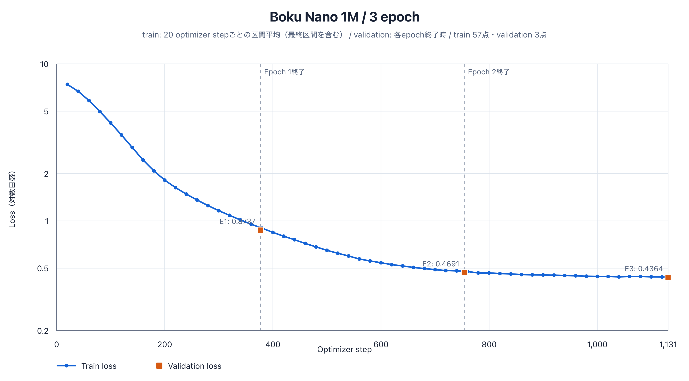
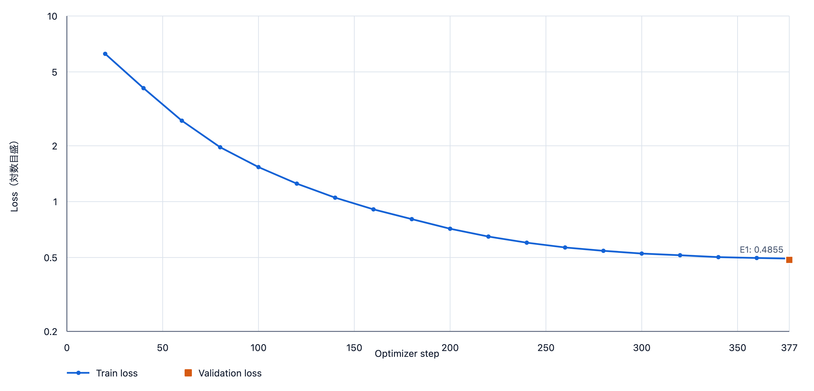
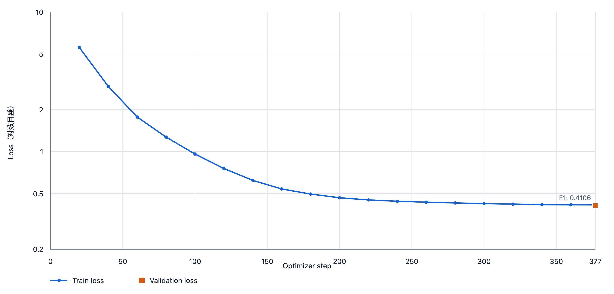
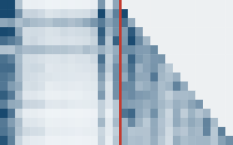
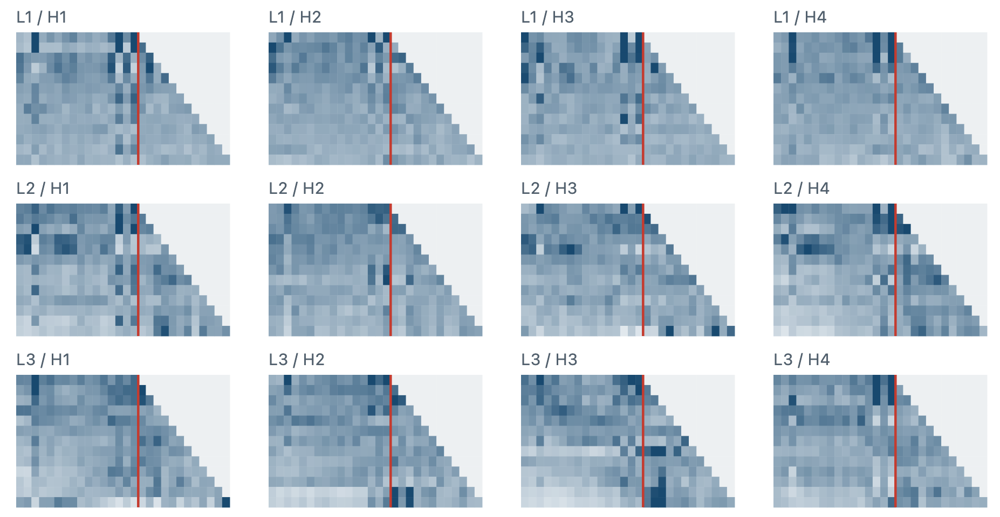
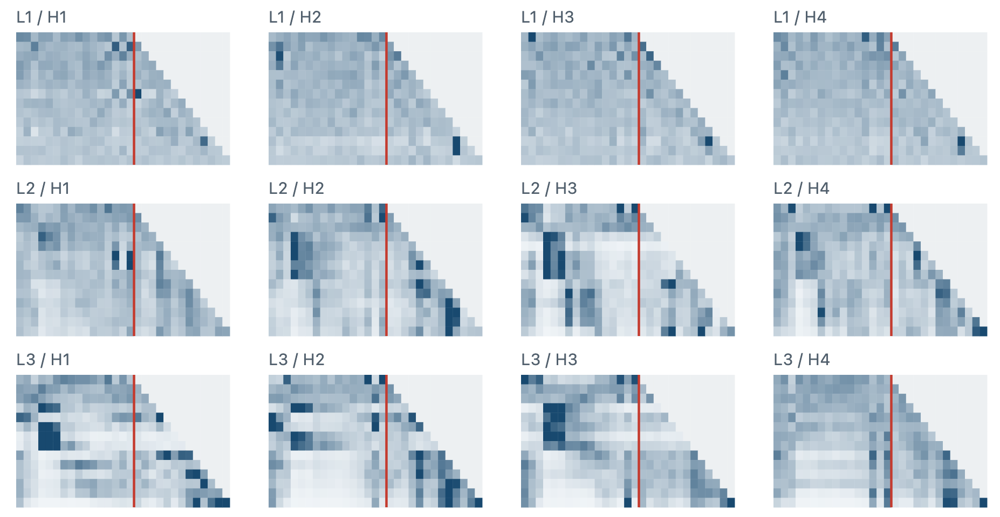
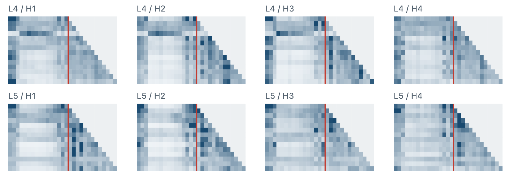
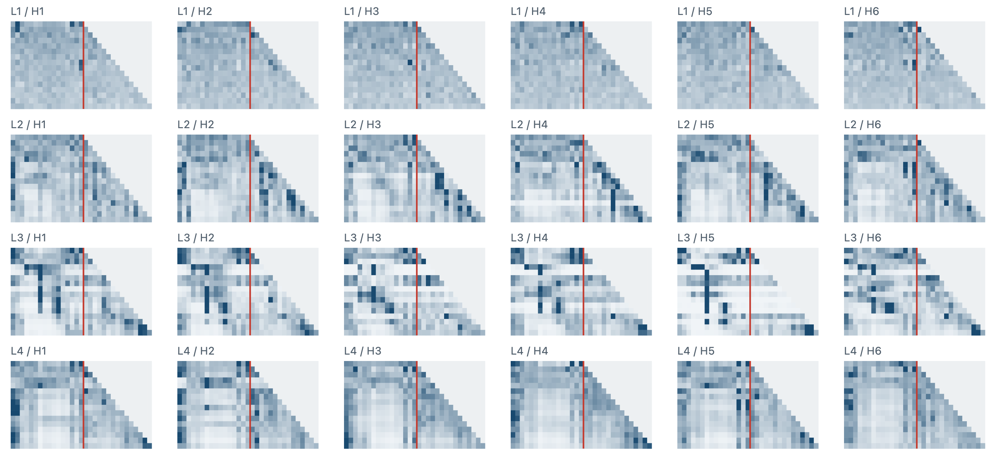
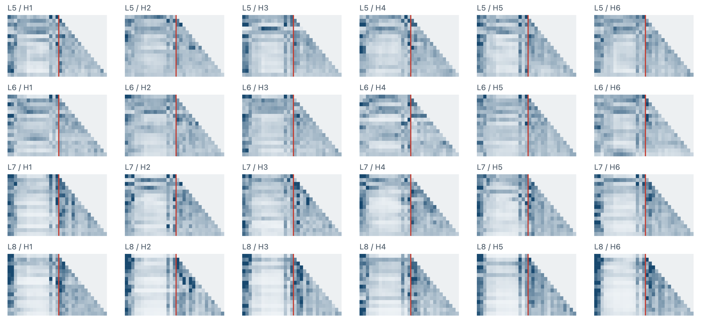
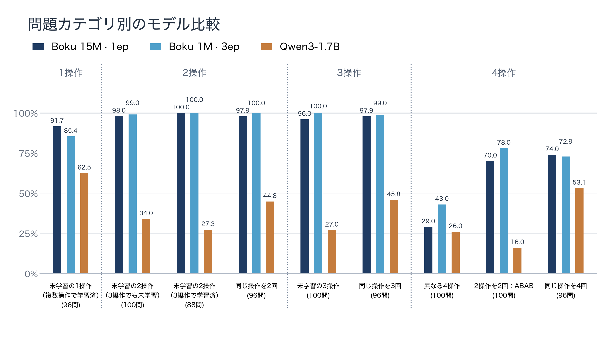

<!-- _class: cover -->

<!-- _paginate: false -->

# Boku-nano

## 制限された日本語からPythonの関数を生成する小型言語モデル（SLM）

<!--
小さなモデルをゼロから学習し、動作と表現への強さを確かめる

**基本比較は1 epoch学習。1Mの損失には3 epoch学習の結果も掲載。**


1 epochは、訓練データ全体を1回使う学習です。先行研究のモデルの学習回数を主張するものではありません。
根拠：../results/trained_model_inventory.md
-->

---
<!-- _class: intro-overview -->
<!-- _header: "" -->

# Boku-nano：制限された日本語からPythonの関数を生成する小型言語モデル（SLM）

24種類の整数リスト操作を扱う、小型言語モデルをフルスクラッチ学習

## 使うとき

<div class="ov-flow">
<div class="ov-card">

### ① 日本語の指示

整数リストxs から
偶数だけを残し、  
各要素に k を加える  
solve 関数を書いて

決められた操作・文型の範囲

</div>
<div class="ov-card">

### ② Boku-nano

15M パラメータ

Decoder-only Transformer

指示を読み、コードを生成

</div>
<div class="ov-card">

### ③ Python の関数

`def solve(xs, k):`

`return [x + k for x in xs`  
`if x % 2 == 0]`

</div>
</div>

## 作り方と確かめ方

<div class="ov-steps">
<div class="ov-step">

### **1** 意味を定義

24操作を最大3つ

順序も含めて組み合わせる

</div>
<div class="ov-step">

### **2** 教材を作る

日本語指示と正解コード

訓練データ 192,900件

</div>
<div class="ov-step">

### **3** モデルを学習

トークナイザもモデルも

既存の重みを使わず学習

</div>
<div class="ov-step">

### **4** 実行して評価

生成コードの動作を確認

84,180 / 84,550問 合格

</div>
</div>

> 評価結果は「24操作・最大3操作」という限定された範囲でのものです。Webデモの自由な日本語入力は、別モデルで決められた文型に整えてから -nano に渡します。

<!--
日本語の指示からPython関数を作る流れと、教材生成・学習・実行評価の流れを説明する。
このページの本文はboku1_nano_overview_intro_marp.mdからコピーした。
根拠：../results/model_reports/boku_nano_15m_bpe_2048_minfreq5_maxlen24_1epoch.md
-->

---
<!-- _class: key-goal -->
<!-- _header: "1. 課題と狙い" -->

# 課題と狙い

抽出や順序の変更など、**対象を24種類の操作に限定**する

| 範囲を絞る | 目指すモデル |
| :--- | :--- |
| あらかじめ定めた整数リストの操作 | 学生一人でもフルスクラッチで作れる |
| 操作を組み合わせて処理を表す | **小規模言語モデル（SLM）** |

## 別の用途への応用

関数の組み合わせで表せる処理なら、  
同じ考え方を **NPCの挙動などにも応用できる可能性**がある

<!--
目安：60秒

今回の対象は、抽出・変換・順序変更・切り出しの24操作です。あらゆるコード生成を扱うのではなく、対象の処理をあらかじめ定めることで、学生一人でトークナイザーとTransformerをフルスクラッチで作れる規模を目指しました。既存のモデル重みは使わず学習しています。
関数の組み合わせで表現できる処理なら、同じ考え方をNPCの挙動など別の用途へ応用できる可能性があります。これは今後の構想であり、今回実装・評価した成果ではありません。

根拠：
- [atomic_semantic_asts.md](../specifications/atomic_semantic_asts.md)
- [trained_model_inventory.md](../results/trained_model_inventory.md)
-->

---
<!-- _class: default -->
<!-- _header: "2. 学習を成立させるための工夫" -->

# 意味ASTの具体例

日本語：**偶数だけを残して、各要素にkを加える**

```json
{
  "sequence": [
    {"filter": ["even"]},
    {"map": ["add_k"]}
  ]
}
```

偶数の抽出 → kを加える、という処理の順序を保存

<!--
目安：40秒

実際の仕様からsemantic_astの部分を抜き出しています。抽出がfilter、各要素への変換がmapです。ASTは教材を作るために使用し、推論時には日本語だけをモデルへ渡します。

根拠：
- [atomic_semantic_asts.md](../specifications/atomic_semantic_asts.md)
-->

---
<!-- _class: ast-training-pair ast-merged -->
<!-- _header: "2. 学習を成立させるための工夫" -->

# 意味ASTから訓練データを自動生成・検証する

<div class="ast-source">

### 共通の処理の定義：意味AST

```json
{"sequence": [
  {"filter": ["even"]}, {"map": ["add_k"]}
]}
```

</div>

<div class="ast-outputs">
<div class="ast-output">

### 日本語の指示文

<div class="ast-method">

#### 生成の手順

**Qwenで各操作の日本語表現を生成。**  
ASTの順に結合し、テンプレートの  
`{operations}`をルールベースで埋める。

</div>
<div class="ast-example">

#### 生成例

整数リストxsと整数kを受け取り、  
偶数だけを残し、各要素にkを加える  
solve関数を書いてください。

</div>
</div>
<div class="ast-output">

### 検証済みのPythonコード

<div class="ast-method">

#### 生成の手順

**ASTの操作をPythonコードへ変換。**  
構文を確認し、実行結果を  
参照インタプリタの期待値と照合する。

</div>
<div class="ast-example">

#### 生成例

```python
def solve(xs, k):
    return [x + k for x in xs
            if x % 2 == 0]
```

</div>
</div>
</div>

<!--
旧5ページの分岐図に、旧6ページの教材生成・検証の説明を統合。
意味ASTが共通の生成元であり、そこから日本語の指示文と正解のPythonコードの両方を作る。日本語をモデルでコードに翻訳して教材を作るという図ではない。
説明用に同じ処理の例を示し、Pythonの型注釈は省略した。filter(even)を先に適用し、その結果にmap(add_k)を適用する。
日本語側では、Qwenで各単純操作の終止形・接続形の候補を生成し、検査・承認した表現を使う。意味ASTの操作順に表現を結合し、固定した外側文の{operations}へ挿入する。外側テンプレートへの挿入はルールベースで行う。
根拠：../policies/rule_generated_instruction_policy.md
生成したコードはPythonとして解析し、実行結果を独立に実装した参照インタプリタの期待値と比較する。教材のコードは境界値9件とランダム32件の計41入力で検証。有限個の入力での検証であり、全入力に対する正しさの証明ではない。
意味ASTは教材の生成・検証用であり、学習と推論の入力へASTそのものを加えるわけではない。
対象を24操作に限定し、教材を自動生成・検証することで、小規模モデルの学習を目指す。実験のGPUはRTX 5090であり、計算資源が不要という意味ではない。
根拠：../specifications/atomic_semantic_asts.md
根拠：../results/final_train_dataset_results.md
根拠：../results/multi_operation_python_code_generation_results.md
根拠：../specifications/reference_interpreter.md
-->

---
<!-- _class: default -->

# 扱う範囲は24種類の操作

| 種類 | 操作数 | 例 |
| :--- | ---: | :--- |
| 条件に合う数を残す | 10 | 偶数、奇数、正の値、kより大きい値 |
| 一つずつ値を変える | 8 | kを加える、2倍、絶対値、二乗 |
| 順序を変える | 3 | 昇順、降順、現在の順序の反転 |
| 一部を取り出す | 3 | 先頭k個、末尾k個、1個おき |

**最大3操作を組み合わせる、限定されたコード生成課題。**

<!--
汎用のプログラミング全般を扱う実験ではありません。
根拠：../specifications/atomic_semantic_asts.md
-->

---
<!-- _class: diagram -->


<!--
説明用の例です。意味定義は操作の順序を含みます。
根拠：../specifications/atomic_semantic_asts.md
-->


<!-- _class: default -->


<!--
ASTは抽象構文木の略です。本研究では操作の種類と順序を構造化した意味仕様を指します。初学者向けに日本語で示しています。
根拠：../specifications/atomic_semantic_asts.md
-->


<!-- _class: diagram -->

# 同じ意味から、日本語とコードを作る

| 段階 | 作るもの | 例 |
| :--- | :--- | :--- |
| ① 意味を決める | 操作と順序の記録 | 偶数を残す。その後、kを加える |
| ② 指示を作る | 日本語の説明 | 偶数だけを残して、各要素にkを加える |
| ③ 正解を作る | Pythonコード | 指示どおりに処理するsolve関数 |
| ④ 動作を確認する | 入力と出力の比較 | 参照実装と結果が一致するか |

**指示と正解を、一つの意味に対応付ける。**

<!--
意味ASTは教材の生成と検証に使います。推論では意味ASTを与えず、日本語の指示をモデルに渡します。
根拠：../results/final_train_dataset_results.md、../specifications/reference_interpreter.md
-->

---
<!-- _class: default -->

# 操作の組み合わせは12,720種類

同じ操作を繰り返さず、順序を区別して数える。

| 操作の数 | 数え方 | 意味の種類 |
| :--- | :--- | ---: |
| 1操作 | 24 | 24 |
| 2操作 | 24 × 23 | 552 |
| 3操作 | 24 × 23 × 22 | 12,144 |
| 合計 | 24 ＋ 552 ＋ 12,144 | **12,720** |

同じ操作の繰り返しは、別のテストで確かめる。

<!--
12,720は指示文やコードの件数ではなく、反復のない意味仕様の総数です。
根拠：../policies/ast_split_policy.md
-->

---
<!-- _class: default -->

# 一つの意味に、複数の日本語を用意する

| 共通の意味 | 指示の言い回し |
| :--- | :--- |
| 偶数を残す | 偶数だけを残す |
| 偶数を残す | 偶数の要素を取り出す |
| 偶数を残す | 偶数の値を抽出する |

ルールと補助モデルを使い、意味を確認して教材に採用する。

**訓練・検証・テストに意味を分けてから、表現を増やす。**

<!--
表は仕組みの説明例です。補助モデルはQwen3-4B-AWQ。Boku Nanoの重みを流用したものではありません。
根拠：../results/rule_generated_instruction_results.md、../results/replacement_resolved_train_instruction_results.md、../policies/ast_split_policy.md
-->

---
<!-- _class: default -->

# コードの書き方にも変化を付ける

どちらも「偶数だけを残す」正しい書き方。

```python
result = [x for x in xs if x % 2 == 0]
```

```python
result = []
for x in xs:
    if x % 2 == 0:
        result.append(x)
```

**文字列が同じかではなく、動作が同じかを重視する。**

<!--
説明用のコードです。内包表記、ループなど複数の構造を生成します。
根拠：../results/multi_operation_python_code_generation_results.md
-->

---
<!-- _class: default -->


<!--
41入力の一致は、あらゆる入力での正しさの証明ではありません。学習用の検査入力はモデル評価用と分離しています。
根拠：../results/multi_operation_python_code_generation_results.md、../specifications/reference_interpreter.md
-->


<!-- _class: default -->

# 学習に使った教材は192,900件

1件は「日本語の指示」と「正解コード」の組。

| 処理の長さ | 訓練データの件数 |
| :--- | ---: |
| 1操作 | 460 |
| 2操作 | 8,680 |
| 3操作 | 183,760 |
| 合計 | **192,900** |

**約95%が3操作の教材。** 単独操作の教材は少ない。

<!--
3操作の割合は95.2618%。データの偏りは文型依存の考察につながります。
根拠：../results/final_train_dataset_results.md
-->

---
<!-- _class: compact -->

# 三つの大きさを、1 epochで比較する

**パラメータ**は、学習で調整するモデル内部の数値。

| 呼び名 | パラメータ数 | 今回の学習 |
| :--- | ---: | :--- |
| 1M | 約100万 | 教材全体を1回使う |
| 5M | 約500万 | 教材全体を1回使う |
| 15M | 約1,500万 | 教材全体を1回使う |

<!-- 教材全体を1回使う学習を、**1 epoch（1エポック）**と呼ぶ。 -->

既存の学習済み重みを使わず、Transformerをゼロから学習する。

<!--
正確には1,016,704、5,065,472、15,735,168パラメータ。共通の分割設定で学習した3モデルを本編に採用。Transformerは文章内の情報を参照しながら次の単位を予測するモデル。すべてDecoder-only、最大系列長256。
根拠：../results/trained_model_inventory.md
-->

---
<!-- _class: autoregressive ar-diagram -->
<!-- _header: "4. モデルと評価方法" -->

# 自己回帰：出力を次の入力に加えて繰り返す

GPTなどの言語モデルは、**直前までの言葉から次を予測**して文章を作る。

<div class="ar-flow">
<div class="ar-labels">

入力：ここまでの文章

予測するモデル

出力：次の言葉

</div>
<div class="ar-flow-row">
<div class="ar-tokens">

`私` `は` `猫` `が`

</div>
<div class="ar-arrow">

→

</div>
<div class="ar-model">

**言語モデル**

</div>
<div class="ar-arrow">

→

</div>
<div class="ar-output">

**好き**

</div>
</div>
<div class="ar-feedback">

出力した「好き」を、次の入力の末尾へ

</div>
<div class="ar-flow-row">
<div class="ar-tokens ar-appended">

`私` `は` `猫` `が` `好き`

</div>
<div class="ar-arrow">

→

</div>
<div class="ar-model">

**同じモデル**

</div>
<div class="ar-arrow">

→

</div>
<div class="ar-output ar-next">

**です**

</div>
</div>
</div>

> **学習では**、文章の途中までを見せ、実際の次の言葉を当てるように学ぶ。

<div class="ar-note">

説明用に言葉で区切った例。実際はトークン単位で予測し、生成を繰り返す。

</div>

<!--
図の例は「私は猫が好きです」。上段で「好き」を生成し、その出力を次の入力の末尾へ加える。下段は同じモデルをもう一度使い、「です」を生成する。二つの別モデルを直列に学習するという意味ではない。
各語を囲む枠、モデル、矢印、出力を入力へ戻す経路を使い、自己回帰生成を説明する。実際のモデルの実測出力やトークン分割結果ではない。
学習では正解文章の直前までの系列から実際に続くトークンを予測し、正解トークンの確率を高めるように重みを更新する。causal maskにより未来の正解は見えない。学習時は各位置の予測を一括して計算できる。
図の生成時には自分で出したトークンを次の入力へ加える。候補は確率分布として予測され、次の言葉が一意に決まるわけではない。
Boku1-nanoはDecoder-onlyであり、この記事のEncoder-Decoder構成のCross-Attentionは本モデルに含まれない。
図示の参考： https://disassemble-channel.com/transformer-decoder/ （Decoderの役割・自己回帰生成）
参考記事の画像自体は使用せず、説明図をMarkdownの本文とCSSの配置で作成。
実装の根拠：../../scripts/model/boku_nano.py（causal attention、shifted labels、cross entropy）
実装の根拠：../../scripts/model/train_boku_nano.py（collate_training_batch）
-->

---
<!-- _class: ar-code -->
<!-- _header: "4. モデルと評価方法" -->

# 実装①：生成したトークンを、次の入力に加える

`currentIds` は日本語指示と生成済みコード。**1回の推論で次の1トークンを選ぶ。**

```javascript
const currentIds = [...promptIds];
const generatedIds = [];
const limit = model.context_length - promptIds.length;
let ended = false;
// …（表示の準備などを省略）
for (let step = 0; step < limit && current(job); step += 1) {
  const input = new ort.Tensor("int64", BigInt64Array.from(currentIds, BigInt), [1, currentIds.length]);
  let outputs;
  try {
    outputs = await runtime.session.run({ input_ids: input });
    if (!current(job)) break;
    const tokenId = selectToken(outputs.logits.data, temperature);
    if (tokenId === state.manifest.special_token_ids.eos) { ended = true; break; }
    currentIds.push(tokenId);
    generatedIds.push(tokenId);
    // …（表示更新・finallyによるリソース解放・閉じ括弧を省略）
```

**`currentIds.push(tokenId)` で入力を伸ばし、同じモデルをもう一度呼ぶ。**
終了トークン `eos`、長さの上限、または中断で止まる。

<div class="code-source">抜粋：web/demo.js 585–601行。字下げを調整し、省略箇所を明示。</div>

<!--
上のコードは関数全体ではない。生成ループの表示処理とfinally、閉じ括弧を末尾で省略している。生成時に重みは更新しない。
現行Web実装は毎回currentIds全体をONNXへ入力する。KVキャッシュ版の説明ではない。
出典：../../web/demo.js 585–601行。
ONNXはLastTokenLogits.forwardで末尾位置のlogitsだけを返す：../../scripts/model/export_boku_nano_onnx.py 85–86行。
-->

---
<!-- _class: ar-code -->

# 実装②：ロジットを温度で調整し、確率にする

ロジットは各候補トークンの点数。**T > 0では `softmax(logits / T)` を計算する。**

```javascript
export function temperatureProbabilities(logits, temperature) {
  const t = validateTemperature(temperature);
  // …（T=0・空配列の検査を省略）
  let maximum = -Infinity;
  for (const value of logits) {
    // …（不正な数値の検査を省略）
    maximum = Math.max(maximum, value);
  }
  // …（元コードのコメントを省略）
  const probabilities = Float64Array.from(logits, value => Math.exp((value - maximum) / t));
  const sum = probabilities.reduce((total, value) => total + value, 0);
  return probabilities.map(value => value / sum);
}
```

1. 最大値を引いてから **Tで割り、expを計算**する。
2. 全候補の合計で割り、**合計が1になる確率分布**にする。

最大値を引くのは数値の発散を防ぐため。`softmax(logits / T)` と数学的に同じ確率になる。

<div class="code-source">抜粋：web/sampling.js 10–23行。省略は入力検査とコメントのみ。</div>

<!--
p_i = exp((z_i - max_j z_j)/T) / sum_j exp((z_j - max_k z_k)/T)。共通因子exp(-max/T)が約分されるため、exp(z_i/T)/sum_j exp(z_j/T)と一致する。
実装で受理する温度は0〜2。T=0はこの関数ではエラーとし、selectToken内の別分岐で処理する。
出典：../../web/sampling.js 2–23行。
-->

---
<!-- _class: ar-code -->

# 実装③：温度による違いと、T=0の処理

**同じロジット `[2, 1, 0]`** に対する確率。実モデルの出力ではなく、計算例。

| 温度T | 候補A | 候補B | 候補C |
| ---: | ---: | ---: | ---: |
| 0.5 | 86.7% | 11.7% | 1.6% |
| 1.0 | 66.5% | 24.5% | 9.0% |
| 2.0 | 50.6% | 30.7% | 18.6% |

Tを小さくすると最大候補に集中し、大きくすると他の候補も選ばれやすくなる。

```javascript
if (t === 0) {
  let best = 0;
  for (let i = 0; i < logits.length; i += 1) {
    // …（不正な数値の検査を省略）
    if (logits[i] > logits[best]) best = i;
  }
  return best;
}
```

**T=0ではsoftmaxを計算せず、最大候補を選ぶ（greedy）。** 温度を上げても正解率が上がるとは限らない。

<div class="code-source">抜粋：web/sampling.js 28–35行。表は同ファイルのtemperatureProbabilitiesで算出（丸めで合計に差）。</div>

<!--
正の温度で割ってもロジットの順位は変わらない。変わるのは候補間の確率の偏り。T=0の分岐はゼロ除算をしない。
同点の最大値は先に現れたIDを選ぶ。greedyはその時点の局所的な最大候補を選ぶ処理であり、系列全体で最高確率の出力を保証しない。
出典：../../web/sampling.js 28–35行。数値例はT=0.5,1,2に対して同関数を直接実行して確認。
-->

---
<!-- _class: ar-code -->

# 実装④：確率に従って1トークンを選ぶ

T > 0では、**0以上1未満の乱数を引き、確率の幅に応じて候補を選ぶ。**

```javascript
export function selectToken(logits, temperature, random = Math.random) {
  const t = validateTemperature(temperature);
  // …（空配列の検査とT=0の分岐を省略）
  const probabilities = temperatureProbabilities(logits, t);
  let threshold = random();
  // …（乱数が0以上1未満であることの検査を省略）
  for (let i = 0; i < probabilities.length; i += 1) {
    threshold -= probabilities[i];
    if (threshold < 0) return i;
  }
  // …（丸め誤差で候補が決まらなかった場合の処理を省略）
}
```

例：確率が `[0.6, 0.3, 0.1]` で乱数が `0.7` の場合

- 候補A：`0.7 − 0.6 = 0.1`。まだ0以上なので次へ。
- 候補B：`0.1 − 0.3 = −0.2`。0未満になり、**候補Bを選ぶ**。

選んだIDを `currentIds` に追加し、**更新された入力で次のトークンを予測する。**

<div class="code-source">抜粋：web/sampling.js 25–47行。モデルの出力確率に従う抽選で、毎回同じ候補になるとは限らない。</div>

<!--
乱数rに対し、累積確率がrを初めて上回る候補を返す。元実装は最後に丸め誤差用のフォールバックも持つ。
T=0のベンチマーク結果と、T>0のデモ生成を混同しない。この説明のためにモデルや生成実装を変更していない。
出典：../../web/sampling.js 25–47行、../../web/demo.js 598–601行。
-->

---
<!-- _class: compact -->

# 五つのテストで、生成コードを実行する

| テスト | 確かめること | 指示の件数 |
| :--- | :--- | ---: |
| 通常 | 未学習の操作の並びを扱えるか | 24,040 |
| 組合せ | 訓練から隔離した操作対を組めるか | 13,400 |
| 日本語の言い換え | 未学習の30表現を理解できるか | 30 |
| 同じ操作の反復 | 同じ操作を2回・3回実行できるか | 23,040 |
| 境界値 | 空リストなどでも正しく動くか | 24,040 |

1指示につきコードを1候補生成し、全検査を通ったら合格。

通常と境界値では同じ指示を使い、検査する入力を変える。

<!--
合計84,550件は評価集合の合計で、重複のない指示数ではありません。greedy最大160 token。構文、安全AST、signature、入力非変更、返値型、制限時間も検査。通常・組合せ・言い換え・反復は各64入力。境界値は共通30入力と操作固有入力。
根拠：../policies/boku_nano_model_evaluation_policy.md
-->

---
<!-- _class: scientific -->
<!-- _header: "5. 学習結果と課題" -->

# 1M：3 epochまでの損失の推移

3 epochの学習。訓練損失は20 stepごと、検証損失は各epoch終了時の実測値。



**val loss：1 epoch 0.8737 ／ 2 epoch 0.4691 ／ 3 epoch 0.4364**

20 stepごとのvalidationは未記録。図は保存済みの3点を表示。

<!--
3epoch設定の1回の訓練ログを使用。train loss 57点、validation loss 3点。最終stepは1131、epoch境界は377・754・1131。validationは24,040レコードのコード部分を評価。
1epoch専用runとは学習率スケジュールが異なるため、1epoch専用runの終了値1.3781と接続しない。
使用図：figure/loss_1m_3epoch.svg
根拠：../../data/models/boku_nano_1m_bpe_2048_minfreq5_maxlen24_3epoch/training_metrics.jsonl
-->

---
<!-- _class: scientific -->
<!-- _header: "5. 学習結果と課題" -->

# 5M：損失の推移

1 epochの学習。訓練損失と、検証データで測った損失を示す。



**学習終了時の val loss：0.4855**

val lossは終了時の1点。途中の検証値は保存されていない。

<!--
保存された19点のtrain lossと、1点のvalidation lossをすべて使用。曲線はtrain lossだけであり、val lossの推移を補間していない。縦軸は保存済みの各モデルの図の対数目盛をそのまま使用する。モデルごとに範囲は異なる。最終stepは377。validationは24,040レコードのコード部分を評価。
使用図：../results/figures/training_loss_20step/boku_nano_5m_bpe_2048_minfreq5_maxlen24_1epoch.svg
根拠：../../data/models/boku_nano_5m_bpe_2048_minfreq5_maxlen24_1epoch/training_metrics.jsonl
-->

---
<!-- _class: scientific -->
<!-- _header: "5. 学習結果と課題" -->

# 15M：損失の推移

1 epochの学習。訓練損失と、検証データで測った損失を示す。



**学習終了時の val loss：0.4106**

val lossは終了時の1点。途中の検証値は保存されていない。

<!--
保存された19点のtrain lossと、1点のvalidation lossをすべて使用。曲線はtrain lossだけであり、val lossの推移を補間していない。縦軸は保存済みの各モデルの図の対数目盛をそのまま使用する。モデルごとに範囲は異なる。最終stepは377。validationは24,040レコードのコード部分を評価。
使用図：../results/figures/training_loss_20step/boku_nano_15m_bpe_2048_minfreq5_maxlen24_1epoch.svg
根拠：../../data/models/boku_nano_15m_bpe_2048_minfreq5_maxlen24_1epoch/training_metrics.jsonl
-->

---
<!-- _class: compact -->

# 1 epochの結果：モデル規模による違い

五つのテストを合計した参考値。分母は84,550件。

| モデル | 合格数 | 合格率 |
| :--- | ---: | ---: |
| 1M | 1,467件 | 1.74% |
| 5M | 81,557件 | 96.46% |
| 15M | 84,180件 | 99.56% |

**今回の条件では、5Mと15Mは高い全体合格率を示した。**

ただし、件数の少ない言い換えテストは全体値に表れにくい。

<!--
本編は全てmin_frequency=5/max_token_length=24の設定。すべて1 epoch・単一seed。モデル間の比較で分割方法は共通。
根拠：../results/trained_model_inventory.md
-->

---
<!-- _class: compact -->

# 全体が高精度でも、言い換えには弱い

15Mモデル・1 epochのテスト別結果。

| テスト | 合格数 | 合格率 |
| :--- | ---: | ---: |
| 通常 | 24,003 / 24,040 | 99.85% |
| 組合せ | 13,188 / 13,400 | 98.42% |
| 日本語の言い換え | **15 / 30** | **50.00%** |
| 同じ操作の反復 | 22,971 / 23,040 | 99.70% |
| 境界値 | 24,003 / 24,040 | 99.85% |

**全体の99.56%だけでは、日本語表現への弱さが見えない。**

<!--
固定30表現の言い換えテストです。後の14操作の冒頭変更とは別の評価。
根拠：../results/model_reports/boku_nano_15m_bpe_2048_minfreq5_maxlen24_1epoch.md
-->

---
<!-- _class: sources -->

# 先行研究：日本語の書き方で正解率が変わる

Gan and Mori（2023）は、意味や指示が近い5種類のプロンプトを比較した。

**プロンプト**は、モデルに渡す指示文や質問文のこと。

| 日本語の課題 | モデル | 正解率の範囲 |
| :--- | :--- | :--- |
| 2文の意味関係を分類するJNLI | GPT-4 | **25.44〜49.21%** |

意味が近くても、書き方によって性能が大きく変わる場合がある。

出典：[Gan and Mori, PACLIC 2023, Table 3](https://aclanthology.org/2023.paclic-1.1/)

<!--
JNLIは含意・矛盾・中立の3分類。各課題1,000件のzero-shot評価。今回のコード生成と同じ実験ではありません。
Chengguang Gan and Tatsunori Mori. Sensitivity and Robustness of Large Language Models to Prompt Template in Japanese Text Classification Tasks. PACLIC 2023, pp. 1–11. https://aclanthology.org/2023.paclic-1.1/
-->

---
<!-- _class: sources -->

# 先行研究：言い換えで回答の傾向も変わる

Takayama et al.（2026）は、日本語を含む「はい／いいえ」の質問を評価した。

| 表現の変え方 | 日本語での観察 |
| :--- | :--- |
| 同意を求める「〜ですよね？」 | 道徳判断で「はい」が増える傾向 |
| 反対語への置き換え | 答えの反転を考慮しても、一貫性が低下 |

**同じ判断を求めても、表現によって答えが動く。**

モデルの評価には、複数の言い回しを含める必要がある。

出典：[Takayama et al., LREC 2026, Table 1](https://aclanthology.org/2026.lrec-1.225/)

<!--
日本語はJCommonsenseMoralityとWRIME。道徳判断の同意表現でYes割合は指示調整済みモデル群平均4.9ポイント、GPT-4o5.5ポイント増加。反対語では答えが反転することを考慮。一貫性と正解率は異なる指標です。
Junya Takayama, Masaya Ohagi, Tomoya Mizumoto, and Katsumasa Yoshikawa. Evaluating the Effect of Question Wording Variations on Answer Consistency in Large Language Models. LREC 2026, pp. 2874–2886. https://aclanthology.org/2026.lrec-1.225/
-->

---
<!-- _class: default -->

# 今回は、指示の冒頭だけを変えて比較する

| 条件 | モデルに渡す指示 |
| :--- | :--- |
| 変更前 | **整数リストxsから偶数だけを残すsolve関数を書いてください。** |
| 変更後 | **整数リストxsに対して、偶数だけを残すsolve関数を書いてください。** |

後半の操作の指示をそろえ、冒頭だけが異なる**14操作**を比較。

同じモデルを使い、追加学習せず、同じ入力でコードを検査する。

<!--
保存済み24操作から、kを使わず「整数リストxsから」で始まる14操作を抽出。残り10操作は「xsと整数kを受け取り、」も変更するため除外。「から」の変更には読点の追加も含みます。各指示33入力、greedy最大64 token。
根拠：../results/boku_nano_1epoch_attention_comparison.md、../results/boku_nano_1epoch_attention_comparison_legacy_taishite_prompt.md
-->

---
<!-- _class: result -->

# 5Mモデルでは、12件の合格が1件に減った

**5M・1 epoch。比較した14操作の合格数。**

| 指示の冒頭 | 合格数を表す図 | 合格数・合格率 |
| :--- | :--- | :--- |
| 整数リストxsから | ■■■■■■■■■■■■□□ | **12 / 14・85.7%** |
| 整数リストxsに対して、 | ■□□□□□□□□□□□□□ | **1 / 14・7.1%** |

■は合格1件、□は不合格1件。左から合格数を並べた図。

**冒頭を変えただけで、ほとんど正しく生成できなくなった。**

<!--
図は合格数・不合格数の内訳で、各操作の並びではありません。合格は固定33ケースの検査をすべて通ること。24操作全体の22→1を「から」だけの変更として扱わず、14操作に限定。
根拠：../results/attention_1epoch/boku_nano_5m_bpe_2048_minfreq5_maxlen24_1epoch/analysis.json とlegacy_taishite_prompt/analysis.json
-->

---
<!-- _class: default -->

# 失敗例：偶数を残す指示を別の処理にした

変更後の指示：**整数リストxsに対して、偶数だけを残すsolve関数を書いてください。**

| | 指示どおりの処理 | 変更後に生成した処理 |
| :--- | :--- | :--- |
| 操作 | 偶数だけを残す | 順序を反転し、k以上の値を残す |
| 検査入力 | `xs = [0]`、`k = 1` | 同じ入力 |
| 出力 | **`[0]`** | **`[]`** |

構文は正しかったが、**処理の意味が変わった。**

<!--
5Mモデルのatomic-000001の実際の生成コードと最初の不一致入力。変更前はvalue % 2 == 0で抽出し33ケース合格。変更後はlist(reversed(xs))の後にk <= xで抽出。評価器は全操作でsolve(xs, k)を要求するため、指示にkがなくても検査入力にはkがあります。
根拠：../results/attention_1epoch/boku_nano_5m_bpe_2048_minfreq5_maxlen24_1epoch/analysis.json とlegacy_taishite_prompt/analysis.json
-->

---
<!-- _class: default -->

# 表現への強さは、モデルによって違う

すべて1 epoch。冒頭だけを変えた14操作の合格数。

| モデル | 「xsから」 | 「xsに対して、」 |
| :--- | ---: | ---: |
| 5M | **12 / 14** | **1 / 14** |
| 15M | 12 / 14 | 12 / 14 |

**15Mでは合格数を保った。** すべてが同様に崩れるわけではない。

<!--
共通の分割設定。samplesをoperation_idで対応付け、指示が「整数リストxsから」で始まる14操作を集計。後半の文が同じと確認。合格数が同じでも生成コードの一致を主張しない。
根拠：../results/attention_1epoch/ 配下の5M・15Mのminfreq5_maxlen24_1epoch/analysis.jsonとlegacy_taishite_prompt/analysis.json
-->

---
<!-- _class: default -->

# 学習データの文型との結び付きが考えられる

訓練データで「整数リストxsに対して、」と始まる指示は84件。

| その文型で学習した処理 | 件数 |
| :--- | ---: |
| 1操作 | **0** |
| 2操作 | 1 |
| 3操作 | 83 |

この文型を、複数の操作と結び付けて覚えた可能性がある。

**原因の確定には、教材を変えた追加比較が必要。**

<!--
解釈は仮説です。頻度や操作数の偏り以外に、モデル規模も関係し得ます。失敗だけで原因を断定しません。
根拠：../results/boku_nano_1epoch_attention_comparison.md「新旧文型の比較」
-->

---
<!-- _class: compact -->

# モデルが情報を読み取る仕組み

**アテンション**は、次のコードを作るときに、どこから情報を読むかを決める仕組み。

| 参照できる情報 | 内容 |
| :--- | :--- |
| 日本語の指示 | 「偶数」「残す」など、求める処理 |
| すでに生成したコード | 変数名、構文、処理の続き |
| 開始の印など | 入力の始まりや区切り |

参照割合だけでは、その情報が必要だったかは確定できない。

**情報の受け渡しを止めて、生成結果が変わるかを調べる。**

<!--
図の読み方を説明した後の5ページは、同一の絶対値・降順の指示について、1M・5M・15Mの全層・全ヘッドの生成中のattentionを表示する。Value ablationでは指示位置のKeyとattention weightを保ち、Valueだけを0にします。
根拠：../results/boku_nano_1epoch_attention_comparison.md
-->

---
<!-- _class: chart -->
<!-- _header: "6. アテンションの可視化" -->

# アテンションの図の読み方

<div class="attention-guide-labels"><span></span><div><span>入力の指示・区切り</span><span>生成済みコード</span></div><span></span></div>

<div class="attention-guide-grid">
<div>生成<br>ステップ<br>↓</div>



<div>薄い：弱い<br><br>濃い：強い</div>
</div>

<div class="attention-guide-x">横：参照するトークン位置 →</div>

濃い位置ほど強く参照。15M・1エポックのL8・H5の例

<!--
目安：40秒

保存済みのattention_by_layer_head.svgをPNGへ出力し、第8層第5ヘッドの領域をそのまま切り出して拡大しています。図のセルを描き直していません。横は参照先、縦は生成ステップです。赤線は指示側と生成コード側の境界です。灰色はまだ存在しない位置です。指示は『各要素を絶対値にして降順に並べる』です。色は元の図の尺度を維持し、上位2％は濃い色で飽和します。

根拠：
- [detail_analysis.json](../results/attention_1epoch/boku_nano_15m_bpe_2048_minfreq5_maxlen24_1epoch/detail_analysis.json)
- [attention_by_layer_head.svg](../results/attention_1epoch/boku_nano_15m_bpe_2048_minfreq5_maxlen24_1epoch/figures/attention_by_layer_head.svg)
-->

---
<!-- _class: scientific attention-result -->
<!-- _header: "6. アテンションの可視化" -->

# 1M：attention の可視化

同じ指示：**各要素を絶対値にして、降順に並べる**



**生成結果：未定義の result を参照し、この指示では実行できなかった。**

色は各モデル内の相対的な強さ。モデル間で濃さを直接比較しない。

<!--
入力全文：xsの各要素を絶対値にして降順に並べるsolve関数を書いてください。
3層×4head。全headを掲載。縦軸は13生成step。参照位置数・生成長はモデルによって異なる。
保存済みのattention_by_layer_head.svgをPNGへ出力し、掲載する層の領域をそのまま切り出して使用。セル・色・層とヘッドの並びを描き直していない。色の上限は元図のモデル別98パーセンタイル。
一つの指示での生成事例であり、固定5テストの合格率や24操作診断とは別。attentionの濃さだけで因果的寄与を断定しない。
生成コード：
def solve(xs: list[int], k: int) -> list[int]:
    # 現在の要素順を反転する
    output = list(reversed(result))
    # 昇順に並べる
    result = sorted(result)[::-1]
    return result

根拠：../results/attention_1epoch/boku_nano_1m_bpe_2048_minfreq5_maxlen24_1epoch/detail_analysis.json
元図：../results/attention_1epoch/boku_nano_1m_bpe_2048_minfreq5_maxlen24_1epoch/figures/attention_by_layer_head.svg
-->

---
<!-- _class: scientific attention-result -->
<!-- _header: "6. アテンションの可視化" -->

# 5M：attention の可視化（L1〜L3）

同じ指示：**各要素を絶対値にして、降順に並べる**



**生成結果：絶対値の処理は生成したが、k加算が入り、降順の処理が抜けた。**

色は各モデル内の相対的な強さ。モデル間で濃さを直接比較しない。

<!--
入力全文：xsの各要素を絶対値にして降順に並べるsolve関数を書いてください。
5層×4head。全headを掲載。縦軸は14生成step。参照位置数・生成長はモデルによって異なる。
保存済みのattention_by_layer_head.svgをPNGへ出力し、掲載する層の領域をそのまま切り出して使用。セル・色・層とヘッドの並びを描き直していない。色の上限は元図のモデル別98パーセンタイル。
一つの指示での生成事例であり、固定5テストの合格率や24操作診断とは別。attentionの濃さだけで因果的寄与を断定しない。
生成コード：
def solve(xs: list[int], k: int) -> list[int]:
    result: list[int] = []
    for value in xs:
        result += [value + k]
    output: list[int] = []
    for value in result:
        output += [abs(value)]
    return output

根拠：../results/attention_1epoch/boku_nano_5m_bpe_2048_minfreq5_maxlen24_1epoch/detail_analysis.json
元図：../results/attention_1epoch/boku_nano_5m_bpe_2048_minfreq5_maxlen24_1epoch/figures/attention_by_layer_head.svg
-->

---
<!-- _class: scientific attention-result -->
<!-- _header: "6. アテンションの可視化" -->

# 5M：attention の可視化（L4〜L5）

同じ指示：**各要素を絶対値にして、降順に並べる**



**生成結果：絶対値の処理は生成したが、k加算が入り、降順の処理が抜けた。**

色は各モデル内の相対的な強さ。モデル間で濃さを直接比較しない。

<!--
入力全文：xsの各要素を絶対値にして降順に並べるsolve関数を書いてください。
5層×4head。全headを掲載。縦軸は14生成step。参照位置数・生成長はモデルによって異なる。
保存済みのattention_by_layer_head.svgをPNGへ出力し、掲載する層の領域をそのまま切り出して使用。セル・色・層とヘッドの並びを描き直していない。色の上限は元図のモデル別98パーセンタイル。
一つの指示での生成事例であり、固定5テストの合格率や24操作診断とは別。attentionの濃さだけで因果的寄与を断定しない。
生成コード：
def solve(xs: list[int], k: int) -> list[int]:
    result: list[int] = []
    for value in xs:
        result += [value + k]
    output: list[int] = []
    for value in result:
        output += [abs(value)]
    return output

根拠：../results/attention_1epoch/boku_nano_5m_bpe_2048_minfreq5_maxlen24_1epoch/detail_analysis.json
元図：../results/attention_1epoch/boku_nano_5m_bpe_2048_minfreq5_maxlen24_1epoch/figures/attention_by_layer_head.svg
-->

---
<!-- _class: scientific attention-result -->
<!-- _header: "6. アテンションの可視化" -->

# 15M：attention の可視化（L1〜L4）

同じ指示：**各要素を絶対値にして、降順に並べる**



**生成結果：絶対値を取って降順に並べるコードを生成した。**

色は各モデル内の相対的な強さ。モデル間で濃さを直接比較しない。

<!--
入力全文：xsの各要素を絶対値にして降順に並べるsolve関数を書いてください。
8層×6head。全headを掲載。縦軸は16生成step。参照位置数・生成長はモデルによって異なる。
保存済みのattention_by_layer_head.svgをPNGへ出力し、掲載する層の領域をそのまま切り出して使用。セル・色・層とヘッドの並びを描き直していない。色の上限は元図のモデル別98パーセンタイル。
一つの指示での生成事例であり、固定5テストの合格率や24操作診断とは別。attentionの濃さだけで因果的寄与を断定しない。
生成コード：
def solve(xs: list[int], k: int) -> list[int]:
    # 各要素の絶対値を取る
    result: list[int] = []
    for value in xs:
        result += [abs(value)]
    # 降順に並べる
    output: list[int] = sorted(result, reverse=True)
    return output

根拠：../results/attention_1epoch/boku_nano_15m_bpe_2048_minfreq5_maxlen24_1epoch/detail_analysis.json
元図：../results/attention_1epoch/boku_nano_15m_bpe_2048_minfreq5_maxlen24_1epoch/figures/attention_by_layer_head.svg
-->

---
<!-- _class: scientific attention-result -->
<!-- _header: "6. アテンションの可視化" -->

# 15M：attention の可視化（L5〜L8）

同じ指示：**各要素を絶対値にして、降順に並べる**



**生成結果：絶対値を取って降順に並べるコードを生成した。**

色は各モデル内の相対的な強さ。モデル間で濃さを直接比較しない。

<!--
入力全文：xsの各要素を絶対値にして降順に並べるsolve関数を書いてください。
8層×6head。全headを掲載。縦軸は16生成step。参照位置数・生成長はモデルによって異なる。
保存済みのattention_by_layer_head.svgをPNGへ出力し、掲載する層の領域をそのまま切り出して使用。セル・色・層とヘッドの並びを描き直していない。色の上限は元図のモデル別98パーセンタイル。
一つの指示での生成事例であり、固定5テストの合格率や24操作診断とは別。attentionの濃さだけで因果的寄与を断定しない。
生成コード：
def solve(xs: list[int], k: int) -> list[int]:
    # 各要素の絶対値を取る
    result: list[int] = []
    for value in xs:
        result += [abs(value)]
    # 降順に並べる
    output: list[int] = sorted(result, reverse=True)
    return output

根拠：../results/attention_1epoch/boku_nano_15m_bpe_2048_minfreq5_maxlen24_1epoch/detail_analysis.json
元図：../results/attention_1epoch/boku_nano_15m_bpe_2048_minfreq5_maxlen24_1epoch/figures/attention_by_layer_head.svg
-->

---
<!-- _class: compact -->

# 指示の情報を止めると合格数が落ちる

1 epochモデル。学習時に準拠した文型で、24操作を診断。

| モデル | 通常の生成 | 指示の情報を止めた生成 |
| :--- | ---: | ---: |
| 1M | 3 / 24 | **0 / 24** |
| 5M | 22 / 24 | **0 / 24** |
| 15M | 22 / 24 | **2 / 24** |

**指示から受け取る情報が、操作の選択に寄与している。**

24操作の内部診断。冒頭変更の14操作、固定5テストとは別。

<!--
本編採用の3モデルの実測値。全層で日本語指示位置のValueを0にした介入であり、指示自体を削除したものではない。各prompt33入力、greedy最大64 token。
根拠：../results/attention_1epoch/ 配下のminfreq5_maxlen24_1epoch/analysis.json
-->

---
<!-- _class: default -->

# 評価では、表現を変えた場合も確かめる

| 調べること | 今回、分かったこと |
| :--- | :--- |
| 決めた文型での動作 | 5M・15Mは高い全体合格率を示した |
| 未学習の言い換え | 15Mでも30件中15件の合格 |
| 指示の冒頭の変更 | 5Mは14件中12件から1件へ低下 |

**一種類のプロンプトでの精度に加え、表現を変えても性能が保たれるかを評価する必要がある。**

<!--
先行研究は分類・二択質問、今回の実験は限定したコード生成。課題と指標が違うことに注意。
根拠：スライド17〜24の出典、Gan and Mori（2023）、Takayama et al.（2026）
-->

---
<!-- _class: compact -->
<!-- _header: "6. 組み合わせ汎化を測る" -->

# 組み合わせ汎化ベンチマークの前提

**各操作を表す日本語表現は、Bokuの訓練データに登場する。**
**ただし、完成した指示文は訓練データと完全一致しない。**

評価872問と訓練192,900件を照合し、指示全文の一致は0件。

| 課題 | 訓練と評価で何が変わるか |
| :--- | :--- |
| 複数操作で学んだ表現を1操作で使う | 複数操作の指示でだけ使った言い方を、単独操作に使う |
| 初めて組み合わせる2操作 | 訓練では同じ指示に登場しない2操作を組み合わせる |
| 3操作で学んだ順序を2操作で使う | 3操作中の既知の順序を、未学習の2操作列として使う |

未知の日本語表現への強さとは分けて、**既知の表現を異なる構成で使う能力**を調べる。

<!--
全文未出でも、操作や機能まで未知とは限らない。Qwenの事前学習との重複は不明。
根拠：../results/composition_suite_20261008/report.md、../../data/benchmarks/composition_suite_20261008/questions.jsonl
全文一致0件は2026年10月8日に訓練アーカイブを走査して確認。
-->

---
<!-- _class: benchmark-data -->

# データセットの構成：9種類・872問

| 操作数 | 問題の種類 | 問数 | 構成 |
| ---: | :--- | ---: | :--- |
| 1 | 複数操作で学んだ表現を1操作で使う | 96 | 24操作 × 4表現 |
| 2 | 初めて組み合わせる2操作 | 100 | 5ペア × 両順序 × 10表現 |
| 2 | 同じ操作を2回 | 96 | 24操作 × 4表現 |
| 2 | 3操作で学んだ順序を2操作で使う | 88 | 88種類の操作列 |
| 3 | 初めてのペアを含む3操作 | 100 | 100種類の操作列 |
| 3 | 同じ操作を3回 | 96 | 24操作 × 4表現 |
| 4 | 同じ操作を4回 | 96 | 24操作 × 4表現 |
| 4 | 異なる4操作を組み合わせる | 100 | 100種類の操作列 |
| 4 | 2操作の組を2回繰り返す | 100 | A・B・A・Bの100種類 |

各問題でコードを1つ生成。**179通りの共通テスト入力ですべて合格した問題の割合**を正答率とする。

<!--
関数契約・許可構文・入力非変更も採点条件。179入力は境界9、固定seedのランダム128、k関連40、操作順序確認2。任意入力での正しさの証明ではない。
根拠：../../data/benchmarks/composition_suite_20261008/protocol.json、../results/composition_suite_20261008/report.md
-->

---
<!-- _class: default -->
<!-- _header: "" -->



<!--
条件A、greedy、各問題1生成・修復なし。標準BPEのBoku 15M・1epochと1M・3epoch、Qwen3-1.7Bを比較。訓練回数・生成上限・実行基盤などは一致しない。
図：figure/composition_benchmark/plot.png
数値・実行条件・入力hash：figure/composition_benchmark/values.json
作図：.venv/bin/python scripts/model/benchmark.py --models boku-15m-1epoch boku-1m-3epoch qwen3-1.7b --presentation --rows 1 --columns 9 --output docs/report/figure/composition_benchmark
-->

---
<!-- _class: compact -->
<!-- _header: "6. 組み合わせ汎化を測る" -->

# 高得点の課題と、残る課題を分けて読む

| 問題の種類 | Boku 15M・1ep | Boku 1M・3ep | Qwen3-1.7B |
| :--- | ---: | ---: | ---: |
| 初めて組み合わせる2操作 | 98 / 100 | 99 / 100 | 34 / 100 |
| 初めてのペアを含む3操作 | 96 / 100 | 100 / 100 | 27 / 100 |
| 異なる4操作を組み合わせる | 29 / 100 | 43 / 100 | 26 / 100 |

- **今回の2・3操作の課題では、小規模モデルにも有望な結果がある。**
- 4操作では誤りが多く残る。どの操作を落とすか、順序を変えるかを分析する。
- 1Mは3epoch、15Mは1epoch。生成条件も異なり、規模だけの優劣とは解釈しない。

<!--
2操作は10種類の意味ASTの表現違い。3操作と4操作は対応した同一問題ではないため、1操作の増加だけの効果を示す比較ではない。
Bokuは入力込み256 token、Qwenは最大512新規token・thinking無効。各構成単一seed。
根拠：figure/composition_benchmark/values.json、../results/composition_suite_20261008/report.md
-->

---
<!-- _class: default -->
<!-- _header: "7. ベンチマークから研究課題を考える" -->

# 今回の結果の意義と、次の研究課題

**今回のベンチマークでは、小規模モデルの組み合わせ汎化について有望な結果が得られた。**

今後は比較条件を揃え、より大きなモデルとの比較を追加するとともに、**評価設計と作成手順を明文化する。**

- 比較条件：訓練回数、プロンプト、生成上限などを記録し、揃えられる条件を揃える。
- 評価設計：何を既知・未知とするか、どの誤りを検出したいかを定める。
- 作成手順：問題の選定、訓練との照合、採点方法、再現手順を公開可能な形に整理する。

<!--
小規模モデルの一般的優位を主張するものではなく、今回の限定した課題での結果と今後の研究方針。
-->

---
<!-- _class: default -->

# ベンチマークの役割

**モデルの能力と限界を観測し、次に取り組む研究課題を明確にする。**

- 入出力の成功例だけでは、能力を獲得したか判断できない。共通の基準で定量評価する。
- 正誤を検証できる課題では、評価基準を明確にしやすい。小規模モデルでも改善を確かめられる。
- 得点だけでなく、どの条件で成功し、どの条件で失敗するかを見る。

今回なら、**2・3操作での高得点と、4操作で残る誤り**が、次の分析対象を教えてくれる。

---
<!-- _class: default -->

# 自分の研究でベンチマークを作るには

1. **測りたい能力を先に決める。** 例：既知の操作を、新しい組み合わせで実行できるか。
2. **目的に沿って課題と正解基準を作る。** 何を変え、何を固定するかを決める。
3. **共通条件で測り、成功と失敗を分析する。** 作成手順と比較条件も記録する。
4. **高得点で差が見えなくなったら、評価の役割を見直す。** 元の結果を残し、次に測る能力を定める。

**得点を上げる研究と、能力向上を観測できる評価を作る研究を、両方考える。**

<!--
学生に求めるのは結果の暗記ではなく、自分の研究で測りたい能力、評価課題、採点基準、次の研究課題を説明できること。
-->

---
<!-- _class: default -->

# この結果が示す範囲

- 訓練は24操作を最大3つ組み合わせるコード生成。追加評価では4操作まで調べた。
- 冒頭変更の比較は14操作。日本語能力全体の測定ではない。
- 学習は一つの乱数設定。繰り返し実験のばらつきは未確認。

今後は文型の偏りを減らした教材で、表現への強さを再評価する。

<!--
乱数seedは学習20260925、内部診断20260930。追加実験は今後の提案です。
根拠：../results/trained_model_inventory.md、../results/boku_nano_1epoch_attention_comparison.md
-->

---
<!-- _class: diagram -->

# まとめとWebデモ

**限定したコード生成は、小さなモデルでも1 epochで学習できた。**

**表現を変えた場合の性能と、操作を組み合わせる能力は、分けて確かめる必要がある。**

| デモの流れ | 役割 |
| :--- | :--- |
| ① 自由な日本語を入力 | 作りたい処理を伝える |
| ② 補助モデルで文型を整える | 対象の操作と表現にそろえる |
| ③ 指示を確認して生成する | Boku-nanoがPythonコードを作る |

<!--
デモの文型整形の効果は上記の実験評価値に含めていません。整形はQwen3-0.6B、生成は選択したBoku Nano。デモでは1 epochモデルを選択してください。自由な日本語をBoku Nano単体が扱うとは説明しないこと。
根拠：../../web/index.html、../../web/app.js、../procedures/boku_nano_onnx_web_demo.md
-->
