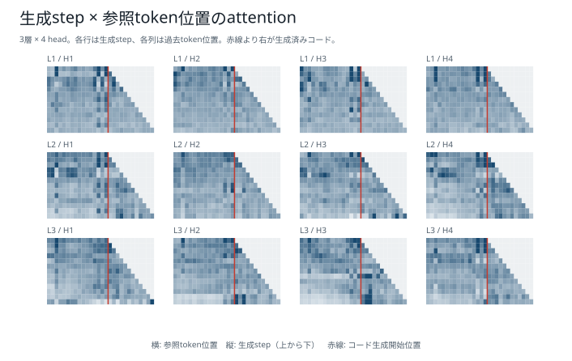
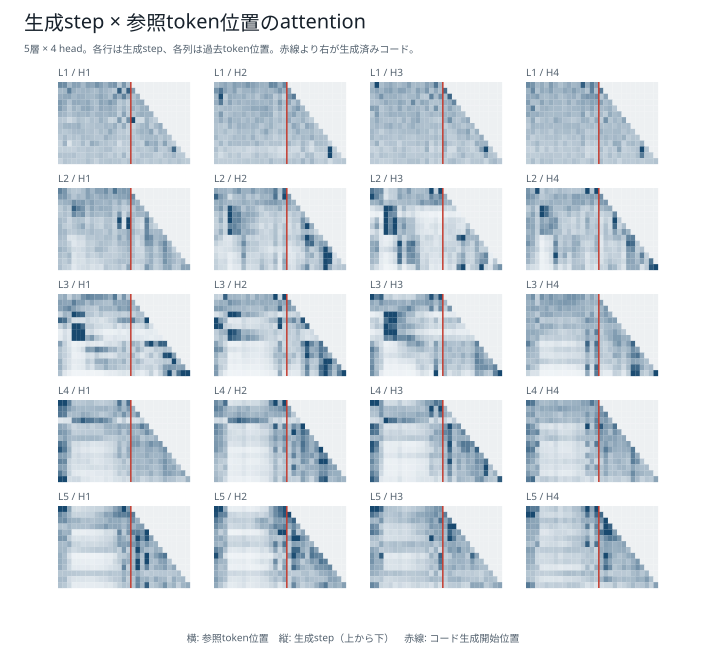
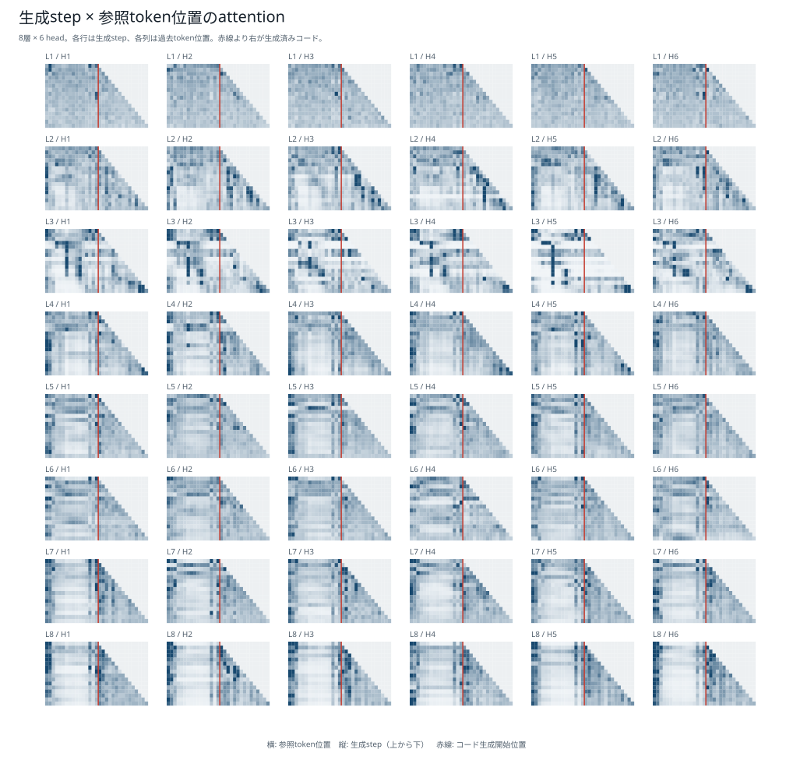

# 生成step×参照token位置：6モデル比較

[結果種類別一覧](README.md) / [総合比較レポート](../boku_nano_1epoch_attention_comparison.md)

「xsの各要素を絶対値にして降順に並べるsolve関数を書いてください。」という単一promptについて、各生成stepの最後のQueryから参照可能な全token位置へ向いたattentionを、層・head別に表示したヒートマップである。横軸は参照token位置、縦軸は生成stepで、小さな各パネルが1つの層・headに対応する。赤線はprompt末尾と生成コード開始の境界を示す。

復元したattentionは、`attention @ V`とモデル本体のfused attention出力を数値比較している。全モデルでfloat32の丸め誤差程度に一致した。ただし、これは単一promptの観察であり、24操作の平均ではない。

## 1M・既存BPE

## 1M・短いpiece版BPE

## 5M・既存BPE

## 5M・短いpiece版BPE

## 15M・既存BPE

## 15M・短いpiece版BPE

[結果種類別一覧へ戻る](README.md)
