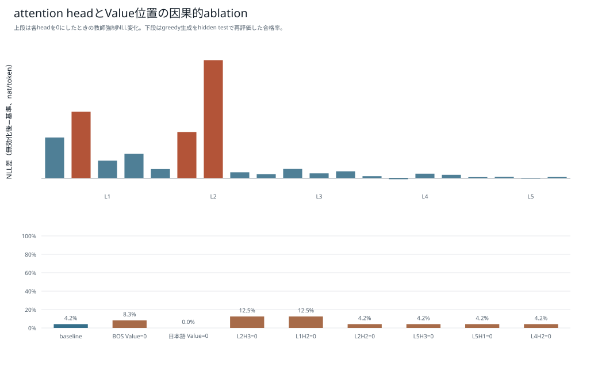
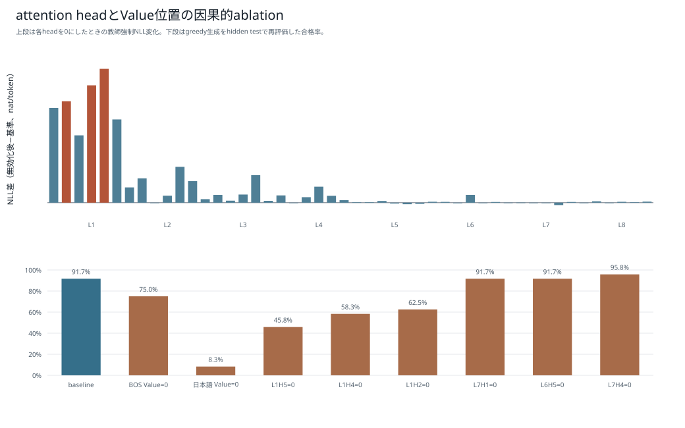

# 因果的ablation：6モデル比較

[結果種類別一覧](README.md) / [総合比較レポート](../boku_nano_1epoch_attention_comparison.md)

24操作に対し、head出力またはBOS・日本語指示位置のValueを無効化し、教師強制NLLと再生成後の機能合格数がどう変化したかを示す。ΔNLLは「無効化後NLL − 基準NLL」であり、正なら正解tokenの予測が悪化したことを表す。精度や失敗率ではない。

| モデル | NLL影響最大head | ΔNLL | 基準合格 | head無効化後 | 同じコード |
|---|---|---:|---:|---:|---:|
| 1M・既存BPE | L1H3 | +0.0881 | 3 / 24 | 0 / 24 | 2 / 24 |
| 1M・短いpiece | L1H2 | +0.2027 | 1 / 24 | 0 / 24 | 0 / 24 |
| 5M・既存BPE | L1H2 | +0.5550 | 22 / 24 | 3 / 24 | 0 / 24 |
| 5M・短いpiece | L1H1 | +0.0660 | 23 / 24 | 16 / 24 | 3 / 24 |
| 15M・既存BPE | L1H5 | +0.1386 | 22 / 24 | 11 / 24 | 7 / 24 |
| 15M・短いpiece | L3H4 | +0.0185 | 24 / 24 | 22 / 24 | 15 / 24 |

1Mは基準生成自体の合格数が少ないため、機能低下の解釈範囲が狭い。head単独のablation結果から、後段層全体の削除や複数headの同時pruningが安全だとは結論できない。

## 1M・既存BPE

## 1M・短いpiece版BPE

## 5M・既存BPE

## 5M・短いpiece版BPE

## 15M・既存BPE

## 15M・短いpiece版BPE

[結果種類別一覧へ戻る](README.md)
