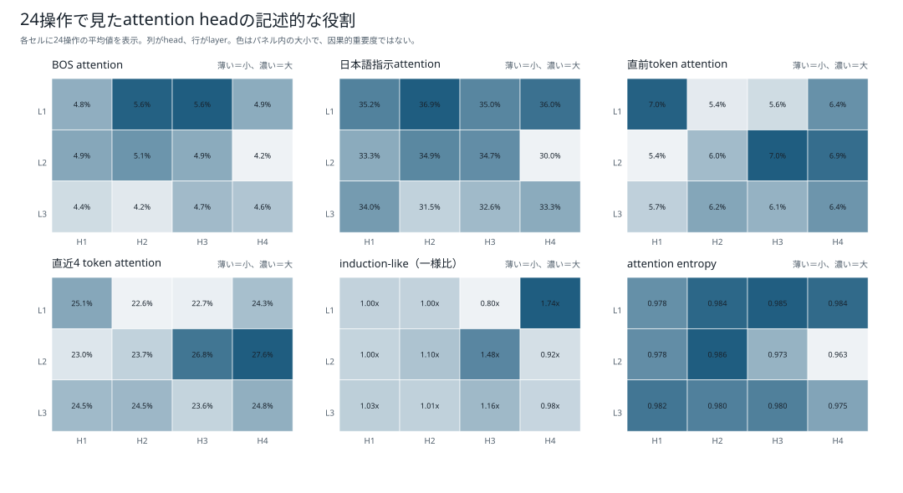
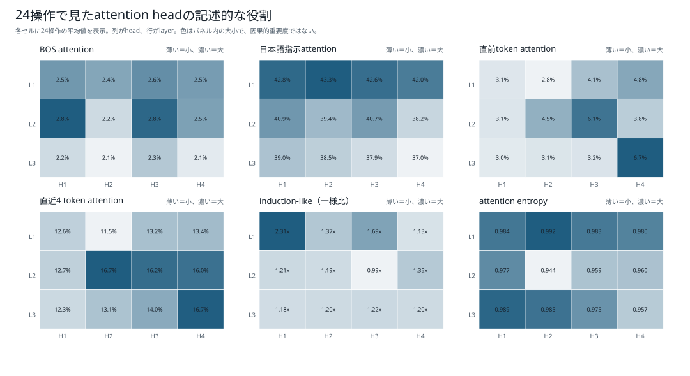
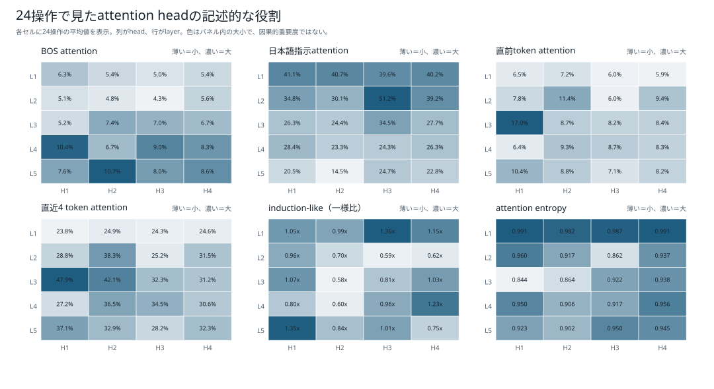
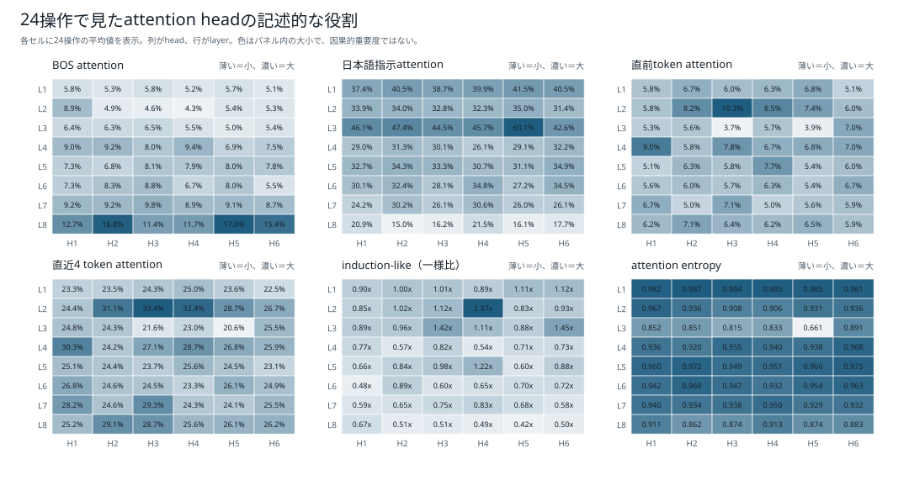

# head別の記述的役割：6モデル比較

[結果種類別一覧](README.md) / [総合比較レポート](../boku_nano_1epoch_attention_comparison.md)

24種類の単独操作を生成した全stepについて、各層・各headのattention weightを役割候補ごとに集計した図である。表示しているのはValueベクトルではなく、QueryとKeyから計算したattention weightの要約である。

図中のBOS、日本語指示、直前token、直近4 tokenは各領域へ向いたattentionの平均、induction-likeは過去の同一token直後への参照を一様分布の期待値で割った値、entropyはattentionの広がりを0〜1へ正規化した値である。高いattentionは役割仮説を作る手掛かりだが、重要性は因果的ablationで別に確かめる。

| モデル | 日本語attention最大head | attention | NLL影響最大head | ΔNLL |
|---|---|---:|---|---:|
| 1M・既存BPE | L1H2 | 29.09% | L1H3 | +0.0881 |
| 1M・短いpiece | L1H2 | 42.74% | L1H2 | +0.2027 |
| 5M・既存BPE | L2H3 | 38.77% | L1H2 | +0.5550 |
| 5M・短いpiece | L3H1 | 50.57% | L1H1 | +0.0660 |
| 15M・既存BPE | L3H5 | 61.43% | L1H5 | +0.1386 |
| 15M・短いpiece | L3H4 | 62.79% | L3H4 | +0.0185 |

## 1M・既存BPE

## 1M・短いpiece版BPE

## 5M・既存BPE

## 5M・短いpiece版BPE

## 15M・既存BPE

## 15M・短いpiece版BPE

[結果種類別一覧へ戻る](README.md)
