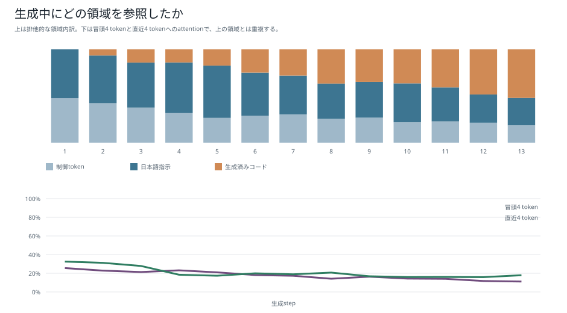
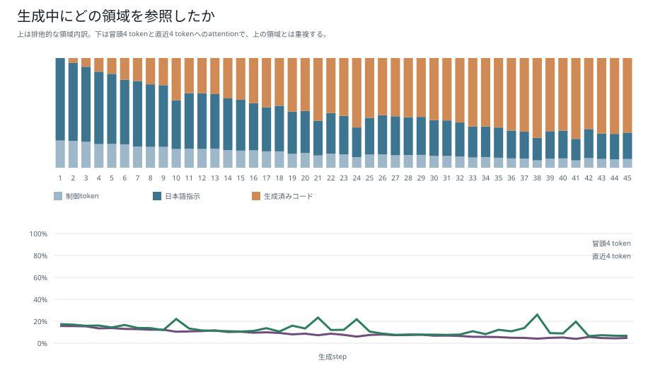
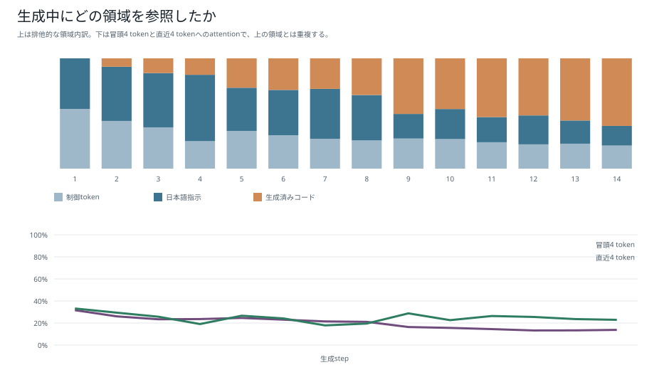
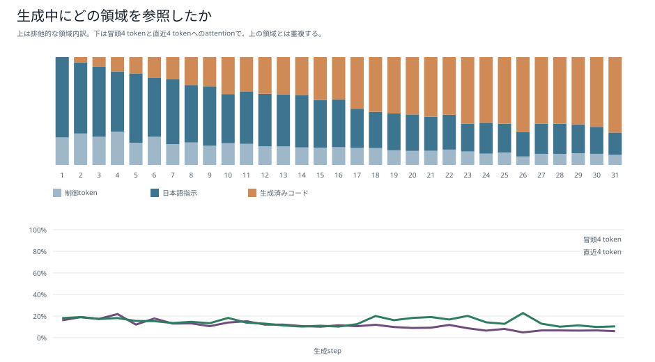
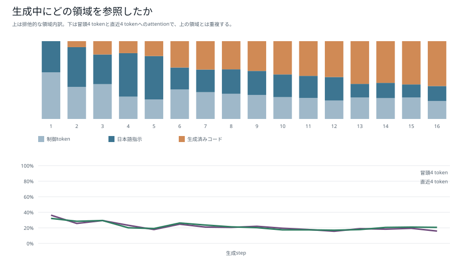
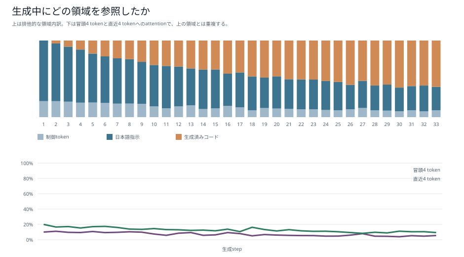

# 領域別attention：6モデル比較

[結果種類別一覧](README.md) / [総合比較レポート](../boku_nano_1epoch_attention_comparison.md)

単一promptの各生成stepで、attentionを制御token、日本語指示、生成済みコードの領域へ分け、全層・全headで平均した図である。コード生成が進むにつれて、参照可能になる生成済みコード領域が増える様子を確認できる。

領域ごとのtoken数が異なるため、attention総量だけで日本語理解の強弱を判断しない。一様分布比は、各stepの参照可能token数に対して日本語指示領域が占めるtoken数を補正した指標である。

| モデル | 日本語指示attention | 一様分布比 |
|---|---:|---:|
| 1M・既存BPE | 43.40% | 0.926倍 |
| 1M・短いpiece | 39.77% | 0.916倍 |
| 5M・既存BPE | 36.32% | 0.772倍 |
| 5M・短いpiece | 42.28% | 0.846倍 |
| 15M・既存BPE | 32.58% | 0.719倍 |
| 15M・短いpiece | 47.55% | 0.988倍 |

## 1M・既存BPE

## 1M・短いpiece版BPE

## 5M・既存BPE

## 5M・短いpiece版BPE

## 15M・既存BPE

## 15M・短いpiece版BPE

[結果種類別一覧へ戻る](README.md)
