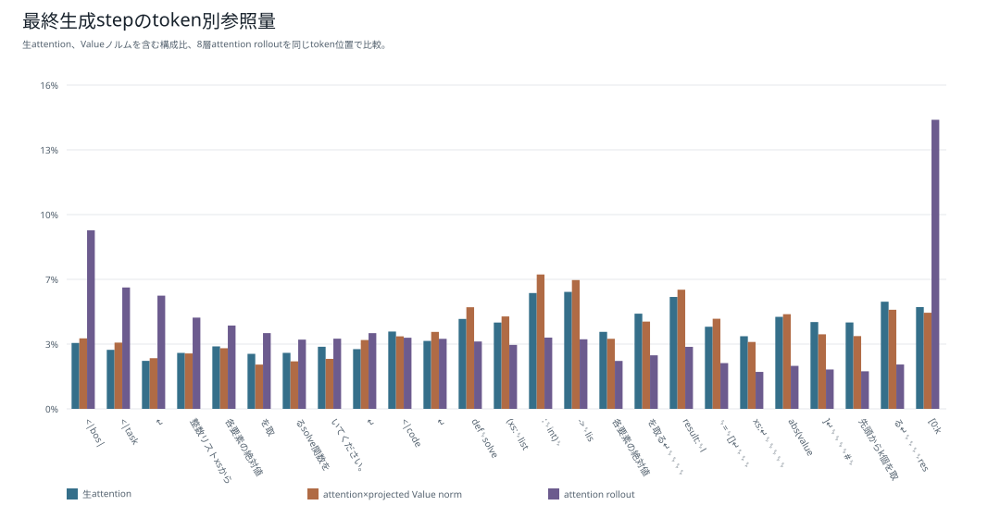
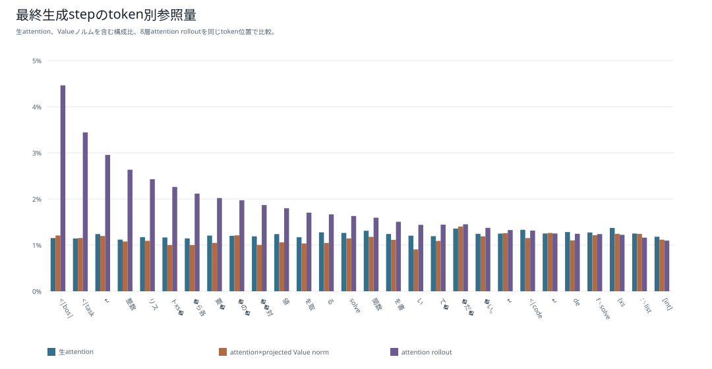
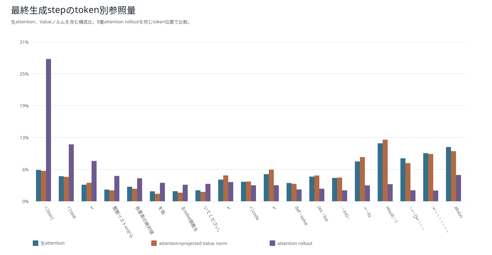
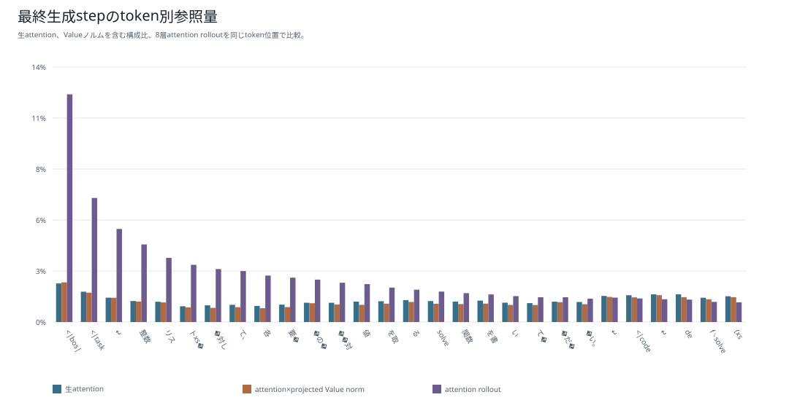
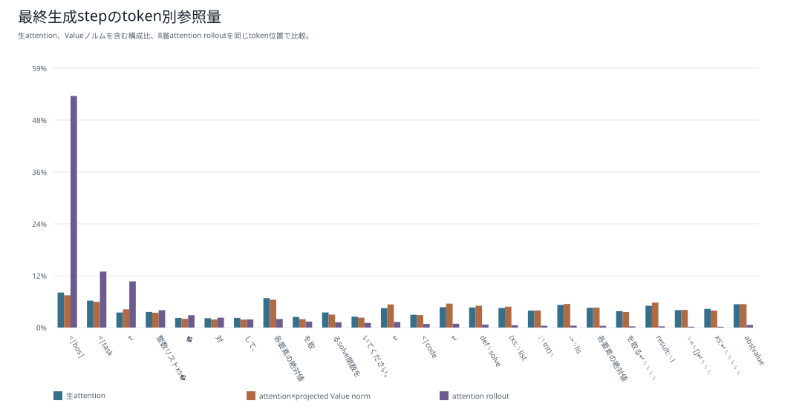
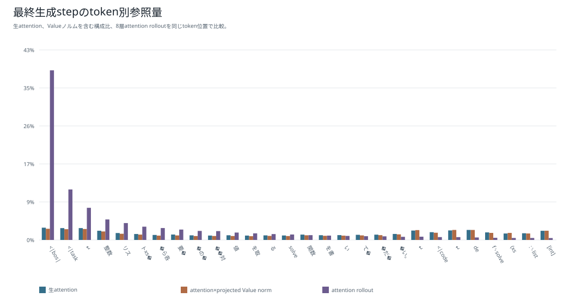

# attention rollout：6モデル比較

[結果種類別一覧](README.md) / [総合比較レポート](../boku_nano_1epoch_attention_comparison.md)

24操作について、残差を含むhead平均attentionを行正規化し、層を順に掛け合わせて、最終位置から入力位置へ至る参照経路を近似した図である。

rolloutは層をまたぐ情報経路の可視化であり、tokenの因果的重要度ではない。causal decoderでは初期tokenへ至る経路が多いため、層を重ねるほどBOSなどの冒頭位置へ偏りやすい。この図だけで「出力の根拠」を判断しない。

## 1M・既存BPE

## 1M・短いpiece版BPE

## 5M・既存BPE

## 5M・短いpiece版BPE

## 15M・既存BPE

## 15M・短いpiece版BPE

[結果種類別一覧へ戻る](README.md)
