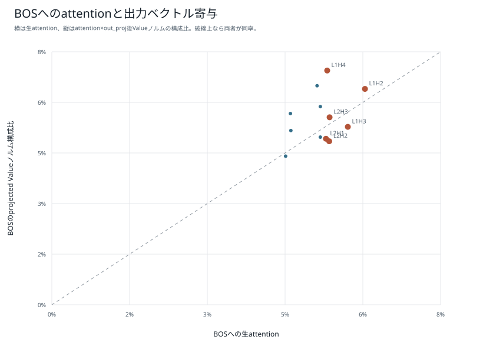
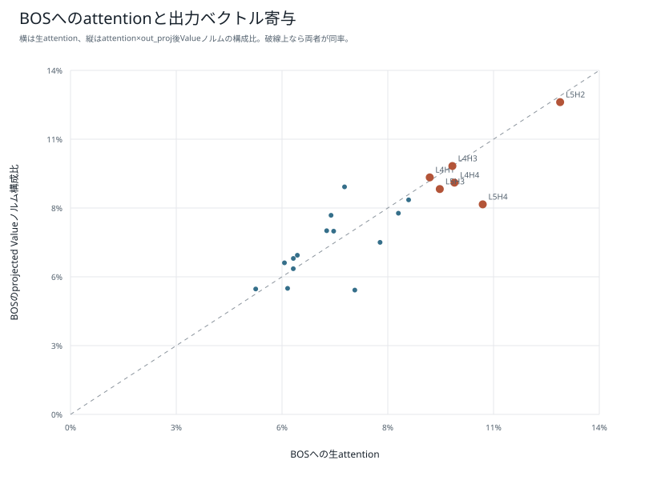
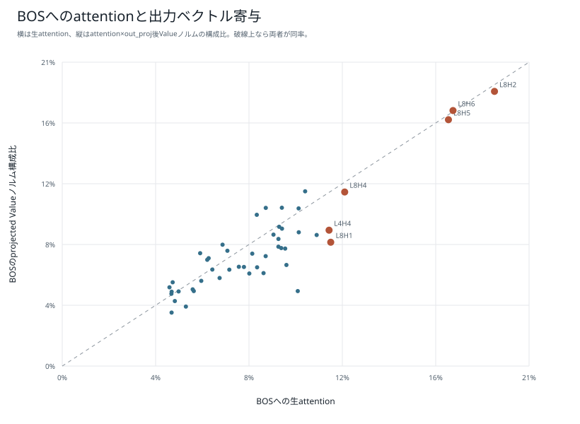

# BOS sinkとValueノルム：6モデル比較

[結果種類別一覧](README.md) / [総合比較レポート](../boku_nano_1epoch_attention_comparison.md)

24操作を通して、BOSへ向いた生attentionと、`attention × projected Value norm`がattention出力全体に占める構成比を層・head別に比較した図である。生attentionが大きくても、取り出すValueが小さければ実際に足し込まれるベクトル寄与は小さくなり得る。

この構成比も因果的重要度そのものではない。ベクトル同士の相殺、残差、FFN、後続層の処理を含まないため、BOSの必要性はValue位置ablationと機能テストを合わせて判断する。

## 1M・既存BPE

## 1M・短いpiece版BPE

## 5M・既存BPE

## 5M・短いpiece版BPE

## 15M・既存BPE

## 15M・短いpiece版BPE

[結果種類別一覧へ戻る](README.md)
