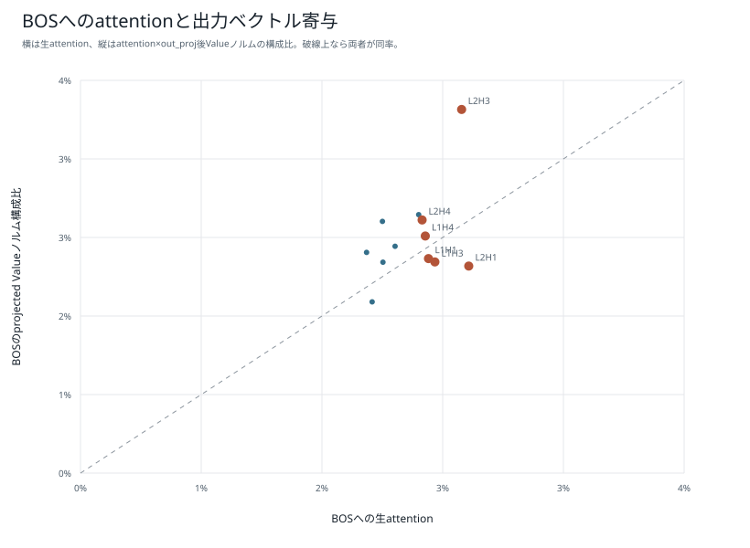
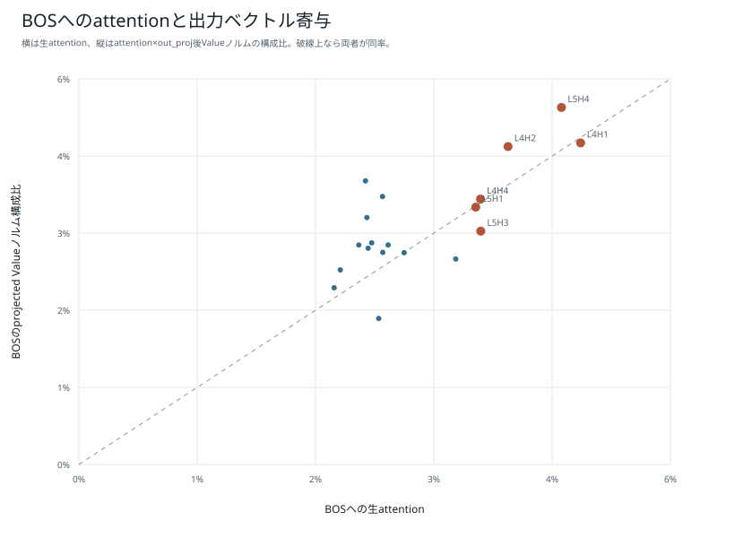
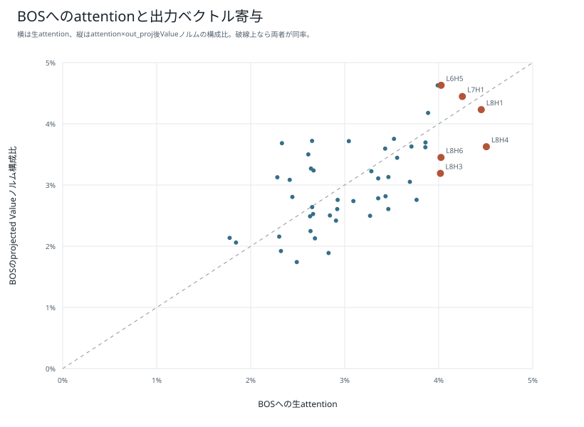

# 短いpiece版BPE：BOS sinkとValueノルム

[短いpiece版BPEの結果一覧](README.md)

BOSへの生attentionと`attention × projected Value norm`の構成比を比較する。後者も残差・FFN・後続層を含まないため、因果的重要度そのものではない。

## 1M・1epoch

## 5M・1epoch

## 15M・1epoch

