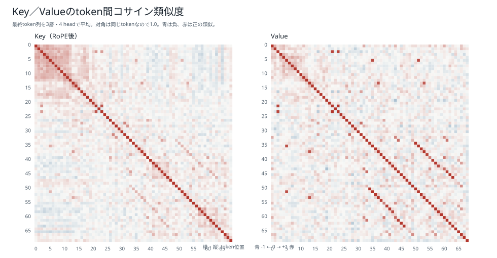
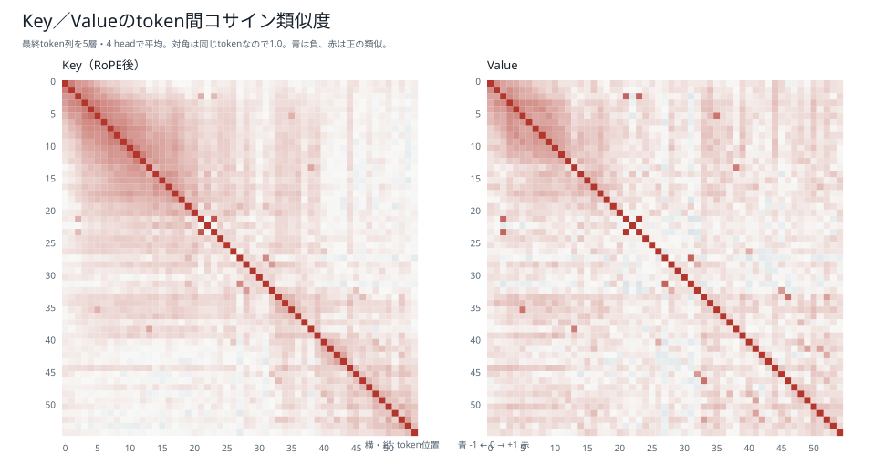
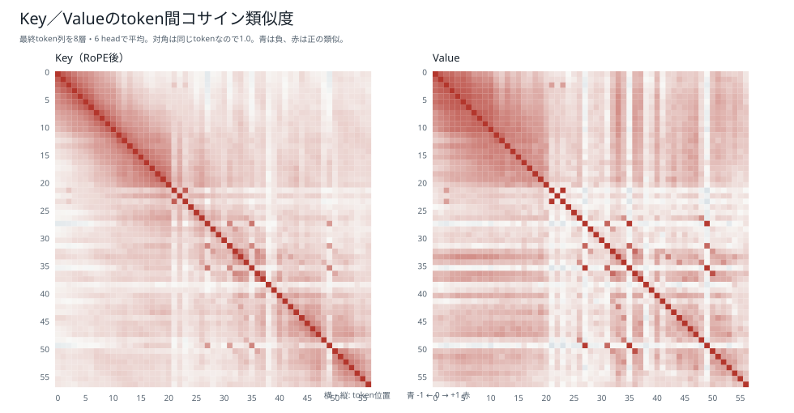

# K/Vのコサイン類似度：6モデル比較

[結果種類別一覧](README.md) / [総合比較レポート](../boku_nano_1epoch_attention_comparison.md)

単一promptについて、各token位置のKey同士、Value同士のコサイン類似度を比較した図である。値が1に近いほど、その層・head内で二つの位置の方向が似ていることを示す。

類似度はattention weightでも因果的重要度でもない。特にValueでは改行や反復コード断片が非常に似た表現になることがあり、高類似であることだけを根拠に片方を削除できるとは判断しない。

| モデル | Key最大非対角cos | Value最大非対角cos |
|---|---:|---:|
| 1M・既存BPE | 0.8672 | 0.9989 |
| 1M・短いpiece | 0.8287 | 0.9996 |
| 5M・既存BPE | 0.8028 | 0.9984 |
| 5M・短いpiece | 0.8328 | 0.9992 |
| 15M・既存BPE | 0.8216 | 0.9977 |
| 15M・短いpiece | 0.8152 | 0.9977 |

## 1M・既存BPE

## 1M・短いpiece版BPE

## 5M・既存BPE

## 5M・短いpiece版BPE

## 15M・既存BPE

## 15M・短いpiece版BPE

[結果種類別一覧へ戻る](README.md)
