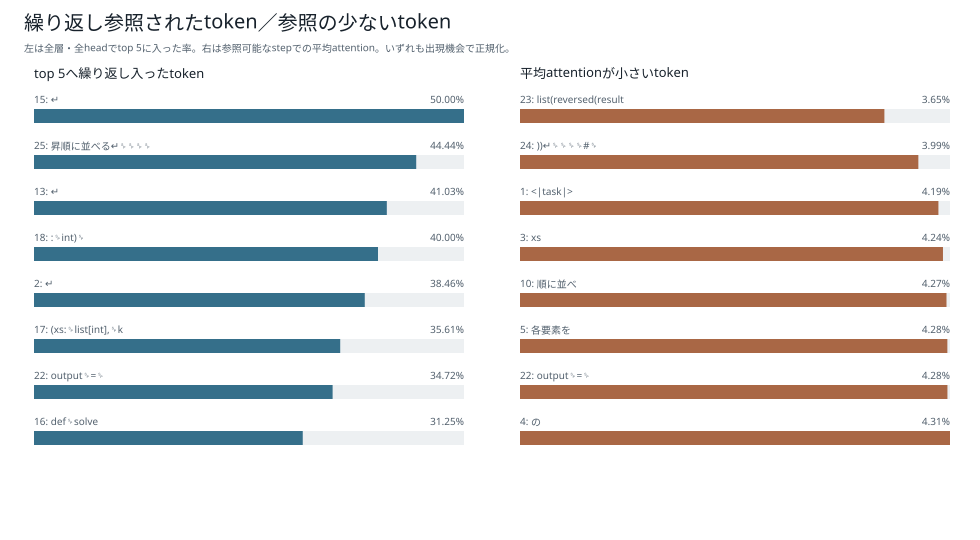
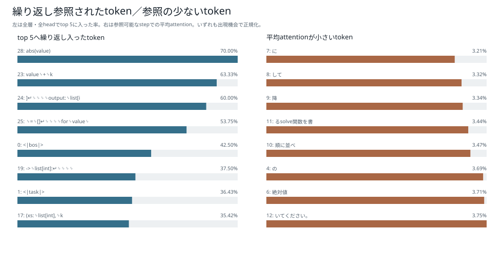
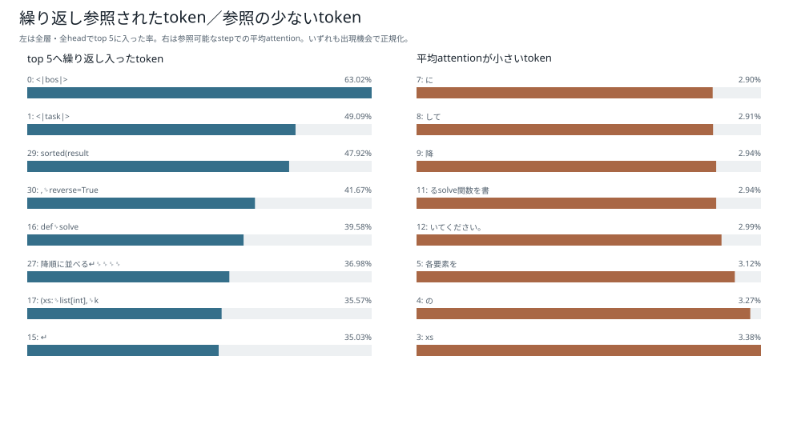

# token利用状況：6モデル比較

[結果種類別一覧](README.md) / [総合比較レポート](../boku_nano_1epoch_attention_comparison.md)

単一promptについて、生成step・層・headを通して繰り返し上位に参照されたtokenと、参照可能だったにもかかわらず平均attentionが小さかったtokenを要約した図である。

これはattention weightを全体集計した記述値であり、Valueベクトルや因果的重要度を表示したものではない。ある特定stepだけで操作選択に必要なtokenは、全step平均では低く見えることがあるため、低attentionだけを根拠にキャッシュから削除しない。

## 1M・既存BPE

## 1M・短いpiece版BPE

## 5M・既存BPE

## 5M・短いpiece版BPE

## 15M・既存BPE

## 15M・短いpiece版BPE

[結果種類別一覧へ戻る](README.md)
