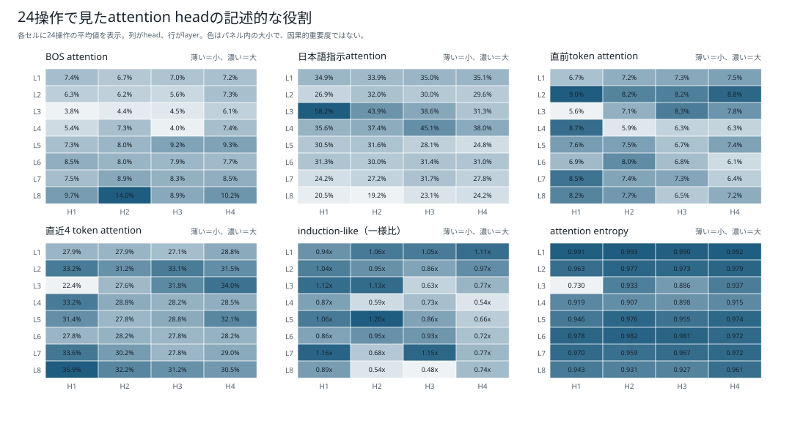
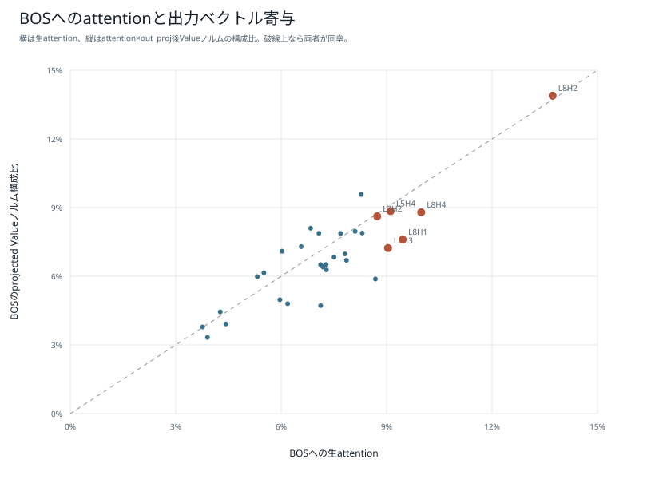
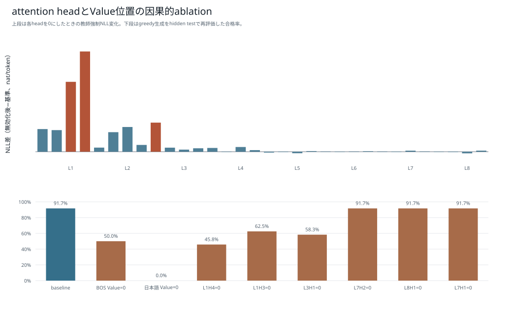
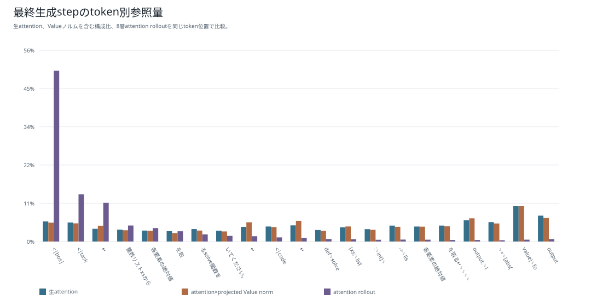
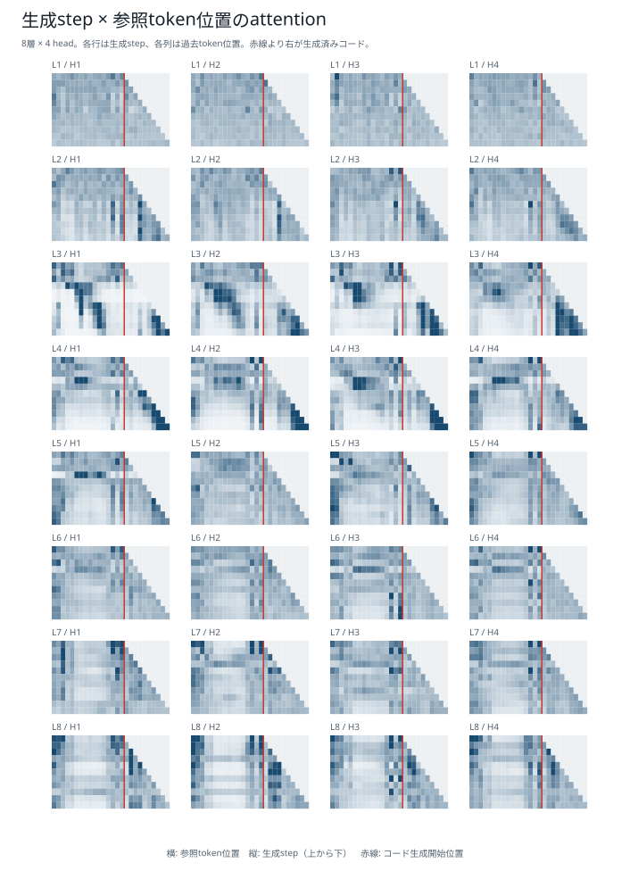
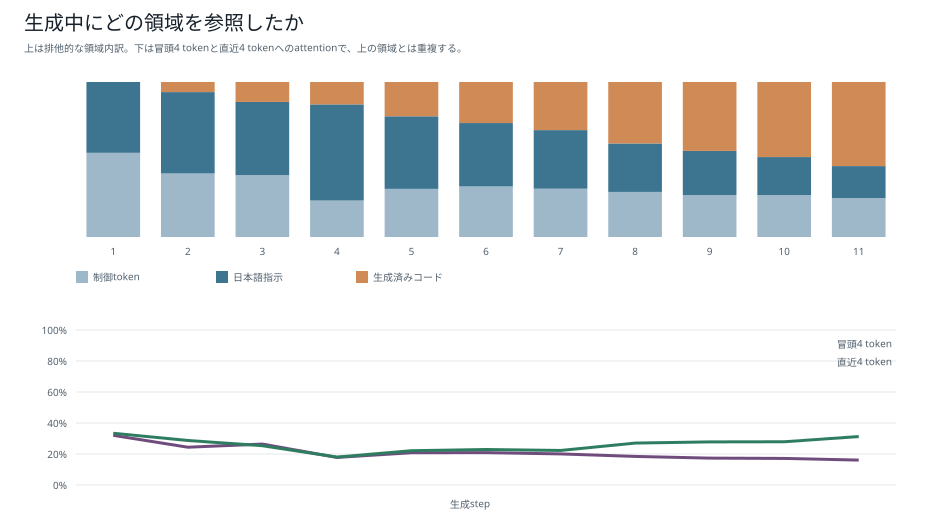
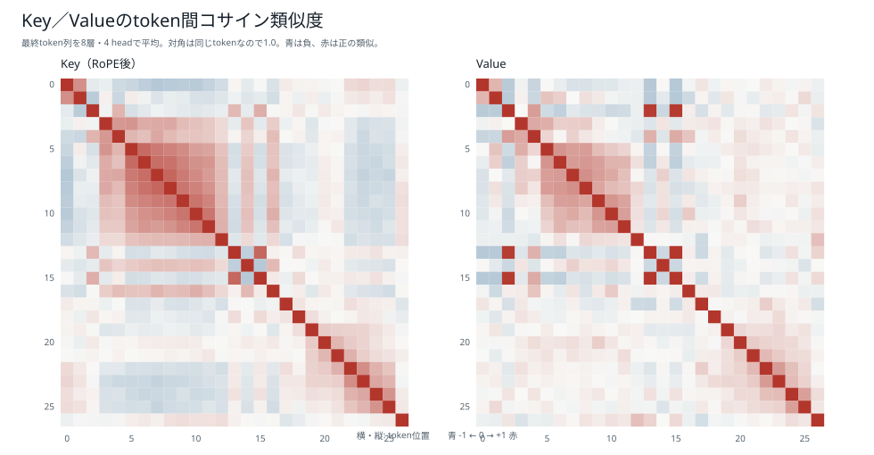
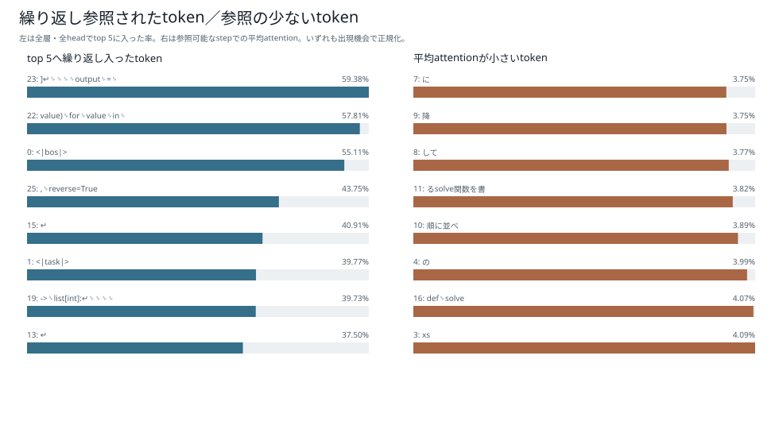

# 約9.5M・4 heads：attention可視化・診断

[5モデル比較へ戻る](../README.md)

構成: 幅256、8 layers、4 heads、head_dim=64、FFN 1024、9,441,536 parameters。

dev50: 29/50。24操作診断: 22/24。BOS Value=0: 12/24、日本語Value=0: 0/24。

ΔNLL最大head: L1H4（+0.245706）。このheadを無効化して再生成した合格数は11/24。

## 単一プロンプトの生成

xsの各要素を絶対値にして降順に並べるsolve関数を書いてください。

```python
def solve(xs: list[int], k: int) -> list[int]:
    result = [abs(value) for value in xs]
    output = sorted(result, reverse=True)
    return output
```

この単一プロンプトのコードは可視化対象であり、ここでは機能正解を保証しない。機能評価は別の24操作診断・dev50を参照。

## 図

### head別の参照傾向

24操作の生成位置を集計。日本語指示・BOS・直近token・entropy等を比較する。記述的傾向であり、役割を断定する分類ではない。



### BOS attentionとValue寄与

横軸はBOSへの生attention、縦軸はattentionで重み付けしたprojected Valueノルムの構成比。方向間の相殺を表現しないため、最終出力への厳密な寄与率ではない。



### head・Valueの無効化

上段は各head無効化時の自己生成列に対するΔNLL。下段は選んだheadおよびBOS・日本語位置Valueを0化して再生成した24操作の合格率。



### attention rollout

固定操作の生成列でhead平均と残差を加えたrollout、生attention、projected Valueノルムを比較。生成列・表示query位置はモデルごとに異なり、近似的な情報経路として読む。



### 生成step×参照位置

共通の単一プロンプトに対する全層・全headのattention。横軸はtoken位置、縦軸は生成step。生成内容・長さはモデルごとに異なる。



### 領域別attention

単一プロンプトで日本語・制御token・生成済みコードへのattentionを集計。領域のtoken数にも依存する。



### K/Vコサイン類似度

単一プロンプトで得たK/Vのtoken間類似度。類似しているだけで同じ機能や因果的重要度を意味しない。



### tokenの参照頻度

単一プロンプトで繰り返し参照された位置と参照が少ない位置を表示。参照が少ないことだけで不要とは判断しない。



## 24操作の結果

| 操作ID | 指示 | 合否 | 診断 |
| --- | --- | --- | --- |
| atomic-000001 | 整数リストxsから偶数だけを残すsolve関数を書いてください。 | ○ |  |
| atomic-000002 | 整数リストxsから奇数だけを残すsolve関数を書いてください。 | ○ |  |
| atomic-000003 | 整数リストxsと整数kを受け取り、kより大きい値だけを残すsolve関数を書いてください。 | ○ |  |
| atomic-000004 | 整数リストxsと整数kを受け取り、k以上の値だけを残すsolve関数を書いてください。 | ○ |  |
| atomic-000005 | 整数リストxsと整数kを受け取り、kより小さい値だけを残すsolve関数を書いてください。 | ○ |  |
| atomic-000006 | 整数リストxsと整数kを受け取り、k以下の値だけを残すsolve関数を書いてください。 | ○ |  |
| atomic-000007 | 整数リストxsと整数kを受け取り、kの倍数だけを残すsolve関数を書いてください。 | ○ |  |
| atomic-000008 | 整数リストxsから正の値だけを残すsolve関数を書いてください。 | ○ |  |
| atomic-000009 | 整数リストxsから負の値だけを残すsolve関数を書いてください。 | ○ |  |
| atomic-000010 | 整数リストxsからゼロだけを残すsolve関数を書いてください。 | ○ |  |
| atomic-000011 | 整数リストxsと整数kを受け取り、各要素にkを加えるsolve関数を書いてください。 | ○ |  |
| atomic-000012 | 整数リストxsと整数kを受け取り、各要素からkを引くsolve関数を書いてください。 | ○ |  |
| atomic-000013 | 整数リストxsと整数kを受け取り、各要素にkを掛けるsolve関数を書いてください。 | ○ |  |
| atomic-000014 | 整数リストxsから各要素を2倍するsolve関数を書いてください。 | ○ |  |
| atomic-000015 | 整数リストxsから各要素を3倍するsolve関数を書いてください。 | ○ |  |
| atomic-000016 | 整数リストxsから各要素の符号を反転するsolve関数を書いてください。 | ○ |  |
| atomic-000017 | 整数リストxsから各要素の絶対値を取るsolve関数を書いてください。 | × | UnboundLocalError: cannot access local variable 'output' where it is not associated with a value |
| atomic-000018 | 整数リストxsから各要素を二乗するsolve関数を書いてください。 | ○ |  |
| atomic-000019 | 整数リストxsから値を昇順に並べるsolve関数を書いてください。 | ○ |  |
| atomic-000020 | 整数リストxsから値を降順に並べるsolve関数を書いてください。 | ○ |  |
| atomic-000021 | 整数リストxsから現在の要素順を反転するsolve関数を書いてください。 | × | 不一致: xs=[1], k=1, expected=[1], actual=[3] |
| atomic-000022 | 整数リストxsと整数kを受け取り、先頭からk個を取るsolve関数を書いてください。 | ○ |  |
| atomic-000023 | 整数リストxsと整数kを受け取り、末尾からk個を取るsolve関数を書いてください。 | ○ |  |
| atomic-000024 | 整数リストxsから先頭から1個おきに取るsolve関数を書いてください。 | ○ |  |

## 再現情報

[全headの数値・生成コード・介入結果](interpretability.json)、[単一プロンプトのQ/K/V解析](attention.json)、[重み・tokenizer・ソースhashと実行コマンド](manifest.json)。
