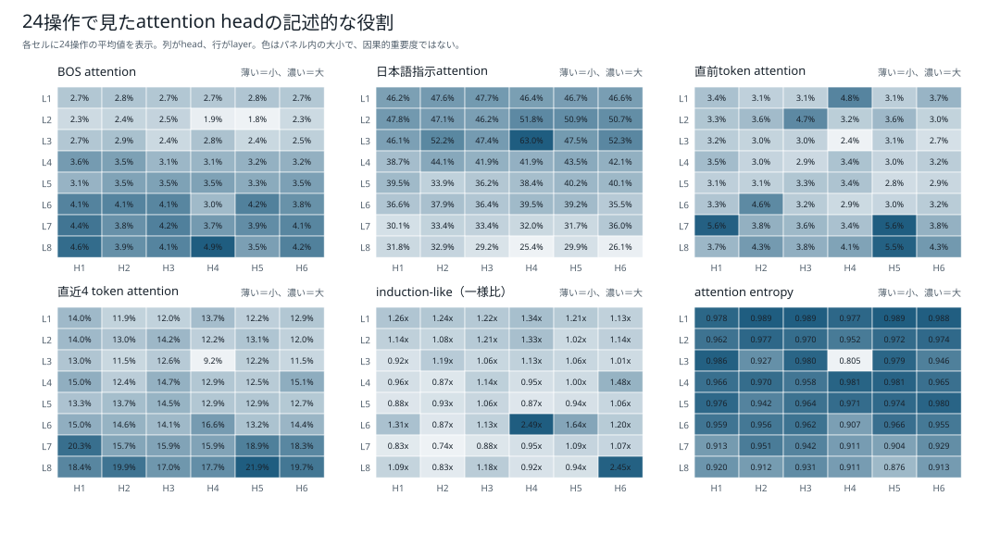
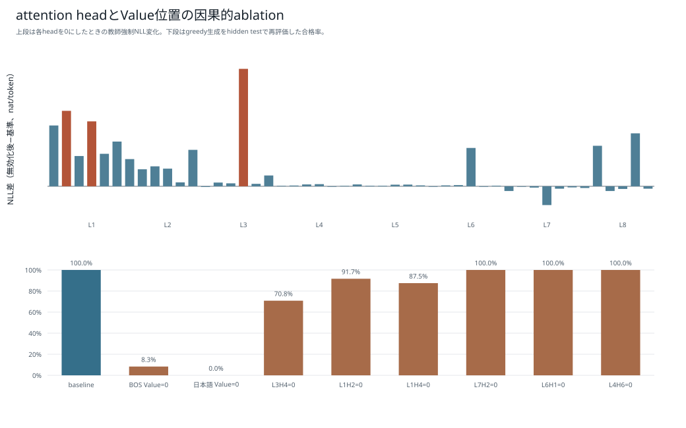

# 注意

この文書は、24操作すべてを「整数リストxsに対して、{操作}solve関数を書いてください。」へ埋め込んだ旧診断の記録である。現在の[学習時準拠文型による再評価](boku_nano_1epoch_attention_comparison.md)とは分けて保存する。現在の6モデルの図は[結果種類別一覧](attention_1epoch_by_result/README.md)で本文へ直接表示している。

# Boku Nano 1epochモデルのattention可視化・因果評価（旧「に対して」文型）

## 結論

1M・5M・15Mの各1epochモデルについて、既存BPE（`min_frequency=5`、`max_token_length=24`）と短いpiece用BPE（`min_frequency=2`、`max_token_length=8`）の計6構成を同じ方法で解析した。各モデルで24種類の単独操作をgreedy生成し、attentionの役割候補、BOSへの集中、Valueノルム、attention rollout、head単位とtoken位置単位の因果的ablationを評価した。

| モデル | パラメータ数 | 層×head | 基準合格 | 教師強制NLL | 日本語Value=0 | BOS Value=0 |
|---|---:|---:|---:|---:|---:|---:|
| 1M・既存BPE | 1,016,704 | 3×4 | 1 / 24 | 1.1979 | 0 / 24 | 1 / 24 |
| 1M・短いpiece | 1,016,704 | 3×4 | 0 / 24 | 0.4307 | 0 / 24 | 1 / 24 |
| 5M・既存BPE | 5,065,472 | 5×4 | 1 / 24 | 0.5240 | 0 / 24 | 2 / 24 |
| 5M・短いpiece | 5,065,472 | 5×4 | 10 / 24 | 0.2428 | 0 / 24 | 0 / 24 |
| 15M・既存BPE | 15,735,168 | 8×6 | 21 / 24 | 0.3747 | 0 / 24 | 13 / 24 |
| 15M・短いpiece | 15,735,168 | 8×6 | 24 / 24 | 0.1149 | 0 / 24 | 2 / 24 |

主な観察は次のとおりである。

- 24操作診断ではモデル規模と基準合格数がおおむね対応し、15Mは既存BPEで21件、短いpiece版で24件すべてに合格した。
- 日本語指示位置のValueを全層で0にすると、6モデルすべて0件になった。ただし基準が0〜1件の1Mと5M既存BPEでは低下幅を解釈できない。基準性能がある5M短いpiece版と15Mの2構成では、日本語指示のValueが操作選択に必要であることを強く支持する。
- 15MではBOS Valueを消すと、既存BPEは21件から13件、短いpiece版は24件から2件へ低下した。BOSへのattentionは単なる無意味なsinkとはいえない。
- 全head内で「日本語指示へのattention」とhead無効化時のNLL増加を比べると、Spearman相関は6構成すべて正で、0.503〜0.824だった。ただし、attention値だけで個々の出力の因果的重要度を断定はできない。
- 5M既存BPEでは最大NLL影響headを消すと基準1件から3件へ合格が増えた。教師強制NLLの悪化と機能合格の悪化は常に一致しない。

## 評価条件

| 項目 | 条件 |
|---|---|
| 対象 | 1M・5M・15M、各1epoch、2トークナイザー、計6モデル |
| prompt | 24種類の単独操作を同じ外形の日本語指示にした固定診断 |
| decoding | greedy、最大64 token |
| 機能判定 | 各promptにつき固定33ケース。構文、安全AST、signature、出力値を検証 |
| head役割 | BOS、日本語指示、制御token、生成済みコード、直前token、直近4 token、copy-like、induction-like、entropy |
| head ablation | attention出力の対象headを`out_proj`直前で0化 |
| 位置ablation | 対象位置のKとattention weightは保ち、全層でValueだけを0化 |
| 因果指標 | 教師強制NLL差、KL divergence、argmax変化率、再生成後の機能合格数 |
| 乱数seed | 20260930 |

24操作の因果評価は[attention解釈性解析スクリプト](../../scripts/model/analyze_boku_nano_attention_interpretability.py)、単一promptの復元検証は[Query・attention解析スクリプト](../../scripts/model/analyze_boku_nano_attention.py)にある。今回、モデル・トークナイザー・図・JSONの保存先を引数で指定できるようにし、1Mの3層×4head、5Mの5層×4head、15Mの8層×6headを同じコードで処理した。

この24操作診断は、既存報告書の固定84,550件評価とは別物である。固定評価は主に2・3操作を含むが、この診断はheadの比較を目的に単独操作だけを統一表現で問う。したがって、ここでの合格数を通常評価の合格率として扱わない。

## 基準生成とattentionの全head平均

| モデル | 平均prompt token | 平均生成token | 日本語指示attention | BOS attention | 生成済みコードattention | 直近4 token | entropy |
|---|---:|---:|---:|---:|---:|---:|---:|
| 1M・既存BPE | 13.38 | 14.08 | 33.94% | 4.82% | 36.70% | 24.42% | 0.9790 |
| 1M・短いpiece | 23.21 | 37.25 | 40.19% | 2.41% | 46.30% | 14.03% | 0.9739 |
| 5M・既存BPE | 13.38 | 10.50 | 30.73% | 6.87% | 36.29% | 31.71% | 0.9322 |
| 5M・短いpiece | 23.21 | 28.63 | 42.32% | 3.22% | 41.30% | 14.92% | 0.9640 |
| 15M・既存BPE | 13.38 | 10.92 | 32.44% | 7.96% | 32.63% | 25.74% | 0.9264 |
| 15M・短いpiece | 23.21 | 30.42 | 40.87% | 3.29% | 41.72% | 14.48% | 0.9518 |

attentionは24操作の生成位置を集計し、全層・全headで平均した。短いpiece版は日本語指示がより多くのtokenに分割されるため、日本語領域のattention総量が高く、BOS 1 tokenの比率が低くなりやすい。領域内のtoken数が異なるので、この表だけからトークナイザーの優劣や日本語理解の強さを結論づけない。entropyは参照可能token数で正規化した0〜1の値で、大きいほどattentionが平坦である。

また、教師強制NLLはtoken単位であり、分割単位が異なる2トークナイザー間では直接比較しない。同じモデル内のablation前後差に使う。

## 日本語指示を参照するhead

| モデル | 日本語attention最大head | attention | NLL影響最大head | ΔNLL | argmax変化率 | 日本語attentionとΔNLLの相関（Pearson / Spearman） |
|---|---|---:|---|---:|---:|---:|
| 1M・既存BPE | L1H2 | 36.89% | L1H3 | +0.1238 | 16.57% | 0.374 / 0.503 |
| 1M・短いpiece | L1H2 | 43.35% | L1H2 | +0.2507 | 15.21% | 0.778 / 0.811 |
| 5M・既存BPE | L2H3 | 51.15% | L2H3 | +0.5323 | 18.65% | 0.742 / 0.824 |
| 5M・短いpiece | L3H1 | 51.15% | L1H4 | +0.0729 | 5.82% | 0.621 / 0.674 |
| 15M・既存BPE | L3H5 | 60.15% | L1H5 | +0.2584 | 12.21% | 0.390 / 0.615 |
| 15M・短いpiece | L3H4 | 62.95% | L3H4 | +0.0366 | 2.33% | 0.522 / 0.684 |

1M短いpiece、5M既存BPE、15M短いpieceでは、日本語attention最大headとNLL影響最大headが一致した。その他の3構成では一致しないため、「日本語を強く見るhead」が常に最重要headとは限らない。相関はhead集合全体の傾向であり、個別headの因果性はablationで判断する。

## 因果的ablation

### Value位置の除去

| モデル | 基準 | BOS Value=0 | 基準と同じコード | 日本語Value=0 | 基準と同じコード |
|---|---:|---:|---:|---:|---:|
| 1M・既存BPE | 1 / 24 | 1 / 24 | 3 / 24 | 0 / 24 | 3 / 24 |
| 1M・短いpiece | 0 / 24 | 1 / 24 | 0 / 24 | 0 / 24 | 0 / 24 |
| 5M・既存BPE | 1 / 24 | 2 / 24 | 0 / 24 | 0 / 24 | 0 / 24 |
| 5M・短いpiece | 10 / 24 | 0 / 24 | 0 / 24 | 0 / 24 | 0 / 24 |
| 15M・既存BPE | 21 / 24 | 13 / 24 | 5 / 24 | 0 / 24 | 0 / 24 |
| 15M・短いpiece | 24 / 24 | 2 / 24 | 0 / 24 | 0 / 24 | 0 / 24 |

日本語Value=0は日本語token自体を削除する実験ではない。日本語位置のKeyは残るため、attention weightは維持される一方、そこから取り出すValueだけが0になる。この条件で高性能3構成がすべて0件まで落ちたことは、日本語指示へのattentionが見かけだけではなく、Value経由で操作選択へ寄与していることを示す。

BOS Valueの影響はモデルにより異なる。生attentionと`attention × projected Value norm`も同一ではないため、BOS attentionが大きいことだけを根拠にsinkまたは不要tokenとは判断しない。

### NLL影響最大headの除去

| モデル | 対象head | ΔNLL | 基準合格 | 無効化後合格 | 同じコード |
|---|---|---:|---:|---:|---:|
| 1M・既存BPE | L1H3 | +0.1238 | 1 / 24 | 0 / 24 | 0 / 24 |
| 1M・短いpiece | L1H2 | +0.2507 | 0 / 24 | 0 / 24 | 0 / 24 |
| 5M・既存BPE | L2H3 | +0.5323 | 1 / 24 | 3 / 24 | 0 / 24 |
| 5M・短いpiece | L1H4 | +0.0729 | 10 / 24 | 7 / 24 | 3 / 24 |
| 15M・既存BPE | L1H5 | +0.2584 | 21 / 24 | 12 / 24 | 3 / 24 |
| 15M・短いpiece | L3H4 | +0.0366 | 24 / 24 | 17 / 24 | 11 / 24 |

NLL影響最大headは、15M既存BPEで9件、15M短いpiece版で7件の機能合格を失わせた。一方、5M既存BPEではNLLが悪化しても合格が1件から3件へ増えた。教師強制NLL、token列一致、機能的正しさは別の指標として読む必要がある。

低NLL影響headでも生成tokenが完全に不変とは限らない。たとえば15M短いpiece版のL7H2はΔNLLが-0.000037で、24件中23件が同じコード、全24件が機能合格だった。これは単独の診断では低影響だったことを示すだけで、複数headの同時削除や未知promptに対する安全なpruningを保証しない。

## 単一promptでのattention復元検証

既存の可視化例と同じ「xsの各要素を絶対値にして降順に並べるsolve関数を書いてください。」を使い、生成stepごとの最後のQueryと全Keyから `softmax(QK^T / sqrt(head_dim))` を再計算した。復元した `attention @ V` を、モデル本体のfused attentionが `out_proj` へ渡す直前の出力と比較した。

| モデル | prompt token | 生成token | 行和範囲 | 最大絶対誤差 | 最小cos類似度 |
|---|---:|---:|---:|---:|---:|
| 1M・既存BPE | 16 | 13 | 0.99999982〜1.00000012 | 1.2 × 10^-7 | 0.99999988 |
| 1M・短いpiece | 24 | 45 | 0.99999988〜1.00000024 | 2.4 × 10^-7 | 0.99999982 |
| 5M・既存BPE | 16 | 14 | 0.99999982〜1.00000024 | 1.8 × 10^-7 | 0.99999988 |
| 5M・短いpiece | 24 | 31 | 0.99999976〜1.00000024 | 3.0 × 10^-7 | 0.99999976 |
| 15M・既存BPE | 16 | 16 | 0.99999976〜1.00000024 | 8.6 × 10^-7 | 0.99999982 |
| 15M・短いpiece | 24 | 33 | 0.99999976〜1.00000024 | 3.6 × 10^-7 | 0.99999982 |

全構成で行和が1と整合し、さらにfused attention出力もfloat32の丸め誤差程度で再現した。したがって、保存したheatmapは少なくともこのCPU推論でモデル本体のattention計算と数値的に一致している。

### 単一promptの生成結果

生成コードは、24操作診断と同じ33ケースおよび「絶対値化→降順化」の意味ASTで機能判定した。

| モデル | 判定 | 主な失敗理由 |
|---|---|---|
| 1M・既存BPE | 不合格 | 代入前の `result` を参照し、実行時例外 |
| 1M・短いpiece | 不合格 | 反復中のlistへ追加し続け、timeout |
| 5M・既存BPE | 不合格 | `abs(value + k)` となり、要求と意味不一致 |
| 5M・短いpiece | 不合格 | 絶対値・降順ではなく二乗を生成 |
| 15M・既存BPE | **合格** | 33 / 33ケースで期待値と一致 |
| 15M・短いpiece | 不合格 | `value * 3result` を生成し、構文不正 |

15M短いpiece版は24操作の統一診断では24 / 24だったが、この表現では構文不正になった。モデル規模だけでなく、指示表現とトークナイザーによって生成が変わるため、1 promptのheatmapをモデル全体の能力説明には使わない。

### 領域attentionとK/V類似度

| モデル | 日本語指示attention | 一様分布比 | Key最大非対角cos | Value最大非対角cos |
|---|---:|---:|---:|---:|
| 1M・既存BPE | 43.40% | 0.926倍 | 0.8672 | 0.9989 |
| 1M・短いpiece | 39.77% | 0.916倍 | 0.8287 | 0.9996 |
| 5M・既存BPE | 36.32% | 0.772倍 | 0.8028 | 0.9984 |
| 5M・短いpiece | 42.28% | 0.846倍 | 0.8328 | 0.9992 |
| 15M・既存BPE | 32.58% | 0.719倍 | 0.8216 | 0.9977 |
| 15M・短いpiece | 47.55% | 0.988倍 | 0.8152 | 0.9977 |

一様分布比は、指示領域のtoken数と各生成stepの参照可能token数を補正した値である。全構成で1未満だったため、この1 promptでは日本語指示領域への総attentionはtoken数比例の一様分布より弱い。Value最大非対角cosはすべて0.997以上だが、高類似の位置は改行や反復するコード断片を含む。類似度が高いこと自体はtokenの重要度を意味しない。

詳細値と図は次のとおりである。

| モデル | step×token | 領域比率 | K/V類似度 | token利用 | 全数値JSON |
|---|---|---|---|---|---|
| 1M・既存BPE | [SVG](attention_1epoch/boku_nano_1m_bpe_2048_minfreq5_maxlen24_1epoch/figures/attention_by_layer_head.svg) | [SVG](attention_1epoch/boku_nano_1m_bpe_2048_minfreq5_maxlen24_1epoch/figures/attention_regions.svg) | [SVG](attention_1epoch/boku_nano_1m_bpe_2048_minfreq5_maxlen24_1epoch/figures/kv_cosine_similarity.svg) | [SVG](attention_1epoch/boku_nano_1m_bpe_2048_minfreq5_maxlen24_1epoch/figures/token_utilization.svg) | [JSON](attention_1epoch/boku_nano_1m_bpe_2048_minfreq5_maxlen24_1epoch/detail_analysis.json) |
| 1M・短いpiece | [SVG](attention_1epoch/boku_nano_1m_bpe_2048_minfreq2_maxlen8_1epoch/figures/attention_by_layer_head.svg) | [SVG](attention_1epoch/boku_nano_1m_bpe_2048_minfreq2_maxlen8_1epoch/figures/attention_regions.svg) | [SVG](attention_1epoch/boku_nano_1m_bpe_2048_minfreq2_maxlen8_1epoch/figures/kv_cosine_similarity.svg) | [SVG](attention_1epoch/boku_nano_1m_bpe_2048_minfreq2_maxlen8_1epoch/figures/token_utilization.svg) | [JSON](attention_1epoch/boku_nano_1m_bpe_2048_minfreq2_maxlen8_1epoch/detail_analysis.json) |
| 5M・既存BPE | [SVG](attention_1epoch/boku_nano_5m_bpe_2048_minfreq5_maxlen24_1epoch/figures/attention_by_layer_head.svg) | [SVG](attention_1epoch/boku_nano_5m_bpe_2048_minfreq5_maxlen24_1epoch/figures/attention_regions.svg) | [SVG](attention_1epoch/boku_nano_5m_bpe_2048_minfreq5_maxlen24_1epoch/figures/kv_cosine_similarity.svg) | [SVG](attention_1epoch/boku_nano_5m_bpe_2048_minfreq5_maxlen24_1epoch/figures/token_utilization.svg) | [JSON](attention_1epoch/boku_nano_5m_bpe_2048_minfreq5_maxlen24_1epoch/detail_analysis.json) |
| 5M・短いpiece | [SVG](attention_1epoch/boku_nano_5m_bpe_2048_minfreq2_maxlen8_1epoch/figures/attention_by_layer_head.svg) | [SVG](attention_1epoch/boku_nano_5m_bpe_2048_minfreq2_maxlen8_1epoch/figures/attention_regions.svg) | [SVG](attention_1epoch/boku_nano_5m_bpe_2048_minfreq2_maxlen8_1epoch/figures/kv_cosine_similarity.svg) | [SVG](attention_1epoch/boku_nano_5m_bpe_2048_minfreq2_maxlen8_1epoch/figures/token_utilization.svg) | [JSON](attention_1epoch/boku_nano_5m_bpe_2048_minfreq2_maxlen8_1epoch/detail_analysis.json) |
| 15M・既存BPE | [SVG](attention_1epoch/boku_nano_15m_bpe_2048_minfreq5_maxlen24_1epoch/figures/attention_by_layer_head.svg) | [SVG](attention_1epoch/boku_nano_15m_bpe_2048_minfreq5_maxlen24_1epoch/figures/attention_regions.svg) | [SVG](attention_1epoch/boku_nano_15m_bpe_2048_minfreq5_maxlen24_1epoch/figures/kv_cosine_similarity.svg) | [SVG](attention_1epoch/boku_nano_15m_bpe_2048_minfreq5_maxlen24_1epoch/figures/token_utilization.svg) | [JSON](attention_1epoch/boku_nano_15m_bpe_2048_minfreq5_maxlen24_1epoch/detail_analysis.json) |
| 15M・短いpiece | [SVG](attention_1epoch/boku_nano_15m_bpe_2048_minfreq2_maxlen8_1epoch/figures/attention_by_layer_head.svg) | [SVG](attention_1epoch/boku_nano_15m_bpe_2048_minfreq2_maxlen8_1epoch/figures/attention_regions.svg) | [SVG](attention_1epoch/boku_nano_15m_bpe_2048_minfreq2_maxlen8_1epoch/figures/kv_cosine_similarity.svg) | [SVG](attention_1epoch/boku_nano_15m_bpe_2048_minfreq2_maxlen8_1epoch/figures/token_utilization.svg) | [JSON](attention_1epoch/boku_nano_15m_bpe_2048_minfreq2_maxlen8_1epoch/detail_analysis.json) |

## モデル別の可視化と生データ

各モデルに4種類のSVGを保存した。head役割図は生attentionの記述的パターン、sink図はBOSの生attentionとprojected Valueノルム構成比、ablation図はNLL差と機能合格率、rollout図は層をまたぐ参照経路を表す。rolloutは因果的重要度ではなく、残差込みの経路可視化である。

| モデル | head役割 | BOS sink | 因果的ablation | rollout | 全数値JSON |
|---|---|---|---|---|---|
| 1M・既存BPE | [SVG](attention_1epoch/boku_nano_1m_bpe_2048_minfreq5_maxlen24_1epoch/legacy_taishite_prompt/figures/attention_head_roles.svg) | [SVG](attention_1epoch/boku_nano_1m_bpe_2048_minfreq5_maxlen24_1epoch/legacy_taishite_prompt/figures/attention_sink_contribution.svg) | [SVG](attention_1epoch/boku_nano_1m_bpe_2048_minfreq5_maxlen24_1epoch/legacy_taishite_prompt/figures/attention_causal_ablation.svg) | [SVG](attention_1epoch/boku_nano_1m_bpe_2048_minfreq5_maxlen24_1epoch/legacy_taishite_prompt/figures/attention_rollout.svg) | [JSON](attention_1epoch/boku_nano_1m_bpe_2048_minfreq5_maxlen24_1epoch/legacy_taishite_prompt/analysis.json) |
| 1M・短いpiece | [SVG](attention_1epoch/boku_nano_1m_bpe_2048_minfreq2_maxlen8_1epoch/legacy_taishite_prompt/figures/attention_head_roles.svg) | [SVG](attention_1epoch/boku_nano_1m_bpe_2048_minfreq2_maxlen8_1epoch/legacy_taishite_prompt/figures/attention_sink_contribution.svg) | [SVG](attention_1epoch/boku_nano_1m_bpe_2048_minfreq2_maxlen8_1epoch/legacy_taishite_prompt/figures/attention_causal_ablation.svg) | [SVG](attention_1epoch/boku_nano_1m_bpe_2048_minfreq2_maxlen8_1epoch/legacy_taishite_prompt/figures/attention_rollout.svg) | [JSON](attention_1epoch/boku_nano_1m_bpe_2048_minfreq2_maxlen8_1epoch/legacy_taishite_prompt/analysis.json) |
| 5M・既存BPE | [SVG](attention_1epoch/boku_nano_5m_bpe_2048_minfreq5_maxlen24_1epoch/legacy_taishite_prompt/figures/attention_head_roles.svg) | [SVG](attention_1epoch/boku_nano_5m_bpe_2048_minfreq5_maxlen24_1epoch/legacy_taishite_prompt/figures/attention_sink_contribution.svg) | [SVG](attention_1epoch/boku_nano_5m_bpe_2048_minfreq5_maxlen24_1epoch/legacy_taishite_prompt/figures/attention_causal_ablation.svg) | [SVG](attention_1epoch/boku_nano_5m_bpe_2048_minfreq5_maxlen24_1epoch/legacy_taishite_prompt/figures/attention_rollout.svg) | [JSON](attention_1epoch/boku_nano_5m_bpe_2048_minfreq5_maxlen24_1epoch/legacy_taishite_prompt/analysis.json) |
| 5M・短いpiece | [SVG](attention_1epoch/boku_nano_5m_bpe_2048_minfreq2_maxlen8_1epoch/legacy_taishite_prompt/figures/attention_head_roles.svg) | [SVG](attention_1epoch/boku_nano_5m_bpe_2048_minfreq2_maxlen8_1epoch/legacy_taishite_prompt/figures/attention_sink_contribution.svg) | [SVG](attention_1epoch/boku_nano_5m_bpe_2048_minfreq2_maxlen8_1epoch/legacy_taishite_prompt/figures/attention_causal_ablation.svg) | [SVG](attention_1epoch/boku_nano_5m_bpe_2048_minfreq2_maxlen8_1epoch/legacy_taishite_prompt/figures/attention_rollout.svg) | [JSON](attention_1epoch/boku_nano_5m_bpe_2048_minfreq2_maxlen8_1epoch/legacy_taishite_prompt/analysis.json) |
| 15M・既存BPE | [SVG](attention_1epoch/boku_nano_15m_bpe_2048_minfreq5_maxlen24_1epoch/legacy_taishite_prompt/figures/attention_head_roles.svg) | [SVG](attention_1epoch/boku_nano_15m_bpe_2048_minfreq5_maxlen24_1epoch/legacy_taishite_prompt/figures/attention_sink_contribution.svg) | [SVG](attention_1epoch/boku_nano_15m_bpe_2048_minfreq5_maxlen24_1epoch/legacy_taishite_prompt/figures/attention_causal_ablation.svg) | [SVG](attention_1epoch/boku_nano_15m_bpe_2048_minfreq5_maxlen24_1epoch/legacy_taishite_prompt/figures/attention_rollout.svg) | [JSON](attention_1epoch/boku_nano_15m_bpe_2048_minfreq5_maxlen24_1epoch/legacy_taishite_prompt/analysis.json) |
| 15M・短いpiece | [SVG](attention_1epoch/boku_nano_15m_bpe_2048_minfreq2_maxlen8_1epoch/legacy_taishite_prompt/figures/attention_head_roles.svg) | [SVG](attention_1epoch/boku_nano_15m_bpe_2048_minfreq2_maxlen8_1epoch/legacy_taishite_prompt/figures/attention_sink_contribution.svg) | [SVG](attention_1epoch/boku_nano_15m_bpe_2048_minfreq2_maxlen8_1epoch/legacy_taishite_prompt/figures/attention_causal_ablation.svg) | [SVG](attention_1epoch/boku_nano_15m_bpe_2048_minfreq2_maxlen8_1epoch/legacy_taishite_prompt/figures/attention_rollout.svg) | [JSON](attention_1epoch/boku_nano_15m_bpe_2048_minfreq2_maxlen8_1epoch/legacy_taishite_prompt/analysis.json) |

### 15M・短いpiece版の代表図

## 解釈上の注意

- attention weightは参照の観測値であり、出力根拠そのものではない。
- `attention × projected Value norm`は各加算項の大きさであり、ベクトル相殺、残差、FFN、後続層を完全には表さない。
- head ablationは1 headずつの局所実験であり、複数headを同時に削除した場合の相互作用は測っていない。
- Value位置ablationはKを残すため、token削除やattention maskとは異なる。
- 24操作は限定自然言語SLMの内部比較用診断であり、一般的な言語理解や説明可能性を示す評価ではない。
