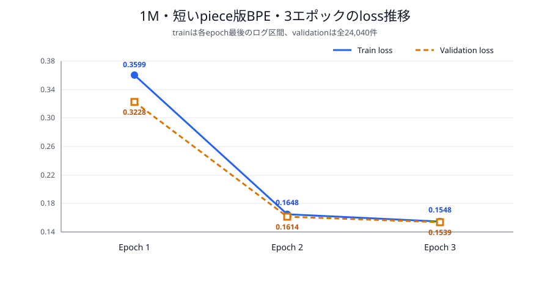
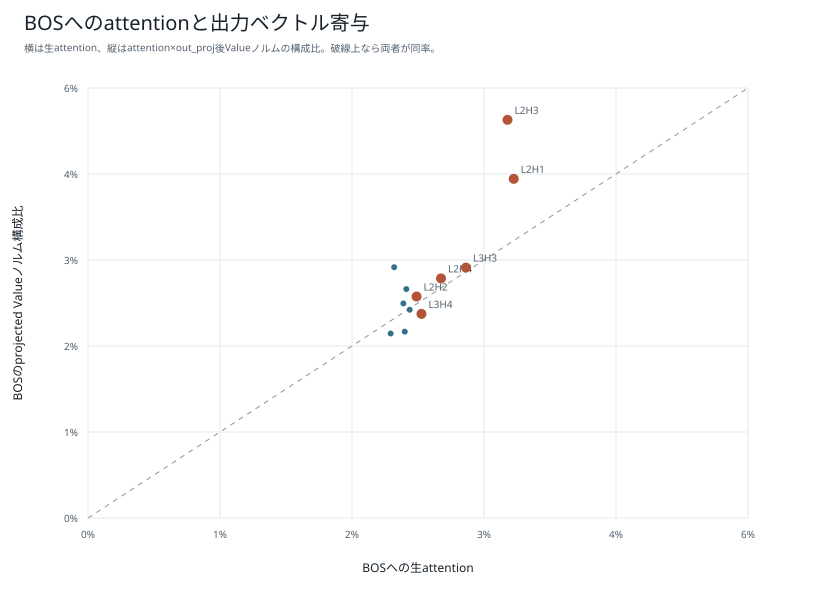
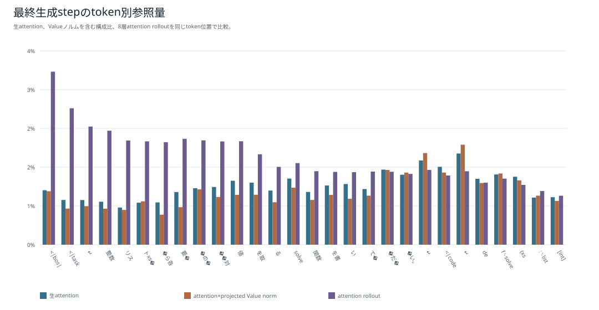
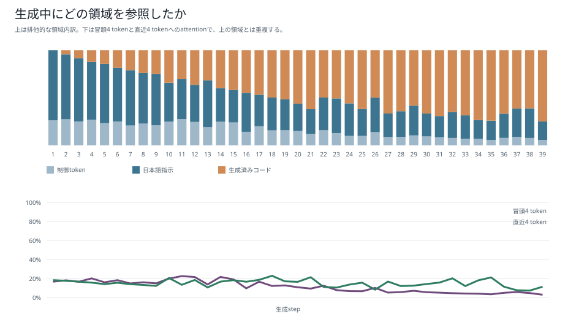
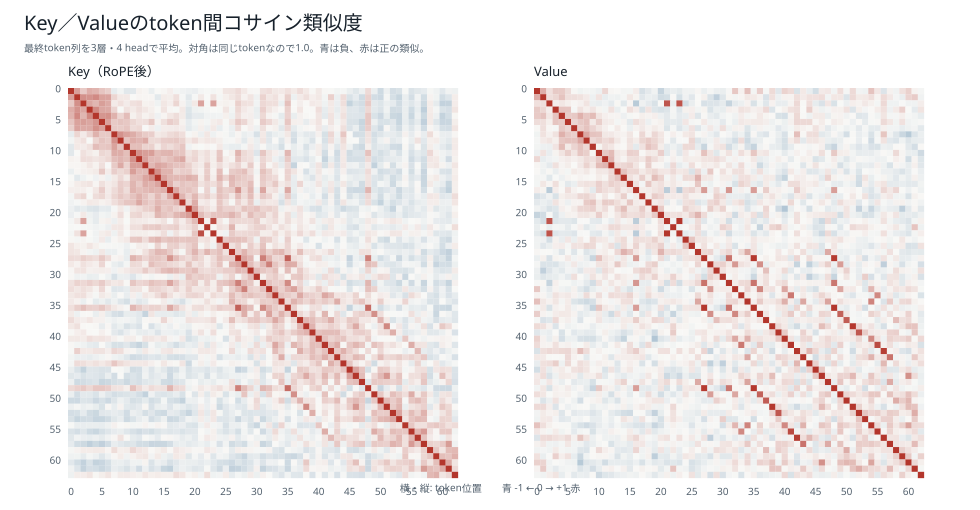
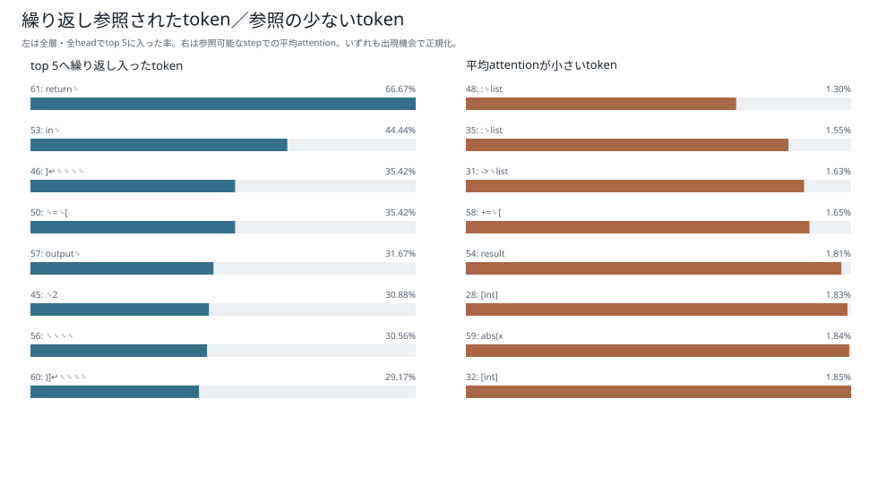

# 1M・短いpiece版BPE・3エポック：学習・評価・attention解析

## 結論

1,016,704パラメータの1Mモデルを、短いpiece版BPE（語彙数2,048、`min_frequency=2`、`max_token_length=8`）でランダム初期値から3エポック学習した。固定5集合84,550件では83,890件に合格し、pass@1は99.2194%だった。1エポック版の4,572件から79,318件増えた。

24単独操作のattention診断では23 / 24件に合格した。日本語指示attentionが最大のheadはL2H1、教師強制NLLへの影響が最大のheadはL1H4であり、一致しなかった。日本語指示位置のValueを全層で0にすると0 / 24件へ低下した。

## モデルとトークナイザー

| 項目 | 値 |
|---|---:|
| パラメータ数 | 1,016,704 |
| 語彙数 | 2,048 |
| hidden size | 128 |
| 層数 | 3 |
| Attention head数 | 4 |
| FFN size | 256 |
| 最大系列長 | 256 |
| tokenizer最小頻度 | 2 |
| tokenizer最大piece長 | 8 |
| seed | 20260925 |
| dtype | bfloat16 |
| micro / effective batch size | 512 / 512 |

## 学習結果

| 項目 | 結果 |
|---|---:|
| エポック | 3 |
| optimizer step | 1,131 |
| 1エポックの系列token | 17,281,995 |
| 3エポックの系列token | 51,845,985 |
| 1エポックのloss対象token | 10,233,836 |
| 3エポックのloss対象token | 30,701,508 |
| 学習時間 | 54.874秒 |
| モデルSHA-256 | `216cc2ce080131455705af5a6589653d090f4d5ee42d031cf97cc15d796a4d7d` |

| Epoch | 最終train loss | Validation loss | Validation perplexity |
|---:|---:|---:|---:|
| 1 | 0.359948 | 0.322824 | 1.381022 |
| 2 | 0.164832 | 0.161426 | 1.175186 |
| 3 | 0.154775 | 0.153865 | 1.166333 |

token分割が異なるため、このloss値を既存BPE版と直接比較してトークナイザーの優劣を決めない。train lossは各epochで最後に記録されたログ区間平均、validation lossは24,040件すべての加重平均である。



### 20 stepごとのloss推移

全57ログ点を示す。青線は原則20 optimizer stepごとの区間平均で、最終step 1,131だけは最後の11 step平均である。オレンジの四角は各epoch終了時のvalidation loss、縦軸は対数目盛である。


## 固定5集合の評価

| テスト | 合格 | 不合格 | pass@1 |
|---|---:|---:|---:|
| 通常テスト | 23,891 / 24,040 | 149 | 99.3802% |
| 組合せ汎化テスト | 13,337 / 13,400 | 63 | 99.5299% |
| 日本語言い換えテスト | 22 / 30 | 8 | 73.3333% |
| 同一操作反復テスト | 22,749 / 23,040 | 291 | 98.7370% |
| 境界値テスト | 23,891 / 24,040 | 149 | 99.3802% |
| **合計・参考値** | **83,890 / 84,550** | **660** | **99.2194%** |

| 段階別指標 | 件数 | 率 |
|---|---:|---:|
| Syntax-valid | 84,545 / 84,550 | 99.9941% |
| Safe-AST | 84,545 / 84,550 | 99.9941% |
| Signature-valid | 84,545 / 84,550 | 99.9941% |
| Executable | 84,545 / 84,550 | 99.9941% |
| pass@1 | 83,890 / 84,550 | 99.2194% |
| 組合せ汎化率 | 13,337 / 13,400 | 99.5299% |

不合格660件の内訳は、hidden testでの意味不一致655件、構文または安全AST不正5件だった。timeout、実行例外、EOS未生成は0件である。既存BPE版より全体では281件少ないが、日本語言い換えは7件多い。

## attention解析

### 24単独操作診断

| 項目 | 結果 |
|---|---:|
| 基準生成の合格 | 23 / 24 |
| 教師強制NLL | 0.119191 |
| 日本語attention最大head | L2H1、55.2085% |
| NLL影響最大head | L1H4、ΔNLL +0.227486 |
| 日本語attentionとΔNLLのSpearman相関 | 0.622378 |
| BOS Value=0 | 9 / 24 |
| 日本語Value=0 | 0 / 24 |
| L1H4無効化 | 4 / 24 |

基準診断で不合格だったのは`降順`の1件で、閉じ括弧不足による構文不正だった。この診断は固定84,550件評価とは別の内部比較用テストである。







### 単一promptの生成step解析

固定promptは24 prompt token、39生成tokenだった。生成コードは絶対値化の前に2倍し、降順化もしないため不合格である。日本語指示領域への平均attentionは38.1359%、token数補正後の一様分布比は0.8297倍だった。Keyの最大非対角cosは0.8723、Valueは0.9989である。








復元attentionから計算した`attention @ V`とfused attention出力は117組で比較し、最大絶対誤差は`2.1e-7`、最小cos類似度は`0.99999988`だった。

## 再現コマンド

```bash
scripts/model/run_boku_nano_experiment_nohup.sh \
  --model-size 1m --epochs 3 \
  --tokenizer bpe_2048_minfreq2_maxlen8

uv run --group model-training --python 3.12.12 python \
  scripts/model/evaluate_boku_nano.py \
  --config config/boku_nano_1m_bpe_2048_minfreq2_maxlen8_1epoch_evaluation.yaml \
  --model-directory data/models/boku_nano_1m_bpe_2048_minfreq2_maxlen8_3epoch \
  --output-directory data/evaluations/boku_nano_1m_bpe_2048_minfreq2_maxlen8_3epoch
```

attention解析の生データは[24操作解析JSON](attention_3epoch/boku_nano_1m_bpe_2048_minfreq2_maxlen8_3epoch/analysis.json)と[生成step解析JSON](attention_3epoch/boku_nano_1m_bpe_2048_minfreq2_maxlen8_3epoch/detail_analysis.json)に保存した。
