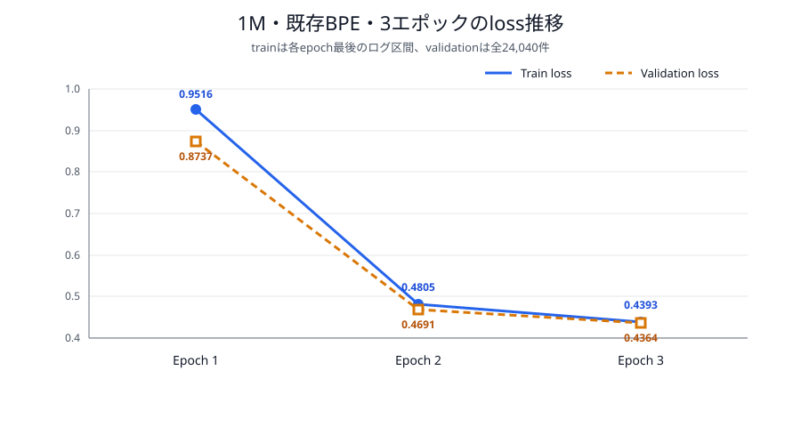
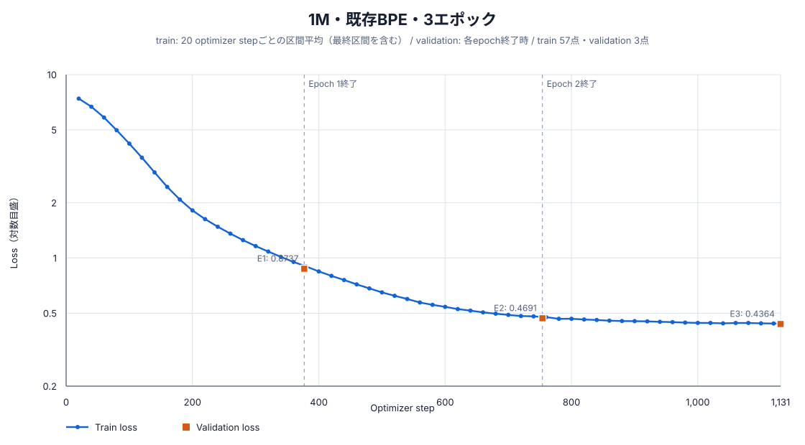
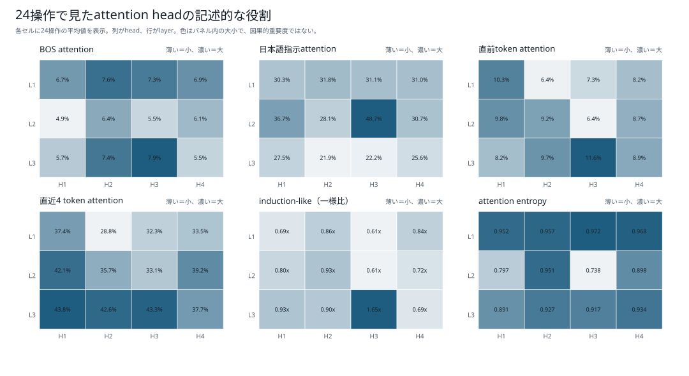
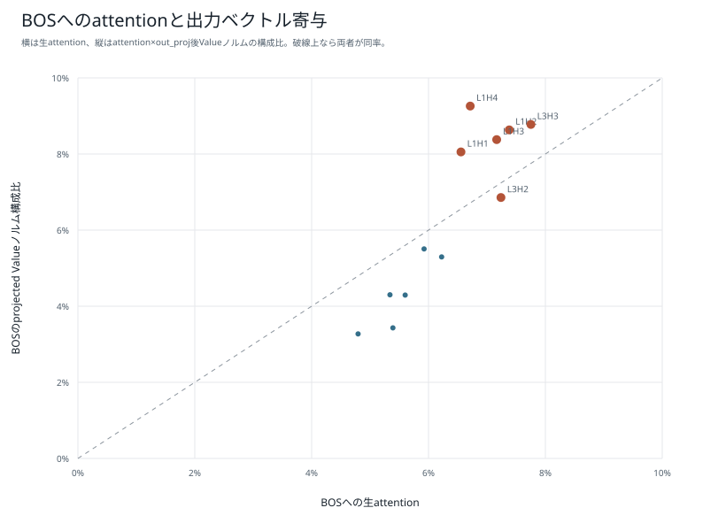
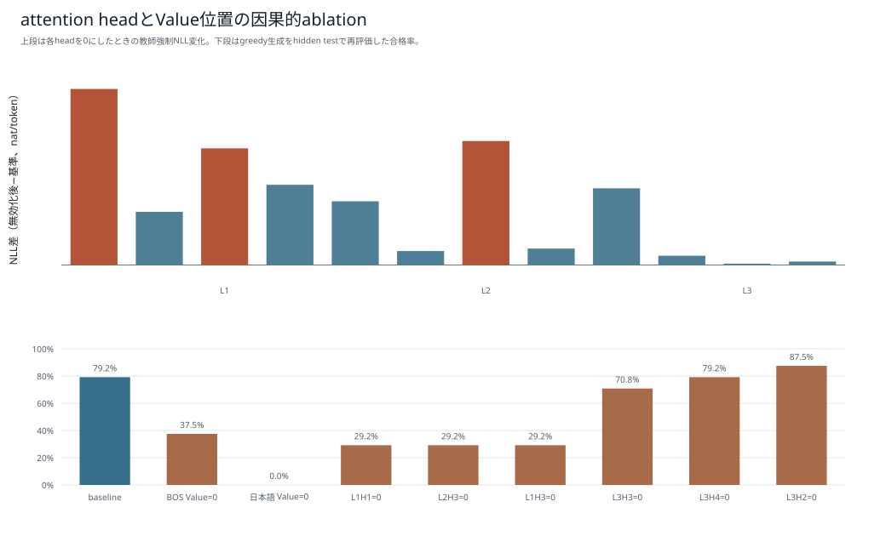
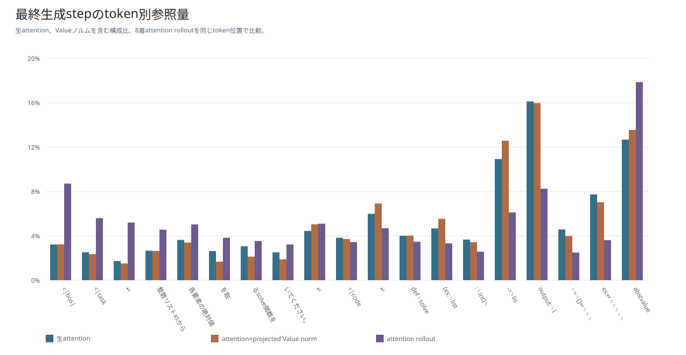
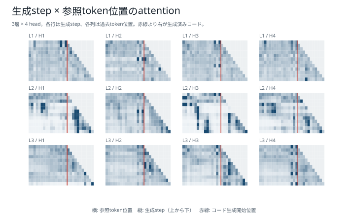
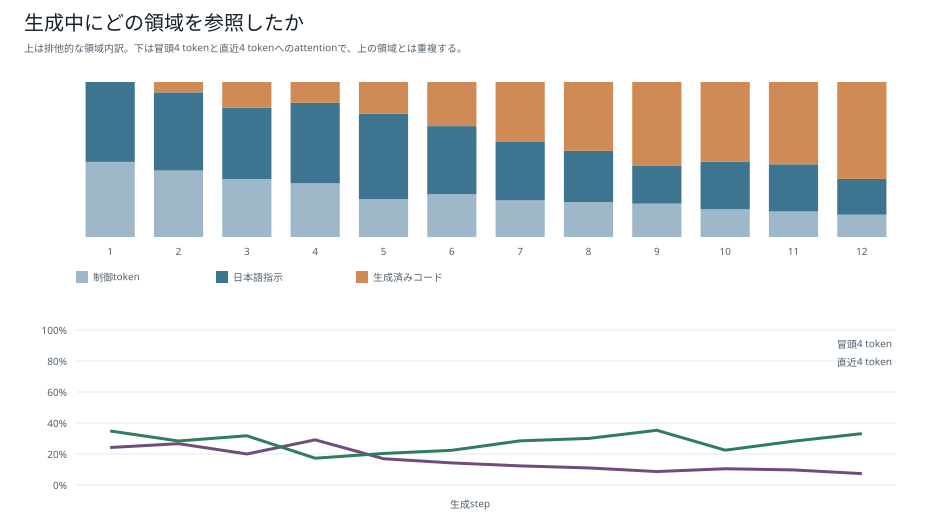
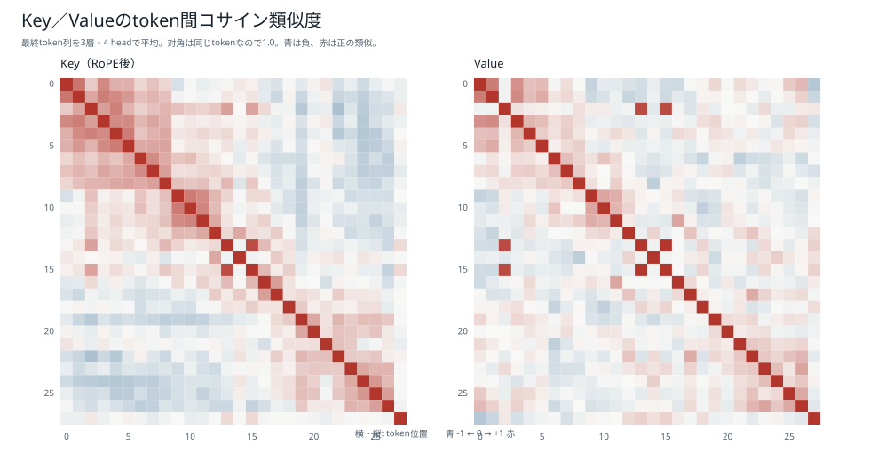
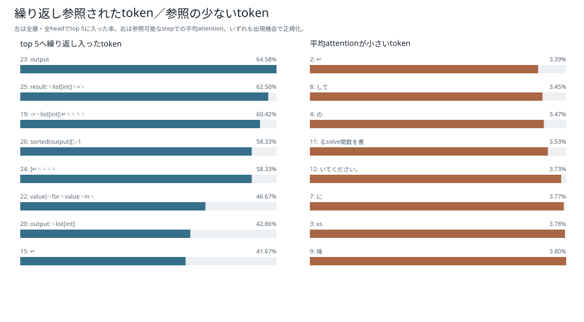

# 1M・既存BPE・3エポック：学習・評価・attention解析

## 結論

1,016,704パラメータの1Mモデルを、既存BPE（語彙数2,048、`min_frequency=5`、`max_token_length=24`）でランダム初期値から3エポック学習した。固定5集合84,550件では84,171件に合格し、pass@1は99.5517%だった。1エポック版の1,467件から82,704件増えた。

24単独操作のattention診断では19 / 24件に合格した。日本語指示attentionが最大のheadはL2H3、教師強制NLLへの影響が最大のheadはL1H1であり、一致しなかった。一方、日本語指示位置のValueを全層で0にすると0 / 24件へ低下したため、日本語指示の情報は操作選択に必要だった。

## モデルとトークナイザー

| 項目 | 値 |
|---|---:|
| パラメータ数 | 1,016,704 |
| 語彙数 | 2,048 |
| hidden size | 128 |
| 層数 | 3 |
| Attention head数 | 4 |
| FFN size | 256 |
| 最大系列長 | 256 |
| tokenizer最小頻度 | 5 |
| tokenizer最大piece長 | 24 |
| seed | 20260925 |
| dtype | bfloat16 |
| micro / effective batch size | 512 / 512 |

## 学習結果

| 項目 | 結果 |
|---|---:|
| エポック | 3 |
| optimizer step | 1,131 |
| 1エポックの系列token | 6,939,466 |
| 3エポックの系列token | 20,818,398 |
| 1エポックのloss対象token | 3,746,067 |
| 3エポックのloss対象token | 11,238,201 |
| 学習時間 | 43.024秒 |
| モデルSHA-256 | `e9eafad8c5195b501414c4456b04918258cc1a3a6ef799d5d77f3ea69cd17533` |

| Epoch | 最終train loss | Validation loss | Validation perplexity |
|---:|---:|---:|---:|
| 1 | 0.951613 | 0.873668 | 2.395683 |
| 2 | 0.480474 | 0.469092 | 1.598542 |
| 3 | 0.439302 | 0.436444 | 1.547196 |

train lossは各epochで最後に記録されたログ区間平均であり、validation lossは24,040件すべてのloss対象tokenによる加重平均である。



### 20 stepごとのloss推移

全57ログ点を示す。青線は原則20 optimizer stepごとの区間平均で、最終step 1,131だけは最後の11 step平均である。オレンジの四角は各epoch終了時のvalidation loss、縦軸は対数目盛である。



## 固定5集合の評価

greedy生成、最大160 token、bfloat16、1コード5秒timeoutで評価した。参照コードとの文字列一致ではなく、構文、安全AST、`solve(xs, k)`、入力非変更、各問のhidden testをすべて満たした場合を合格とした。

| テスト | 合格 | 不合格 | pass@1 |
|---|---:|---:|---:|
| 通常テスト | 23,950 / 24,040 | 90 | 99.6256% |
| 組合せ汎化テスト | 13,311 / 13,400 | 89 | 99.3358% |
| 日本語言い換えテスト | 15 / 30 | 15 | 50.0000% |
| 同一操作反復テスト | 22,945 / 23,040 | 95 | 99.5877% |
| 境界値テスト | 23,950 / 24,040 | 90 | 99.6256% |
| **合計・参考値** | **84,171 / 84,550** | **379** | **99.5517%** |

| 段階別指標 | 件数 | 率 |
|---|---:|---:|
| Syntax-valid | 84,539 / 84,550 | 99.9870% |
| Safe-AST | 84,539 / 84,550 | 99.9870% |
| Signature-valid | 84,539 / 84,550 | 99.9870% |
| Executable | 84,534 / 84,550 | 99.9811% |
| pass@1 | 84,171 / 84,550 | 99.5517% |
| 組合せ汎化率 | 13,311 / 13,400 | 99.3358% |

不合格379件の内訳は、hidden testでの意味不一致363件、構文または安全AST不正11件、`UnboundLocalError` 5件だった。timeoutとEOS未生成は0件である。

## attention解析

### 24単独操作診断

| 項目 | 結果 |
|---|---:|
| 基準生成の合格 | 19 / 24 |
| 教師強制NLL | 0.461350 |
| 日本語attention最大head | L2H3、48.6780% |
| NLL影響最大head | L1H1、ΔNLL +0.469863 |
| 日本語attentionとΔNLLのSpearman相関 | 0.657343 |
| BOS Value=0 | 9 / 24 |
| 日本語Value=0 | 0 / 24 |
| L1H1無効化 | 7 / 24 |

基準診断の不合格は、`kより小さい`の意味不一致、`k加算`・`k減算`・`3倍`の未初期化変数、`符号反転`の構文不正だった。この診断は固定84,550件評価とはpromptと目的が異なるため、正式pass@1と同一視しない。









### 単一promptの生成step解析

固定prompt「xsの各要素を絶対値にして降順に並べるsolve関数を書いてください。」は16 prompt token、12生成tokenだった。生成コードは`output`を初期化前に参照するため不合格である。日本語指示領域への平均attentionは39.8949%、token数補正後の一様分布比は0.8240倍だった。Keyの最大非対角cosは0.8824、Valueは0.9972である。









復元attentionから計算した`attention @ V`とモデル本体のfused attention出力は36組で比較し、最大絶対誤差は`2.1e-7`、最小cos類似度は`0.99999982`だった。

## 再現コマンド

```bash
scripts/model/run_boku_nano_experiment_nohup.sh \
  --model-size 1m --epochs 3 \
  --tokenizer bpe_2048_minfreq5_maxlen24

uv run --group model-training --python 3.12.12 python \
  scripts/model/evaluate_boku_nano.py \
  --config config/boku_nano_1m_bpe_2048_1epoch_evaluation.yaml \
  --model-directory data/models/boku_nano_1m_bpe_2048_minfreq5_maxlen24_3epoch \
  --output-directory data/evaluations/boku_nano_1m_bpe_2048_minfreq5_maxlen24_3epoch
```

attention解析の生データは[24操作解析JSON](attention_3epoch/boku_nano_1m_bpe_2048_minfreq5_maxlen24_3epoch/analysis.json)と[生成step解析JSON](attention_3epoch/boku_nano_1m_bpe_2048_minfreq5_maxlen24_3epoch/detail_analysis.json)に保存した。
