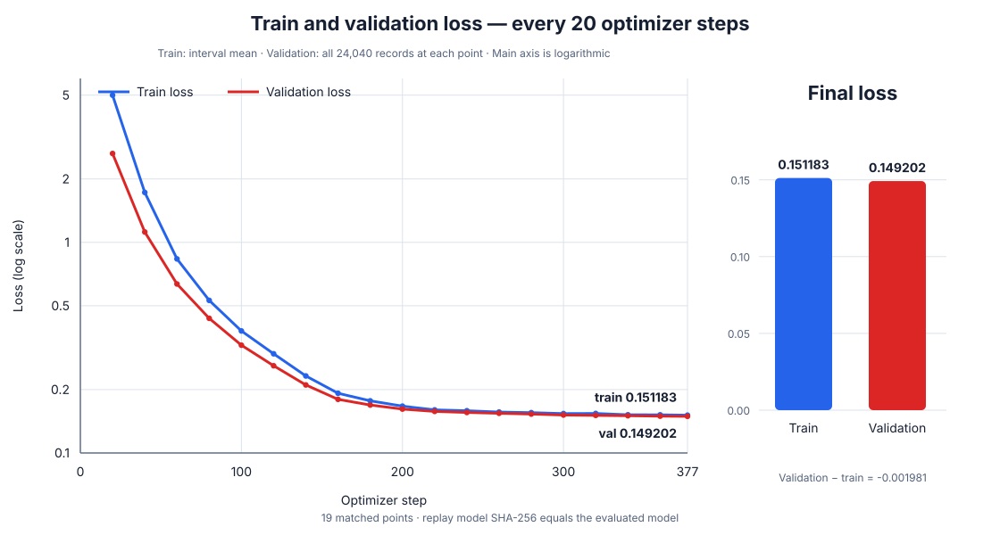

# Boku Nano 短いpiece版BPE・1エポック学習／評価結果

## 結論

`boku_nano_15m_bpe_2048_minfreq2_maxlen8_1epoch`をランダム初期値から1エポック学習し、固定済み5テスト84,550件で評価した。

| 項目 | 結果 |
|---|---:|
| パラメータ数 | 15,735,168 |
| Train loss（最後の17 step平均） | 0.151183 |
| Validation loss（24,040件全体） | 0.149202 |
| Validation perplexity | 1.160907 |
| テスト合格 | 84,305 / 84,550 |
| 全体参考合格率 | 99.7102% |
| 最大GPU使用量（学習時実測） | 27,392 MiB |

通常テストと境界値テストは99.9626%だった。一方、組合せ汎化は99.5299%、同一操作の反復は99.3316%、日本語言い換えは66.6667%で、短いpieceへ分割しても未学習言い換えは改善しなかった。

## 1. 最大GPU使用量27,392 MiBの比較

モデル構造、語彙数、`micro_batch_size=512`を揃え、トークナイザーだけが異なる学習時実測値を比較する。

| 項目 | 既存BPE `min 5 / max 24` | 短いpiece版 `min 2 / max 8` | 変化 |
|---|---:|---:|---:|
| 最大GPU使用量 | 16,264 MiB | 27,392 MiB | +11,128 MiB |
| 倍率 | 1.000倍 | 1.684倍 | +68.42% |
| RTX 5090総量32,607 MiBに対する比率 | 49.88% | 84.01% | +34.13ポイント |
| 実測上の残り容量 | 16,343 MiB | 5,215 MiB | -11,128 MiB |
| 1エポックの系列token数 | 6,939,466 | 17,281,995 | 2.490倍 |
| 完成系列p99 | 46 token | 118 token | 2.565倍 |

パラメータ数は変わらないが、短いpiece版は同じレコードを約2.49倍のtokenへ分割する。512系列を最長系列へpaddingするため、各層で保持するactivationが増え、最大GPU使用量も68.42%増えた。

27,392 MiBは保存済みの学習時実測値である。ただし、測定手段が`nvidia-smi`のプロセス使用量かPyTorch最大割当量かは当時の記録に残っていない。したがって、16,264 MiBとの同系列比較には使えるが、評価時の`torch.cuda.max_memory_allocated()`など異なる測定値とは直接比較しない。

現設定は32,607 MiB GPUの84.01%を使い、余裕は5,215 MiBである。運用時は`micro_batch_size=256`、`gradient_accumulation_steps=2`で実効バッチ512を維持する方法や、系列長bucketingによるpadding削減が候補になる。

## パラメータ設定

### モデル

| 項目 | 値 |
|---|---:|
| アーキテクチャ | Decoder-only Transformer |
| 語彙数 | 2,048 |
| hidden size | 384 |
| 層数 | 8 |
| Attention head数 | 6 |
| 1 head当たりの次元数 | 64 |
| FFN size | 1,024 |
| context length | 256 |
| 位置表現 | RoPE（base 10,000） |
| 正規化 | RMSNorm（epsilon 1e-5） |
| dropout | 0.0 |
| 入出力embedding | 非共有 |
| 総パラメータ数 | 15,735,168 |

### トークナイザー

| 項目 | 値 |
|---|---|
| 方式 | ByteLevel BPE |
| 語彙数 | 特殊token込み2,048 |
| `min_frequency` | 2 |
| `max_token_length` | 8 |
| byte fallback | 有効 |
| dropout | 0.0 |
| normalizer | identity |
| tokenizer SHA-256 | `f09f3d7eccbca2ab1224c662064b71e572d64147147b8b559ebdb428eb035dbf` |

訓練192,900件ではunknown token、round-trip不一致、256 token超過がすべて0件だった。完成系列は平均89.59 token、p99が118 token、最大137 tokenである。

### 学習

| 項目 | 値 |
|---|---:|
| epoch | 1 |
| micro batch | 512 |
| gradient accumulation | 1 |
| 実効batch | 512 |
| optimizer | AdamW（fused） |
| 学習率 | 3.0e-4 → 3.0e-5、cosine減衰 |
| warmup ratio | 0.05 |
| betas / eps | 0.9, 0.95 / 1e-8 |
| weight decay | 0.1 |
| gradient clip | 1.0 |
| seed | 20260925 |
| dtype / device | bfloat16 / CUDA |
| loss範囲 | コードとEOSのみ |
| validation batch | 512 |

訓練データは固定ZIP内の192,900件、validationは24,040件である。両ZIPは処理前後でSHA-256が一致した。

## 学習結果

| 指標 | 結果 |
|---|---:|
| optimizer step | 377 |
| 学習時間 | 124.801秒 |
| 1エポックの系列token | 17,281,995 |
| loss対象token | 10,233,836 |
| 訓練系列長 | 35〜137 token |
| unknown token | 0 |
| step 20 Train loss | 4.998469 |
| step 200 Train loss | 0.166829 |
| step 360 Train loss | 0.151749 |
| step 377 Train loss | 0.151183 |
| Validation loss | 0.149202 |
| Validation perplexity | 1.160907 |

Train lossは原則として直近20 optimizer stepの平均であり、step 377だけは最後の17 step平均である。Validation lossはエポック終了後に固定24,040件、教師対象1,281,557 token全体で計算した値なので、集計範囲が異なる。

最終Validation lossは最終Train lossより0.001981低く、1エポック終了時点でvalidation側だけが悪化する乖離は見られない。ただし、1エポックしかないため、エポックをまたぐ過学習傾向は判断できない。また、既存BPEとはtokenの分割単位が異なるため、token平均lossやperplexityの数値を直接優劣比較してはいけない。

## 評価条件

既存モデルと同じ固定5テスト、同じhidden入力、同じ合格条件を使用した。

| 項目 | 条件 |
|---|---|
| decoding | greedy、samplingなし |
| batch / buffer | 64 / 1,024 |
| 最大生成長 | 160 token |
| context length | 256 token |
| dtype / device | bfloat16 / CUDA |
| signature | `solve(xs: list[int], k: int) -> list[int]` |
| 実行timeout | 1生成コードの全case合計5秒 |
| 合格条件 | 構文、安全AST、signature、全hidden入力の結果、入力非変更、返値型をすべて満たす |

評価器は境界値テストの共通プロセスを再利用できるようにしたが、各レコードへ渡す固定case、参照インタプリタ、静的検査、5秒timeout、合否条件は変更していない。修正前に保存した先頭3,072件を修正後に再評価し、結果JSONLがバイト単位で一致することを確認した。

## テスト評価結果

| テスト | 合格 | 不合格 | 合格率 | 3エポック既存BPE | 差 |
|---|---:|---:|---:|---:|---:|
| 通常 | 24,031 / 24,040 | 9 | 99.9626% | 99.9917% | -0.0291ポイント |
| 組合せ汎化 | 13,337 / 13,400 | 63 | 99.5299% | 99.9776% | -0.4477ポイント |
| 日本語言い換え | 20 / 30 | 10 | 66.6667% | 80.0000% | -13.3333ポイント |
| 同一操作の反復 | 22,886 / 23,040 | 154 | 99.3316% | 99.5530% | -0.2214ポイント |
| 境界値 | 24,031 / 24,040 | 9 | 99.9626% | 99.9917% | -0.0291ポイント |
| 合計・参考値 | 84,305 / 84,550 | 245 | 99.7102% | 99.8628% | -0.1526ポイント |

右側の既存BPEは3エポックモデルであり、今回の短いpiece版は1エポックである。したがって、差にはトークナイザーと学習epoch数の両方が含まれ、トークナイザー単独の因果差とはみなさない。それでも、短いpiece版が少なくとも1エポック時点でGPU増加に見合う評価改善を示したとはいえない。

### 操作数別

| テスト | 操作数 | 合格 | 不合格 | 合格率 |
|---|---:|---:|---:|---:|
| 通常 | 2 | 1,073 / 1,080 | 7 | 99.3519% |
| 通常 | 3 | 22,958 / 22,960 | 2 | 99.9913% |
| 組合せ汎化 | 2 | 200 / 200 | 0 | 100.0000% |
| 組合せ汎化 | 3 | 13,137 / 13,200 | 63 | 99.5227% |
| 日本語言い換え | 1 | 20 / 30 | 10 | 66.6667% |
| 同一操作の反復 | 2 | 475 / 480 | 5 | 98.9583% |
| 同一操作の反復 | 3 | 22,411 / 22,560 | 149 | 99.3395% |
| 境界値 | 2 | 1,073 / 1,080 | 7 | 99.3519% |
| 境界値 | 3 | 22,958 / 22,960 | 2 | 99.9913% |

全84,550件がEOSで終了し、timeoutは0件だった。参照コードとの完全一致は63件だが、機能的に正しい別実装も合格とするため診断値としてのみ扱う。

## 不合格分析

| 失敗形式 | 件数 |
|---|---:|
| hidden入力で実行結果不一致 | 243 |
| 未定義名を含む安全検査不合格 | 1 |
| Python構文エラー | 1 |
| timeout | 0 |

245件の不合格のうち、同一操作の反復が154件（62.9%）、組合せ汎化が63件（25.7%）を占める。操作数別では1操作10件、2操作19件、3操作216件で、3操作が88.2%だった。

### 通常・境界値

通常と境界値は同じ9生成が失敗し、固有の境界値入力だけで新たに落ちた生成はなかった。失敗は4意味仕様に集中した。

| 仕様 | 不合格 | 主な誤り |
|---|---:|---|
| `combined-000320` | 6 | 反転と乗算の順序・回数を誤る |
| `combined-000159` | 1 | 期待する反転を維持できない |
| `combined-007017` | 1 | 二乗回数を過剰に適用 |
| `combined-011480` | 1 | 定数乗算の係数を誤る |

### 組合せ汎化

63件、40意味仕様が不合格だった。2操作200件は全件合格し、不合格はすべて3操作である。主な誤りは昇順・降順・反転の取り違え、`>=`と`>`など境界比較の取り違え、加減算や二乗の重複・省略だった。

### 日本語言い換え

30件中10件が不合格だった。偶数・奇数の説明や否定表現、加減算・倍化・二乗の言い換えで別操作を生成した。ほかに未定義変数`output`だけを返す生成が1件、壊れた内包表記による構文エラーが1件あった。

短いpieceは未知表現を細かく分解できる可能性があったが、今回の機能評価は既存3エポックモデルの24 / 30に対し20 / 30だった。少なくとも1エポック条件では、細分化だけで意味理解は改善していない。

### 同一操作の反復

23,040件中154件、56意味仕様が不合格だった。主要な失敗仕様は次のとおり。

| 仕様 | 操作列 | 不合格 |
|---|---|---:|
| `repetition-001147` | `ascending → ascending → ascending` | 20 |
| `repetition-000551` | `sub_k → sub_k → add_k` | 12 |
| `repetition-000061` | `even → even → descending` | 7 |
| `repetition-000975` | `reverse → reverse → negate` | 7 |
| `repetition-001149` | `reverse → reverse → reverse` | 7 |
| `repetition-000505` | `add_k → add_k → sub_k` | 6 |
| `repetition-000891` | `ascending → ascending → reverse` | 5 |
| `repetition-000897` | `ascending → ascending → every_other` | 5 |
| `repetition-001148` | `descending → descending → descending` | 5 |

同じ操作の回数を維持できず、昇順と降順を反転したり、加減算の適用回数を過不足させたりする誤りが中心である。

## 採用判断

現時点では既存の`min_frequency=5 / max_token_length=24` BPEを維持する判断が妥当である。

- 短いpiece版は最大GPU使用量が11,128 MiB、68.42%増えた。
- 1エポックの系列token数は2.49倍、生成コードのtoken数も既存BPEより長くなる。
- 固定テストでは全体、日本語言い換え、組合せ汎化、反復のいずれも3エポック既存BPEを上回らなかった。
- 今回はepoch数が異なるため、厳密なトークナイザー比較が必要なら、既存BPE側も同じ1エポック・同じseedで学習して比較する。

短いpiece版を継続検証する場合は、GPUメモリを抑えるbatch設定へ変更したうえで、同一epoch数または同一学習token予算で比較する必要がある。

## 再現情報と成果物

| 内容 | パスまたは値 |
|---|---|
| 学習設定 | `config/boku_nano_bpe_2048_minfreq2_maxlen8_1epoch.yaml` |
| 評価設定 | `config/boku_nano_bpe_2048_minfreq2_maxlen8_1epoch_evaluation.yaml` |
| モデル | `data/models/boku_nano_15m_bpe_2048_minfreq2_maxlen8_1epoch/model.safetensors` |
| モデルSHA-256 | `c019688997247f4bc10198703364d88584ff63539d1e6a739764ab372bd1ed83` |
| 学習manifest | `data/models/boku_nano_15m_bpe_2048_minfreq2_maxlen8_1epoch/training_manifest.json` |
| 学習metrics | `data/models/boku_nano_15m_bpe_2048_minfreq2_maxlen8_1epoch/training_metrics.jsonl` |
| 評価manifest | `data/evaluations/boku_nano_bpe_2048_minfreq2_maxlen8_1epoch/evaluation_manifest.json` |
| 評価設定SHA-256 | `6a09025ac18033cb076c04b65a6d3e976ec45d6d515cf284059a41bbc1142841` |
| 評価ZIP SHA-256 | `5b05b76202920f532cb379481d1cfab4adad74e936bdff518cb8b1750b33f0a1` |
| 実行環境 | Python 3.12.12、PyTorch 2.13.0+cu130、CUDA、bfloat16 |

評価ZIPは処理前後で同一SHA-256だった。全5結果JSONLは評価ディレクトリに保存している。
