# Boku1-nanoのK/V内部状態とKVキャッシュ可視化

## 結論

Boku1-nanoは、自由な日本語全般を扱うモデルではなく、24種類の操作を最大3個まで組み合わせた制限自然言語からPythonコードを生成するSLMである。最大系列長も256 tokenに限定している。

今回の本質は、大規模モデルと同じ規模のKVキャッシュを作ることではない。次の二つを機械化することで、データ作成・学習・評価を学生一人で実行できる範囲へ収めた点にある。

1. 学習データとなる日本語指示を、意味ASTと表現辞書から機械的に生成する。
2. 生成コードをPythonとして実行し、参照インタプリタと比較して機械的に検証する。

KVの可視化は、この限定SLMがtoken列をどのように内部表現へ変換するかを学生向けに説明するためのものである。


追加した24操作の解析では、headごとの役割候補は観察できたが、生attentionの大きさと因果的重要度は常には一致しなかった。日本語指示のValueを全層で0にすると合格が24 / 24から1 / 24へ落ちる一方、copy-like attentionが最大のL6H3を0にしても全24問のtoken列が変わらなかった。したがって、本レポートではheatmapを説明の完成形ではなく仮説生成に使い、Valueノルム、rollout、ablation、hidden testを併用する。

## 重要な事実

**現在のBoku1-nanoには、生成stepをまたいでKとVを保持するKVキャッシュは実装されていない。**

PyTorch実装は各forwardで入力系列全体のQ、K、Vを作り直す。ブラウザ版ONNXも、生成済みtokenを含む`input_ids`全体を毎step入力している。したがって、本書で示すヒートマップは、forward中に一時的に作られるK/V内部状態である。容量図は、同じ構造へ永続KVキャッシュを追加した場合の上限を示す。

この区別を付けずに「Boku1-nanoはKVキャッシュを使っている」と説明してはいけない。

## モデル内部のKとV

Boku1-nanoの各Transformer blockでは、同じhidden stateからQuery、Key、Valueをまとめて作る。

```python
query, key, value = self.qkv_proj(hidden_states).chunk(3, dim=-1)
query = query.view(batch_size, sequence_length, 6, 64).transpose(1, 2)
key = key.view(batch_size, sequence_length, 6, 64).transpose(1, 2)
value = value.view(batch_size, sequence_length, 6, 64).transpose(1, 2)
```

- Query: 現在のtokenが何を探すかを表す。
- Key: 各tokenがどのような検索対象かを表す。
- Value: attentionで選ばれたときに取り出す内容を表す。
- RoPE: QueryとKeyへtoken位置を与える。

モデル構造から、1層のKまたはVは`[batch, 6 heads, sequence, 64 dimensions]`になる。これが8層に存在する。

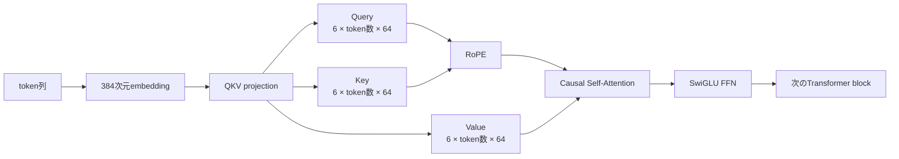

## 実施した可視化

3エポックモデルへ次の指示を入力した。

```text
xsの各要素を絶対値にして降順に並べるsolve関数を書いてください。
```

greedy生成後の27 tokenについて、8層すべてのQKV projection出力をhookで取得した。Keyには実装と同じRoPEを適用し、各層・各tokenについて6 head × 64次元のRMSを計算した。モデルの重みと推論結果は変更していない。


赤線より左が16 tokenの入力prompt、右が11 tokenの生成コードである。色が濃いほどKまたはVベクトルのRMSが大きい。

今回の実測範囲は次のとおりだった。

| 指標 | 最小 | 最大 | 平均 |
| --- | ---: | ---: | ---: |
| Key RMS | 0.374 | 0.989 | 0.590 |
| Value RMS | 0.256 | 0.502 | 0.358 |

層やtoken位置によってK/Vの大きさが異なることは確認できる。ただし、RMSが大きいtokenを「重要なtoken」と断定することはできない。実際にどこを参照したかを説明するには、QueryとKeyの内積から得られるattention weightを別途可視化する必要がある。

## Queryとattentionの詳細解析

RMSだけでは参照先を判断できないため、さらに生成stepごとに全8層・全6 headの「最後のQuery」を保存した。各stepの保存shapeは`[8 layers, 6 heads, 64 dimensions]`で、11生成step分を数値成果物へ記録している。各層・headについて、モデルと同じRoPE適用後のQueryとKeyから次を計算した。

$$
a_{l,h,t,j}
=
\operatorname{softmax}_{j}
\left(
\frac{
Q_{l,h,t} K_{l,h,j}^{\mathsf T}
}{
\sqrt{64}
}
\right)
$$

ここで、$a_{l,h,t,j}$は層$l$、head $h$、生成step $t$から参照位置$j$へ向くattention weightである。参照可能な位置$j$について合計すると1になる。

Boku1-nano本体はPyTorchのfused attentionを使い、attention weightを直接返さない。このため、同じQ/Kをhookで取得して上式により推論後に復元した。最後のQueryには未来tokenが存在しないため、参照可能なprefix全体が計算対象となる。全528行（11 step × 8層 × 6 head）のattention合計は`0.99999976`〜`1.00000024`であり、softmaxの確率分布として整合している。**ただし、行和が約1であることだけでは、fused attentionと同じ重みを復元できた証明にはならない。**

そこで、復元した重みとValueから`attention @ V`を計算し、モデル本体のfused attentionが`out_proj`へ渡した直前の出力と、11 step × 8層の88組すべてで比較した。

| 比較指標 | 結果 |
| --- | ---: |
| 比較した生成step・層 | 88組 |
| 最大絶対誤差 | 4.77 × 10^-7 |
| 平均絶対誤差 | 1.43 × 10^-8 |
| 最小コサイン類似度 | 0.99999982 |

浮動小数点演算順序による微小差だけで一致したため、今回復元した重みは、少なくともこのCPU・float32推論についてモデル本体のfused attention出力を数値的に再現している。これは行和の確認より強い検証である。

### 層・head別ヒートマップ


48個の小図は`8層 × 6 head`に対応する。横軸が参照token位置、縦軸が生成stepである。**赤い縦線は位置16、つまりpromptが終わり、生成済みコードtokenが始まる境界**を表す。赤線より左が制御tokenと日本語指示、右が生成済みコードである。灰色部分は、そのstepではまだ生成されておらず参照できない未来位置である。headごとに濃い位置が異なり、単一の「モデル全体の参照先」ではなく、複数headが異なる位置を並行して参照していることが確認できる。

### 各生成tokenが参照した上位5件

次表は48個の層・headでattentionを平均し、生成tokenごとに上位5位置を並べたものである。`␠`は空白、`↵`は改行を表す。

| step | 生成token | 参照token上位5件（位置、平均attention） |
| ---: | --- | --- |
| 1 | <code>def␠solve</code> | <code>13: ↵</code> 11.28%<br><code>15: ↵</code> 10.96%<br><code>0: <&#124;bos&#124;></code> 9.53%<br><code>1: <&#124;task&#124;></code> 7.73%<br><code>2: ↵</code> 6.38% |
| 2 | <code>(xs:␠list[int],␠k</code> | <code>0: <&#124;bos&#124;></code> 7.11%<br><code>15: ↵</code> 7.05%<br><code>16: def␠solve</code> 7.03%<br><code>13: ↵</code> 6.62%<br><code>1: <&#124;task&#124;></code> 6.61% |
| 3 | <code>:␠int)␠</code> | <code>0: <&#124;bos&#124;></code> 8.19%<br><code>1: <&#124;task&#124;></code> 7.94%<br><code>16: def␠solve</code> 7.38%<br><code>17: (xs:␠list[int],␠k</code> 6.75%<br><code>13: ↵</code> 6.32% |
| 4 | <code>->␠list[int]:↵␠␠␠␠</code> | <code>0: <&#124;bos&#124;></code> 8.29%<br><code>1: <&#124;task&#124;></code> 7.58%<br><code>17: (xs:␠list[int],␠k</code> 7.33%<br><code>16: def␠solve</code> 6.62%<br><code>18: :␠int)␠</code> 6.41% |
| 5 | <code>result</code> | <code>0: <&#124;bos&#124;></code> 7.88%<br><code>19: ->␠list[int]:↵␠␠␠␠</code> 7.37%<br><code>17: (xs:␠list[int],␠k</code> 7.08%<br><code>13: ↵</code> 7.05%<br><code>18: :␠int)␠</code> 6.87% |
| 6 | <code>␠=␠[abs(</code> | <code>0: <&#124;bos&#124;></code> 7.93%<br><code>6: 絶対値</code> 7.27%<br><code>18: :␠int)␠</code> 6.58%<br><code>19: ->␠list[int]:↵␠␠␠␠</code> 6.47%<br><code>1: <&#124;task&#124;></code> 6.45% |
| 7 | <code>value)␠for␠value␠in␠xs</code> | <code>0: <&#124;bos&#124;></code> 8.56%<br><code>19: ->␠list[int]:↵␠␠␠␠</code> 7.57%<br><code>20: result</code> 6.53%<br><code>1: <&#124;task&#124;></code> 6.20%<br><code>15: ↵</code> 6.09% |
| 8 | <code>]↵␠␠␠␠result␠=␠</code> | <code>20: result</code> 8.39%<br><code>0: <&#124;bos&#124;></code> 7.89%<br><code>22: value)␠for␠value␠in␠xs</code> 6.06%<br><code>21: ␠=␠[abs(</code> 5.59%<br><code>1: <&#124;task&#124;></code> 5.56% |
| 9 | <code>sorted(result</code> | <code>0: <&#124;bos&#124;></code> 8.36%<br><code>20: result</code> 7.03%<br><code>22: value)␠for␠value␠in␠xs</code> 6.85%<br><code>1: <&#124;task&#124;></code> 6.02%<br><code>21: ␠=␠[abs(</code> 5.78% |
| 10 | <code>,␠reverse=True</code> | <code>0: <&#124;bos&#124;></code> 7.78%<br><code>22: value)␠for␠value␠in␠xs</code> 6.67%<br><code>23: ]↵␠␠␠␠result␠=␠</code> 6.37%<br><code>15: ↵</code> 5.66%<br><code>1: <&#124;task&#124;></code> 5.27% |
| 11 | <code>)↵␠␠␠␠return␠result↵</code> | <code>23: ]↵␠␠␠␠result␠=␠</code> 8.47%<br><code>0: <&#124;bos&#124;></code> 5.87%<br><code>24: sorted(result</code> 5.61%<br><code>25: ,␠reverse=True</code> 5.58%<br><code>22: value)␠for␠value␠in␠xs</code> 4.69% |

この平均では、生成開始時に改行tokenと`<|bos|>`、関数signatureの途中では直前までに生成したsignature、`abs(`を出すstepでは日本語指示中の「絶対値」が上位に入った。後半では`result`や直前のlist comprehensionなど、生成済みコードの参照が増えた。ただし、attentionの大きさだけで出力の因果関係が証明されるわけではない。

### 冒頭・直近・日本語指示・生成済みコードの比率

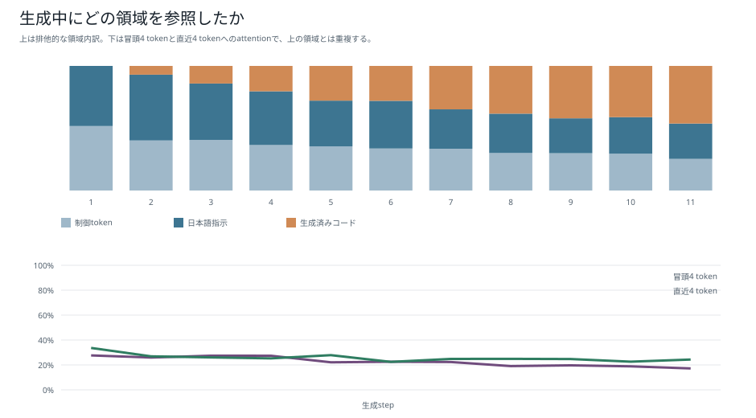

上段は各位置を「prompt制御token」「日本語指示」「生成済みコード」のいずれかへ排他的に分類した比率である。下段の「冒頭4 token」「直近4 token」は位置による別集計なので、上段と重複する。

| 対象 | 11 step平均 | 最初のstep | 最後のstep |
| --- | ---: | ---: | ---: |
| prompt制御token | 35.15% | 51.76% | 25.38% |
| 日本語指示 | 37.58% | 48.24% | 28.37% |
| 生成済みコード | 27.27% | 0.00% | 46.26% |
| 冒頭4 token | 22.76% | 27.66% | 17.20% |
| 直近4 token | 25.79% | 33.64% | 24.34% |

生成前半は制御tokenと日本語指示が中心で、コードが伸びるにつれて生成済みコードの比率が増え、最後のstepでは46.26%になった。一方、日本語指示へのattentionは最後まで28.37%残っており、コードだけへ完全に切り替わったわけではない。

#### 日本語部分へのattentionは弱いのか

**token数を補正すると、「日本語部分へのattentionが相対的に弱く見える」という観察は正しい。** promptは制御token 6個、日本語指示10個であり、日本語側のtoken数が多い。単純なattention総量では日本語指示が37.58%で最も大きいが、1 token当たりでは3.76%に下がる。

| 領域 | token数 | attention総量 | 1 token当たり | 一様なら期待される総量 | 一様分布に対する倍率 |
| --- | ---: | ---: | ---: | ---: | ---: |
| prompt制御token | 6 | 35.15% | 5.86% | 29.25% | 1.20倍 |
| 日本語指示 | 10 | 37.58% | 3.76% | 48.74% | 0.76倍 |
| 生成済みコード | stepにより0〜10 | 27.27% | 5.92%（存在stepのみ） | 22.01% | 1.25倍 |

日本語指示は、一様にattentionを配る場合の期待値より約24%低い。一方、全headが日本語を見ていないわけではない。11 step平均の日本語指示attentionは、Layer 3 Head 2で73.05%、Layer 3 Head 4で61.36%、Layer 3 Head 5で55.70%だった。つまり、**一部headが日本語条件を強く担当し、多くのheadは制御tokenや生成済みコードを担当しているため、48個平均では日本語が薄く見える**と解釈できる。

また、`abs(`を生成するstepでは「絶対値」が48 head平均でも参照上位2位に入っている。全step平均の低さと、必要な生成stepで意味tokenを選択的に参照することは両立する。ただし、これは1 promptの観測であり、一般化を主張するには複数操作・複数言い換えで同じ集計を行う必要がある。

### Key／Value同士のコサイン類似度

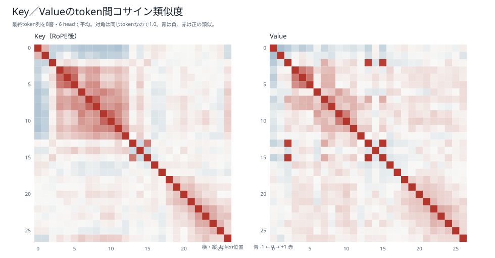

最終27 tokenについてtoken間のコサイン類似度を層・headごとに計算し、48個の値を平均した。KeyはRoPE適用後、Valueはprojection直後である。

| 指標 | Key | Value |
| --- | ---: | ---: |
| 非対角要素の平均 | 0.0723 | 0.0743 |
| 非対角要素の絶対値平均 | 0.1327 | 0.1195 |
| 最大の非対角類似度 | 0.7539 | 0.9951 |
| 最大pair | 位置9「降」／位置10「順に並べ」 | 位置13改行／位置15改行 |

Valueでは同じ改行tokenの2位置が非常に近い表現になった。Keyでは日本語の隣接token「降」「順に並べ」が最も近かった。ただし、48個の層・headを平均した結果であり、個別headの差を消した要約である。

### 複数headで繰り返し参照されたtoken

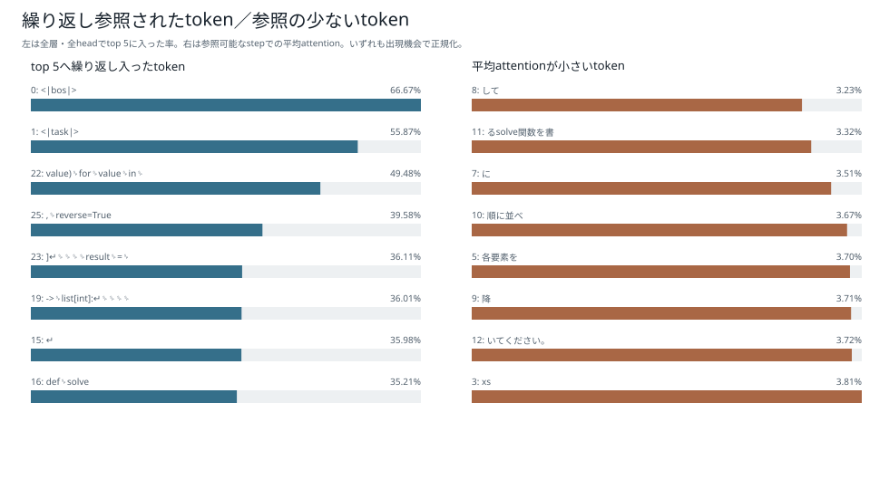

「top 5入り率」は、そのtokenが参照可能だった`生成step × 48 layer-head`を分母にし、個別layer-headの上位5位置へ入った回数を正規化した値である。

| 位置 | token | top 5入り率 | 参照したlayer-head | 参照step |
| ---: | --- | ---: | ---: | ---: |
| 0 | <code><&#124;bos&#124;></code> | 66.67% | 48 / 48 | 11 / 11 |
| 1 | <code><&#124;task&#124;></code> | 55.87% | 46 / 48 | 11 / 11 |
| 22 | <code>value)␠for␠value␠in␠xs</code> | 49.48% | 39 / 48 | 4 / 4 |
| 25 | <code>,␠reverse=True</code> | 39.58% | 19 / 48 | 1 / 1 |
| 23 | <code>]↵␠␠␠␠result␠=␠</code> | 36.11% | 26 / 48 | 3 / 3 |
| 19 | <code>->␠list[int]:↵␠␠␠␠</code> | 36.01% | 39 / 48 | 7 / 7 |
| 15 | <code>↵</code> | 35.98% | 48 / 48 | 11 / 11 |
| 16 | <code>def␠solve</code> | 35.21% | 44 / 48 | 10 / 10 |

`<|bos|>`は全48 layer-head・全11 stepから参照され、top 5入り率66.67%だった。`<|task|>`も46 / 48 layer-headから参照された。位置22以降の生成tokenは参照可能なstepが少ないため、率が高くても長い期間の再利用を意味しない。表の「参照step」と「参照可能step」を併記して区別している。

### ほとんど参照されなかったtoken

短い生成末尾tokenが不当に低くならないよう、3 step以上参照可能だったtokenだけを対象に、参照可能stepでの平均attentionが小さい順に示した。

| 位置 | token | 平均attention | top 5入り率 | 参照したlayer-head |
| ---: | --- | ---: | ---: | ---: |
| 8 | <code>して</code> | 3.23% | 8.90% | 25 / 48 |
| 11 | <code>るsolve関数を書</code> | 3.32% | 5.30% | 19 / 48 |
| 7 | <code>に</code> | 3.51% | 7.77% | 29 / 48 |
| 10 | <code>順に並べ</code> | 3.67% | 10.04% | 24 / 48 |
| 5 | <code>各要素を</code> | 3.70% | 11.74% | 33 / 48 |
| 9 | <code>降</code> | 3.71% | 10.42% | 20 / 48 |
| 12 | <code>いてください。</code> | 3.72% | 8.52% | 26 / 48 |
| 3 | <code>xs</code> | 3.81% | 11.74% | 28 / 48 |

この例では、日本語指示中の助詞・定型句に低い値が多かった。ただし「絶対値」のように特定の生成stepで上位へ入るtokenも、全11 step平均では薄まる。したがって、平均値だけを根拠にKVキャッシュから削除してよいとは判断できない。

## attention研究の論点に沿った追加解析

1 promptの観察だけではheadの役割や因果的寄与を判断できないため、24種類の単独操作を使い、head別パターン、Valueノルム、attention rollout、因果的ablationを追加した。

### 実験条件

| 項目 | 条件 |
| --- | --- |
| モデル | 3エポックBoku1-nano |
| 指示 | 24単独操作のcanonical指示を各1件 |
| 生成 | greedy、合計208生成token |
| hidden test | 1問当たり境界9件＋seed固定ランダム24件＝33件 |
| head | 8層 × 6 head＝48 head |
| head ablation | 1 headずつout_proj直前の64次元を0化 |
| 位置ablation | 全層で対象位置のValueだけを0化。Keyとattention weightは維持 |

基準モデルは24 / 24問、24 × 33＝792入力に合格した。この24問はhead比較用の診断集合であり、通常評価84,550件の代わりではない。

### headごとの記述的な役割

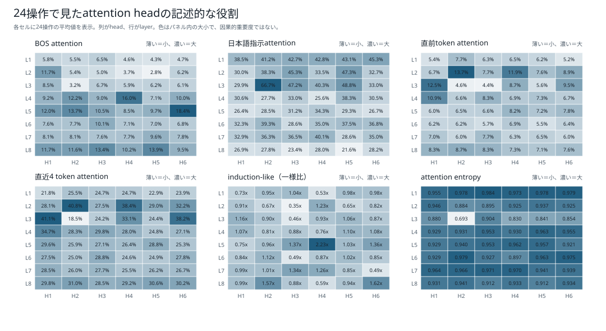

#### このヒートマップは何を平均したものか

**この図はValueベクトルを表示したものではない。** QueryとKeyから計算したattention weightを、層・headごとに要約した図である。Valueを含む解析は次節の「Attention sinkとValueノルム」で別に示す。

1セルは1つの「層 × head」を表す。例えばL3H2はLayer 3のHead 2である。24種類の単独操作から得た合計208生成stepをまとめ、各stepで計算した指標を算術平均した。

$$
\bar m_{l,h}
=
\frac{1}{208}
\sum_{s=1}^{24}
\sum_{t=1}^{T_s}
m_{l,h,s,t},
\qquad
\sum_{s=1}^{24}T_s=208
$$

したがって、これは「24問の平均をさらに平均した値」ではなく、**24問に含まれる208生成stepを同じ重みで平均した値**である。生成token数が多い操作は、そのstep数だけ平均へ多く入る。

| パネル | 各生成stepで測っている値 | セルの表示 |
| --- | --- | --- |
| BOS attention | BOS位置1点へのattention weight | 208 stepの平均、% |
| 日本語指示attention | 日本語指示に属する全tokenへのattention合計 | 208 stepの平均、% |
| 直前token attention | 現在位置の1つ前へのattention weight | 208 stepの平均、% |
| 直近4 token attention | 現在位置を含む直近4位置へのattention合計 | 208 stepの平均、% |
| induction-like | 同じtokenの過去出現直後へ向いたattentionを、一様分布の期待値で割った倍率 | 該当位置がある24 stepだけの平均、倍 |
| attention entropy | attentionが1点集中か、広く分散か | 208 stepの正規化平均、0〜1 |

日本語指示attentionのstep値は、指示領域$I_s$に含まれるattentionを足した値である。

$$
m^{\mathrm{instruction}}_{l,h,s,t}
=
\sum_{j \in I_s}
a_{l,h,s,t,j}
$$

各パネルの色は、そのパネル内の48セルだけで最小値から最大値へ割り当てている。したがって、**異なるパネル同士を色の濃さだけで比較してはいけない。** パネルをまたいで比較するときはセル内の数値を見る。濃いセルでは白文字、薄いセルでは濃色文字に切り替えている。

#### attention entropyとは

attention entropyは、1つのheadが参照可能なtokenへattentionをどれくらい広く配ったかを表す。参照可能token数$N_t$で正規化している。

$$
H_{l,h,t}
=
-
\frac{
\displaystyle\sum_{j=1}^{N_t}
a_{l,h,t,j}\log a_{l,h,t,j}
}{
\log N_t
}
$$

- $H$が0に近い: ほぼ1つのtokenへ集中している。
- $H$が1に近い: 参照可能なtokenへほぼ均等に分散している。
- entropyが高いことは、性能や重要度が高いことを意味しない。「広く見るhead」か「絞って見るhead」かを記述する値である。

今回もっともentropyが高いL1H3は0.984で、かなり均等にattentionを配っていた。一方、これはL1H3が重要だという意味ではなく、参照分布が平坦だという意味だけである。

#### 図から読める役割候補

- L3H2は日本語指示attentionが66.7%で最大であり、日本語条件を読む候補である。
- L2H2は直前token 13.7%、直近4 token 40.8%で、局所的なコード列を追う候補である。
- L5H6はBOS attentionが18.4%で最大であり、attention sink候補である。
- L6H3はcopy-like scoreが一様分布の3.40倍だが、この指標は今回の6パネルには含めず、全数値JSONとablation節で扱う。
- L5H4のinduction-like scoreは2.23倍だが、該当する生成stepは24 / 208だけである。正式なinduction head認定には反復ランダム系列での追加実験が必要である。

### Attention sinkとValueノルム

各tokenについて次の構成比を計算した。

$$
c_{l,h,t,j}
=
\left\|
a_{l,h,t,j}
W_{O,l,h}
V_{l,h,j}
\right\|_2
$$

$$
r_{l,h,t,j}
=
\frac{
c_{l,h,t,j}
}{
\displaystyle\sum_{k=1}^{N_t}c_{l,h,t,k}
}
$$

$c_{l,h,t,j}$はtoken $j$から足し込まれるベクトルの大きさ、$r_{l,h,t,j}$はその構成比である。

これはKobayashi et al.の「重みだけでなく重み付きValueのノルムも見る」という考えを、head別out_projまで含めて適用したものである。

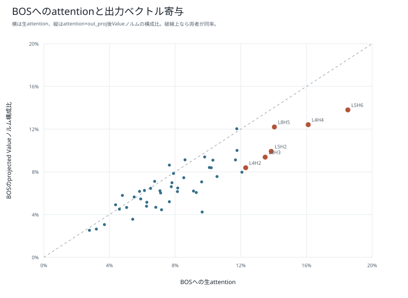

| BOSの指標 | 48 head平均 | 最大head |
| --- | ---: | ---: |
| 生attention | 8.42% | L5H6: 18.37% |
| attention × Valueノルム構成比 | 7.29% | L5H6: 15.09% |
| attention × projected Valueノルム構成比 | 6.95% | L5H6: 13.69% |

48 head中39 headでprojected Valueノルム構成比が生attentionより小さく、L5H6も18.37%から13.69%へ低下した。heatmapはBOSの実ベクトル寄与を過大表示している。ただし、BOS Valueを全層で0にすると14 / 24問でコードが変わり、合格率も24 / 24から22 / 24へ下がった。BOSはsink的だが完全に無意味ではない。

### attention rollout

残差を含むhead平均attentionを行正規化し、8層を掛け合わせた。

$$
\widetilde A_l
=
\operatorname{row-normalize}
\left(
\frac{1}{6}
\sum_{h=1}^{6}A_{l,h}
+
I
\right)
$$

$$
R
=
\widetilde A_8
\widetilde A_7
\cdots
\widetilde A_1
$$

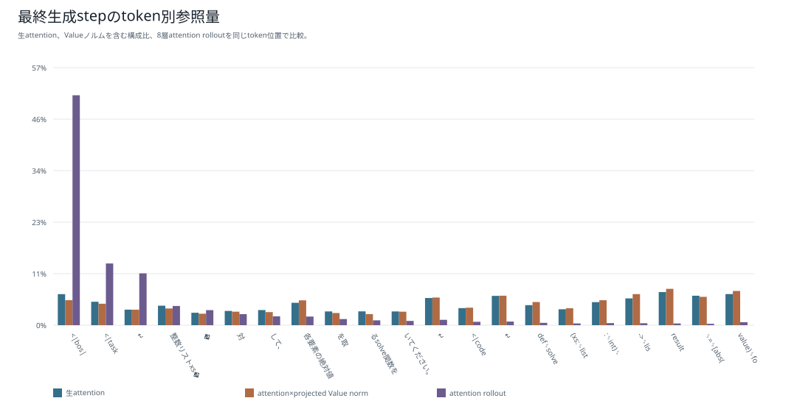

絶対値操作の最終生成stepでは、生attentionのBOSは6.93%だったがrolloutでは51.31%になった。これは出力の半分がBOSを根拠にしたという意味ではない。causal decoderでは冒頭へ至る経路が多く、層を掛けるほど初期tokenへ偏る。Abnar and Zuidemaもdecoderのcausal maskによる初期位置バイアスを指摘しているため、rolloutは経路の可視化に限り、因果的重要度には使わない。

### head ablationによる因果的検証

#### NLL影響とは

NLLはnegative log-likelihoodの略で、正解として比較するtokenへモデルが付けた確率の低さを測る損失である。今回は基準モデル自身がgreedy生成した208 tokenを正解列$y_1,\ldots,y_T$として、teacher forcingで計算した。

$$
\operatorname{NLL}
=
-
\frac{1}{T}
\sum_{t=1}^{T}
\log
p_{\theta}
\left(
y_t
\mid
x,y_{<t}
\right)
$$

確率が高いほど$-\log p$は小さくなるため、**NLLは小さいほうが、基準生成tokenを強く支持している。** 基準モデルのNLLは0.39244 nat/tokenだった。

**natは自然対数で測った情報量の単位**である。ここでの$\log$は底$e$の自然対数$\ln$で、実装でもPyTorchの`F.cross_entropy`（自然対数）を使っている。底2の対数で測る場合の単位がbitで、$1\,\mathrm{nat}=1/\ln 2\approx1.443\,\mathrm{bit}$である。したがって基準NLLの0.39244 nat/tokenは約0.566 bit/tokenに当たる。

nat単位の平均NLLは、$\exp(-\operatorname{NLL})$で「1 token当たりの幾何平均確率」に戻せる。基準の0.39244 nat/tokenは$\exp(-0.39244)\approx0.675$で、基準生成tokenへ平均して約0.675の確率を付けていたことになる。

例えば、対象tokenへの確率が0.8なら$-\ln(0.8)\approx0.223$ nat、0.2なら$-\ln(0.2)\approx1.609$ natである。表の`+0.04822`は「正解率が4.822%下がった」という意味ではなく、headを消したことで1 token当たりの平均NLLが0.04822 nat増えた、という意味である。確率に戻すと$\exp(-0.04822)\approx0.953$倍、つまり幾何平均確率が相対的に約4.7%下がったことに相当する（0.675→約0.644）。

本レポートの「NLL影響」は、headを無効化した後と基準状態との差である。

$$
\Delta\operatorname{NLL}_{l,h}
=
\operatorname{NLL}_{\mathrm{head}\,(l,h)\,\mathrm{off}}
-
\operatorname{NLL}_{\mathrm{baseline}}
$$

- $\Delta\operatorname{NLL}>0$: headを消すと正解tokenの確率が下がった。そのheadが元の予測を支えていた可能性がある。
- $\Delta\operatorname{NLL}\approx0$: 消しても基準tokenの確率がほとんど変わらない。
- $\Delta\operatorname{NLL}<0$: 消したほうが基準tokenへの確率がわずかに上がった。

NLL差は、コードが正しいかを直接測る指標ではない。NLLが変わっても同値コードを生成できるため、greedy生成とhidden test合格率を併記する。

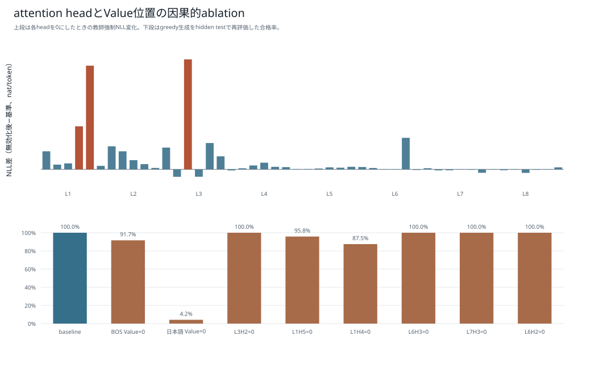

| head | 記述上の特徴 | NLL差（無効化後−基準） | argmax変化 | 合格 | 同じコード |
| --- | --- | ---: | ---: | ---: | ---: |
| L3H2 | 日本語指示66.66% | +0.04822 | 12 / 208 | 24 / 24 | 16 / 24 |
| L1H5 | 日本語指示43.10% | +0.04544 | 13 / 208 | 23 / 24 | 13 / 24 |
| L1H4 | copy-like 2.43倍 | +0.01887 | 9 / 208 | 21 / 24 | 15 / 24 |
| L6H3 | copy-like最大3.40倍 | -0.00002 | 0 / 208 | 24 / 24 | 24 / 24 |
| L7H3 | 低影響候補 | -0.00004 | 0 / 208 | 24 / 24 | 24 / 24 |
| L6H2 | 低影響候補 | -0.00006 | 0 / 208 | 24 / 24 | 24 / 24 |

L3H2は日本語attentionとNLL影響がともに最大で、日本語条件を扱う仮説を支持する。ただし、無効化後も全問が実行合格し、8問は異なるが同値なコードだった。token確率と機能的正しさは分けて評価する必要がある。

一方、copy-like score最大のL6H3を無効化しても24問すべてで生成token列まで一致した。特徴的なattention配置だけでは因果的重要度を証明できない。低影響3 headも個別ablationの結果であり、同時pruningや複数操作で安全とはまだ言えない。

### 日本語指示とBOSのValue ablation

| 条件 | 合格 | 同じコード |
| --- | ---: | ---: |
| 基準 | 24 / 24 | 24 / 24 |
| BOS Valueを全層で0 | 22 / 24 | 10 / 24 |
| 日本語指示Valueを全層で0 | 1 / 24 | 0 / 24 |

日本語のKeyとattention weightを残してValueだけを消しても23問が不合格となり、多くが符号反転に似た同一コードへ崩れた。日本語attentionが平均的に薄く見えても、そのValueは操作選択に必要である。BOS Valueの失敗はk以上とkの倍数が負値抽出へ変わった2件であり、BOSを単純な削除候補にはできない。

### attention値と因果的重要度の相関

| attention指標 | Pearson | Spearman |
| --- | ---: | ---: |
| 日本語指示 | 0.570 | 0.388 |
| BOS | -0.398 | -0.438 |
| 直前token | -0.177 | -0.032 |
| 直近4 token | -0.342 | -0.236 |
| induction-like | -0.110 | -0.126 |

日本語attentionには中程度の正の関係があるため、可視化が無意味という結果ではない。しかし他の指標では高attentionと因果的重要度が一致しない。結論は、**attentionは役割仮説を作る観察手段として有用だが、出力根拠として主張するにはablationと実行評価が必要**、である。

### 研究との対応

- [Clark et al. 2019](https://aclanthology.org/W19-4828/): head別のdelimiter・位置・構文パターン。
- [Voita et al. 2019](https://aclanthology.org/P19-1580/): 特化headとpruning。本解析は1 headずつのablationで、再学習を伴うpruningではない。
- [Jain and Wallace 2019](https://arxiv.org/abs/1902.10186)、[Wiegreffe and Pinter 2019](https://aclanthology.org/D19-1002/): attentionを説明とする条件と検証方法。
- [Kobayashi et al. 2020](https://aclanthology.org/2020.emnlp-main.574/): attention × Value norm。
- [Abnar and Zuidema 2020](https://aclanthology.org/2020.acl-main.385/): 残差を含むattention rollout。
- [Olsson et al. 2022](https://transformer-circuits.pub/2022/in-context-learning-and-induction-heads/index.html): induction head。本解析では候補観察に留める。
- [Xiao et al. 2023](https://arxiv.org/abs/2309.17453): attention sink。本解析ではValue ablationも併用した。

全数値は[boku_nano_attention_interpretability_analysis.json](boku_nano_attention_interpretability_analysis.json)に保存した。

### 解析の限界

- token別詳細表は1 prompt、追加head解析は24単独操作のcanonical表現各1件である。複数操作、言い換え、反復、境界指示は未検証である。
- attentionは参照の観測値であり、出力tokenの因果的寄与そのものではない。
- attention × projected Valueノルムは各加算項の大きさであり、ベクトル相殺、残差、FFN、後続層を完全には表さない。
- rolloutはhead平均と線形混合を仮定した近似で、causal decoderでは冒頭へ偏る。
- head ablationは1 headずつの局所実験であり、同時削除や再学習後の性能を示さない。
- Value ablationはKeyを残すため、token削除やattention maskとは異なる。
- 現行モデルは永続KVキャッシュを実装していない。今回のQ/K/Vは各stepで再計算した。
- キャッシュ削減は通常評価全体でmaskまたは除去し、pass@1と処理時間を測る必要がある。

生の最後のQuery、attention集計、類似度matrixは[`boku_nano_attention_analysis.json`](boku_nano_attention_analysis.json)に保存した。

## 狭い文脈でのKVキャッシュ容量

Boku1-nanoへ永続KVキャッシュを追加すると仮定した場合、batch 1の1 token当たり要素数は次の式になる。

$$
8\;\mathrm{layers}
\times 2\;(K+V)
\times 6\;\mathrm{heads}
\times 64\;\mathrm{dimensions}
=
6{,}144\;\mathrm{elements/token}
$$

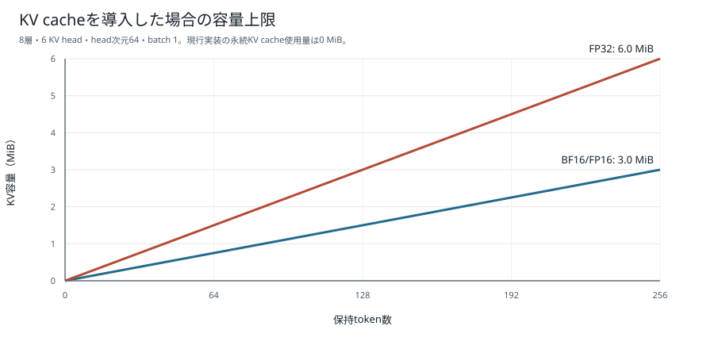

| dtype | 1 token | 256 token上限 |
| --- | ---: | ---: |
| BF16 / FP16 | 12 KiB | 3.0 MiB |
| FP32 | 24 KiB | 6.0 MiB |
| 現行実装の永続KVキャッシュ | 0 | 0 MiB |

最大系列長が256 tokenで、8層・6 headの小型構成なので、将来KVキャッシュを追加してもキャッシュ本体は数MiBに収まる。ただし、これはモデル重み、ONNX Runtimeの作業領域、attentionの一時tensorを含まない。

## 現行生成とKVキャッシュ導入時の違い

現行のブラウザ推論は次の動作をする。

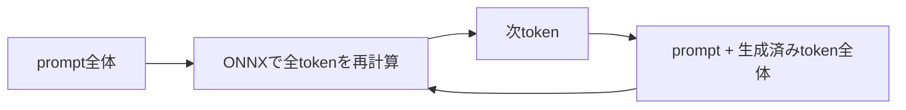

KVキャッシュを実装した場合は、最初にprompt全体を処理した後、過去のK/Vを保持し、新しい1 token分だけを追加計算できる。

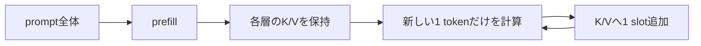

今回の例では、EOS判定を含めてONNX相当の推論呼び出しが12回必要だった。

| 比較対象 | QKV projectionへ通すtoken位置の累計 |
| --- | ---: |
| 現行の全prefix再計算 | 258 |
| KVキャッシュを使う仮想実装 | 27 |
| 比率 | 約9.56倍 |

これはQKV projectionへ通るtoken位置数の比較であり、実測処理時間の高速化率ではない。attention、メモリ転送、ONNX Runtime、WebGPUのオーバーヘッドがあるため、9.56倍高速になるという意味ではない。

## 生成結果

| 項目 | 結果 |
| --- | ---: |
| prompt | 16 token |
| 生成コード | 11 token |
| 可視化対象 | 27 token |
| 推論呼び出し | 12回、最後はEOS |
| 1層のK/V shape | `[1, 6, 27, 64]` |
| 生成コードの実行検証 | 64 / 64入力に合格 |

生成コードは次のとおりだった。

```python
def solve(xs: list[int], k: int) -> list[int]:
    result = [abs(value) for value in xs]
    result = sorted(result, reverse=True)
    return result
```

指示された「絶対値化」と「降順sort」の2操作を順番どおり生成している。 構文、Safe-AST、固定signature、入力非破壊を検査し、境界9件と固定seedのランダム55件、合計64入力で参照インタプリタと一致した。

## 学生へ説明する要点

- Boku1-nanoは制限自然言語専用のSLMであり、自由な日本語全般を理解するモデルではない。
- K/Vはモデルが過去tokenを参照するための内部表現であり、学習データやルール表そのものを格納したものではない。
- KVキャッシュはK/Vを次の生成stepへ再利用する推論最適化であり、モデルの能力を増やす仕組みではない。
- 現行版は実装を単純にするためKVキャッシュを持たず、毎step全prefixを再計算する。
- 最大系列長256 tokenなので、将来キャッシュを追加してもBF16/FP16なら最大約3 MiBと小さい。
- 本課題の中心は、自然言語データの機械生成と、生成コードの実行による機械検証である。

## 再生成方法

```bash
.venv/bin/python scripts/model/visualize_boku_nano_kv.py
.venv/bin/python scripts/model/analyze_boku_nano_attention.py
.venv/bin/python scripts/model/analyze_boku_nano_attention_interpretability.py
```

実行すると次を再生成する。

| 成果物 | 内容 |
| --- | --- |
| [`figures/boku_nano_kv_state_heatmap.svg`](figures/boku_nano_kv_state_heatmap.svg) | 実モデルから取得した層×tokenのK/V RMS |
| [`figures/boku_nano_kv_cache_memory.svg`](figures/boku_nano_kv_cache_memory.svg) | 仮想KVキャッシュのtoken数別容量 |
| [`boku_nano_kv_visualization_metrics.json`](boku_nano_kv_visualization_metrics.json) | 入力、生成コード、shape、RMS、容量計算の生データ |
| [`../../scripts/model/visualize_boku_nano_kv.py`](../../scripts/model/visualize_boku_nano_kv.py) | K/V RMSと容量図の再生成スクリプト |
| [`figures/boku_nano_attention_by_layer_head.svg`](figures/boku_nano_attention_by_layer_head.svg) | 生成step・層・head別attention |
| [`figures/boku_nano_attention_regions.svg`](figures/boku_nano_attention_regions.svg) | 領域別attention比率 |
| [`figures/boku_nano_kv_cosine_similarity.svg`](figures/boku_nano_kv_cosine_similarity.svg) | Key／Valueのtoken間類似度 |
| [`figures/boku_nano_token_utilization.svg`](figures/boku_nano_token_utilization.svg) | 繰り返し参照／参照の少ないtoken |
| [`boku_nano_attention_analysis.json`](boku_nano_attention_analysis.json) | 最後のQuery、attention、類似度の生データ |
| [`../../scripts/model/analyze_boku_nano_attention.py`](../../scripts/model/analyze_boku_nano_attention.py) | 詳細attention解析の再生成スクリプト |
| [figures/boku_nano_attention_head_roles.svg](figures/boku_nano_attention_head_roles.svg) | 24操作におけるhead別の参照パターン |
| [figures/boku_nano_attention_sink_contribution.svg](figures/boku_nano_attention_sink_contribution.svg) | BOSの生attentionとprojected Valueノルム構成比 |
| [figures/boku_nano_attention_causal_ablation.svg](figures/boku_nano_attention_causal_ablation.svg) | head・位置ablationのNLLと実行合格率 |
| [figures/boku_nano_attention_rollout.svg](figures/boku_nano_attention_rollout.svg) | 生attention、norm、rolloutのtoken別比較 |
| [boku_nano_attention_interpretability_analysis.json](boku_nano_attention_interpretability_analysis.json) | 24操作、48 head、ablation結果の全数値 |
| [../../scripts/model/analyze_boku_nano_attention_interpretability.py](../../scripts/model/analyze_boku_nano_attention_interpretability.py) | 研究論点に沿った追加解析スクリプト |

## 根拠となる実装

- [`scripts/model/boku_nano.py`](../../scripts/model/boku_nano.py): QKV projection、6 headへの分割、RoPE、causal attention
- [`scripts/model/export_boku_nano_onnx.py`](../../scripts/model/export_boku_nano_onnx.py): `input_ids`から末尾logitsだけを返すONNX export
- [`web/demo.js`](../../web/demo.js): 生成ごとに`currentIds`全体をONNXへ渡すブラウザ生成ループ
- [`docs/procedures/boku_nano_onnx_web_demo.md`](../procedures/boku_nano_onnx_web_demo.md): KVキャッシュ非実装を含むWebデモの制約
