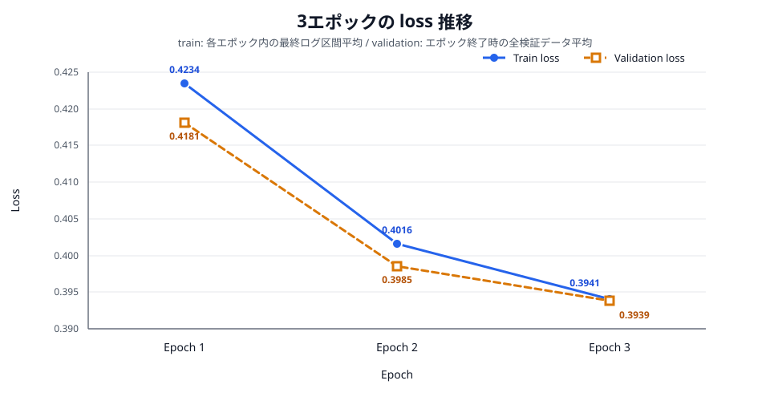
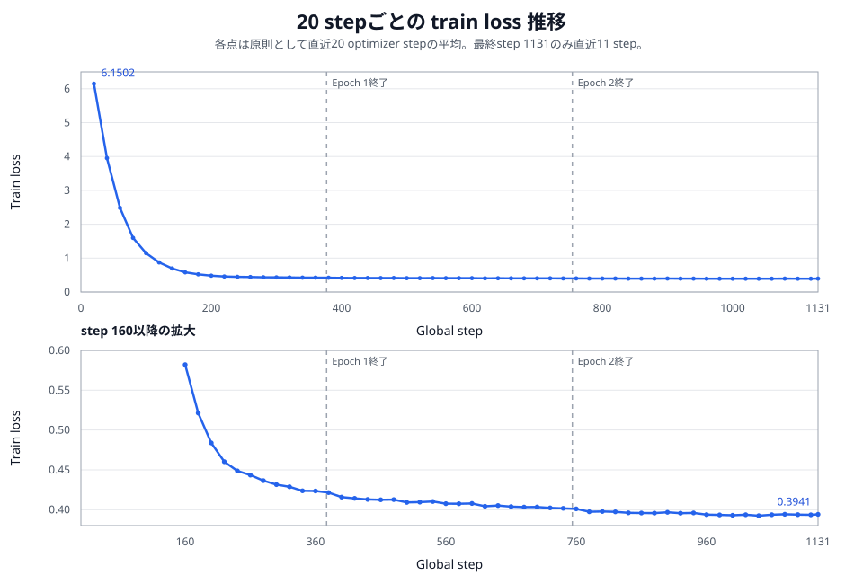

# Boku Nano 3エポック学習結果

## 概要

`data/models/boku_nano_bpe_2048`の学習ログを確認し、3エポックにわたるtrain lossとvalidation lossの推移を整理した。

- train lossは各エポック内の最終ログ区間で`0.4234`、`0.4016`、`0.3941`と低下した。
- validation lossは`0.4181`、`0.3985`、`0.3939`と一貫して低下した。
- 1エポック当たりの訓練系列は`6,939,466 token`で、このうちloss計算対象は`3,746,067 token`である。
- 3エポックの範囲ではvalidation lossの悪化はなく、ログ上に過学習を示す乖離は見られない。
- 改善幅はEpoch 2からEpoch 3で小さくなっており、lossは収束に近づいている。

## 確認対象

| 項目 | ファイル |
|---|---|
| モデル | `data/models/boku_nano_bpe_2048/model.safetensors` |
| 学習メトリクス | `data/models/boku_nano_bpe_2048/training_metrics.jsonl` |
| コンソールログ | `data/models/boku_nano_training_console.log` |
| 学習設定 | `data/models/boku_nano_bpe_2048/training_config.yaml` |
| 完了情報 | `data/models/boku_nano_bpe_2048/training_manifest.json` |

## モデル構成

課題文の推奨構成と、今回実際に学習・評価したモデル設定を並べて示す。評価結果はすべて右列の実設定に対するものである。

| 項目 | 課題文の推奨値 | 実際の設定 |
|---|---:|---:|
| アーキテクチャ | Decoder-only Transformer | Decoder-only Transformer |
| 層数 | 10 | 8 |
| hidden size | 768 | 384 |
| Attention head数 | 12 | 6 |
| KV head数 | 4 | 6 |
| 1 head当たりの次元数 | 64 | 64 |
| FFN size | 2,048 | 1,024 |
| 語彙数 | 4,096 | 2,048 |
| 最大系列長 | 256 | 256 |
| 位置表現 | RoPE | RoPE（base 10,000） |
| 正規化 | RMSNorm | RMSNorm（epsilon 1e-5） |
| 活性化 | SwiGLU | SwiGLU（SiLU gate） |
| 入出力埋め込み | weight tying | 非共有 |
| dropout | 指定なし | 0.0 |
| Linear層のbias | 指定なし | なし |
| 総パラメータ数 | 約70M | 15,735,168（約15.7M） |

実装はGrouped Query Attentionではなく通常のMulti-Head Attentionであり、query・key・valueをすべて6 headへ分割するため、KV head数も6である。入力token embeddingと出力headは共有せず、独立したparameterとしている。

## Lossの読み方

学習コード上の`loss`はエポック平均ではなく、通常は直近20 optimizer stepの平均である。Epoch 1とEpoch 2の境界では未満の区間がフラッシュされないため、表のtrain lossには各エポック内で最後に記録された区間平均を採用した。Epoch 3の最後だけは学習最終stepでも記録されるため、直近11 stepの平均である。

validation lossは各エポック終了時に固定validation 24,040件、教師対象468,381 tokenの全体で計算された平均である。train lossとは集計方法が異なるため、それぞれの時系列で学習の進行を確認する。

## 1エポック当たりのトークン数

| 区分 | 1エポック | 3エポック合計 |
|---|---:|---:|
| 訓練系列全体 | 6,939,466 token | 20,818,398 token |
| loss計算対象（コードとEOS） | 3,746,067 token | 11,238,201 token |

訓練系列全体には、日本語指示を含むprompt、教師コード、EOSが含まれる。実際にlossを計算したのは教師コードとEOSだけである。

参考として、各エポック終了時のvalidationは系列全体851,974 token、loss計算対象468,381 tokenである。

## エポック別結果

| Epoch | エポック終了step | train記録step | Train loss | Validation loss | Validation perplexity |
|---:|---:|---:|---:|---:|---:|
| 1 | 377 | 360 | 0.423421 | 0.418147 | 1.519144 |
| 2 | 754 | 740 | 0.401642 | 0.398529 | 1.489633 |
| 3 | 1,131 | 1,131 | 0.394078 | 0.393880 | 1.482722 |

### 改善幅

| 比較 | Train loss | Validation loss |
|---|---:|---:|
| Epoch 1 → 2 | -0.021780（-5.14%） | -0.019618（-4.69%） |
| Epoch 2 → 3 | -0.007563（-1.88%） | -0.004650（-1.17%） |
| Epoch 1 → 3 | -0.029343（-6.93%） | -0.024268（-5.80%） |

## 学習中の推移

Epoch 1では最初の記録であるstep 20のtrain loss `6.1502`から急速に低下し、step 200で`0.4837`、step 360で`0.4234`となった。初期の大きな低下後も、Epoch 2とEpoch 3で小幅ながら改善が継続した。

validation lossもEpoch 1の`0.4181`からEpoch 2の`0.3985`へ大きく改善し、Epoch 3では`0.3939`まで低下した。ただし、Epoch 3での改善量はEpoch 2までより小さい。3エポック時点ではtrainとvalidationが同方向に低下しており、validationだけが反転して悪化する挙動はない。

### 20 stepごとのtrain loss

学習ログには原則20 optimizer stepごとの区間平均lossが56点記録されている。これに学習終了時のstep 1,131を加えた全57点を示す。

| Epoch 1 step | Loss | Epoch 2 step | Loss | Epoch 3 step | Loss |
|---:|---:|---:|---:|---:|---:|
| 20 | 6.150181 | 380 | 0.421441 | 760 | 0.401005 |
| 40 | 3.952743 | 400 | 0.415811 | 780 | 0.397430 |
| 60 | 2.482738 | 420 | 0.414163 | 800 | 0.397704 |
| 80 | 1.597278 | 440 | 0.412789 | 820 | 0.397259 |
| 100 | 1.147354 | 460 | 0.412427 | 840 | 0.396023 |
| 120 | 0.871717 | 480 | 0.412622 | 860 | 0.395831 |
| 140 | 0.696296 | 500 | 0.409071 | 880 | 0.395666 |
| 160 | 0.582039 | 520 | 0.409419 | 900 | 0.396692 |
| 180 | 0.521410 | 540 | 0.410190 | 920 | 0.395518 |
| 200 | 0.483744 | 560 | 0.407523 | 940 | 0.395880 |
| 220 | 0.460269 | 580 | 0.407424 | 960 | 0.393812 |
| 240 | 0.448704 | 600 | 0.407798 | 980 | 0.393465 |
| 260 | 0.443425 | 620 | 0.404274 | 1,000 | 0.393013 |
| 280 | 0.436364 | 640 | 0.405192 | 1,020 | 0.393625 |
| 300 | 0.431437 | 660 | 0.403819 | 1,040 | 0.392432 |
| 320 | 0.428699 | 680 | 0.403225 | 1,060 | 0.393683 |
| 340 | 0.423691 | 700 | 0.403357 | 1,080 | 0.394174 |
| 360 | 0.423421 | 720 | 0.402202 | 1,100 | 0.393765 |
| — | — | 740 | 0.401642 | 1,120 | 0.393534 |
| — | — | — | — | 1,131* | 0.394078 |

`*`のstep 1,131は学習終了時に追加記録された直近11 stepの平均で、それ以外は直近20 stepの平均である。lossはstep 20の`6.150181`からstep 200の`0.483744`まで急速に低下し、その後は緩やかに改善して最終的に`0.394078`となった。

## 学習条件と完了状態

| 項目 | 値 |
|---|---:|
| エポック数 | 3 |
| optimizer step | 1,131 |
| 訓練レコード | 192,900件 |
| validationレコード | 24,040件 |
| 1エポック当たりの訓練系列 | 6,939,466 token |
| 1エポック当たりのloss計算対象 | 3,746,067 token |
| 有効batch size | 512 |
| パラメータ数 | 15,735,168 |
| device / dtype | CUDA / bfloat16 |
| 最終モデルSHA-256 | `5623f066cc47ef58790e56d5a62fe9a258d502569995a7aff6c65558c622cf0e` |

コンソールログ末尾では、3エポックの学習と最終validation後、当初のモデル書き出しがNumPy不足で失敗している。一方、`training_manifest.json`はEpoch 3 checkpointからの再開後に`status: completed`を記録しており、上記SHA-256の`model.safetensors`も保存済みである。したがって、学習自体と最終モデル保存は完了している。

## 結論

3エポックを通じてtrain lossとvalidation lossはともに低下し、最終validation lossは`0.393880`だった。過学習を示すvalidation lossの反転は確認されない。Epoch 3の改善幅は小さいため、追加学習を行う場合はvalidation lossの改善量と下流評価結果を併せて、延長の効果を判断するのが妥当である。
