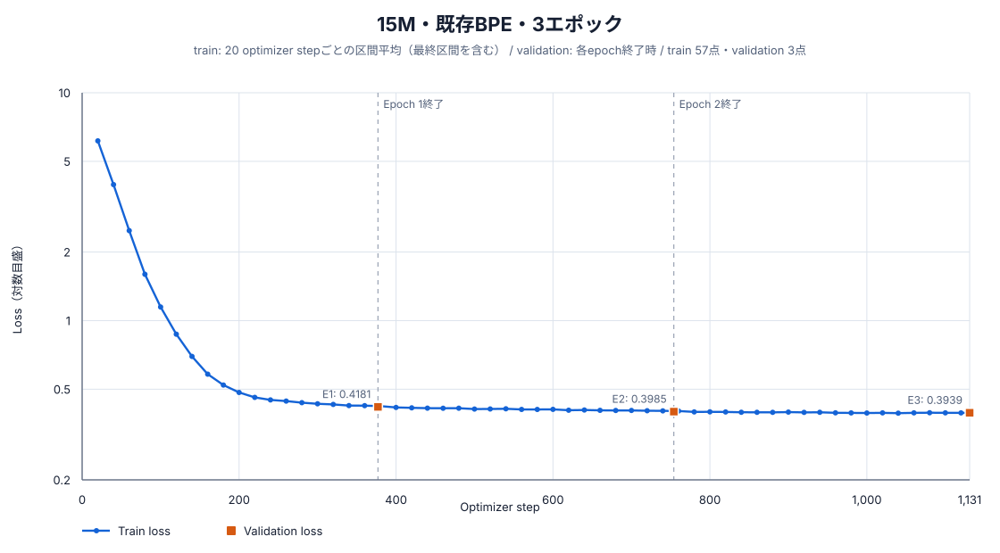

# 15M・既存BPE・3エポック：学習・評価報告

## 結論

15,735,168パラメータのDecoder-only Transformerを、既存BPE（語彙数2,048、`min_frequency=5`、`max_token_length=24`）でランダム初期値から3エポック学習した。固定5テストでは84,434 / 84,550件に合格し、pass@1は99.8628%、最終validation lossは0.393880だった。

## モデルとトークナイザー

| 項目 | 値 |
|---|---:|
| 総パラメータ数 | 15,735,168 |
| 語彙数 | 2,048 |
| hidden size | 384 |
| 層数 | 8 |
| Attention head数 | 6 |
| 1 head当たりの次元数 | 64 |
| FFN size | 1,024 |
| 最大系列長 | 256 |
| 位置表現 | RoPE |
| 正規化 / 活性化 | RMSNorm / SwiGLU |
| 入出力embedding共有 | なし |
| tokenizer最小頻度 / 最大piece長 | 5 / 24 |
| tokenizer SHA-256 | `6840a392e8fcae1083be06842774fa912a1797217c7033944ba2d87f1c227293` |
| seed | 20260925 |
| dtype / device | bfloat16 / cuda |
| micro / effective batch size | 512 / 512 |

## 学習結果

| 項目 | 結果 |
|---|---:|
| エポック | 3 |
| optimizer step | 1,131 |
| 1エポックの系列token | 6,939,466 |
| 全エポックの系列token | 20,818,398 |
| 1エポックのloss対象token | 3,746,067 |
| 全エポックのloss対象token | 11,238,201 |
| 学習時間 | 32.284秒 |
| モデルSHA-256 | `5623f066cc47ef58790e56d5a62fe9a258d502569995a7aff6c65558c622cf0e` |

| Epoch | 終了step | train記録step | 最終train loss | Validation loss | Validation perplexity |
|---:|---:|---:|---:|---:|---:|
| 1 | 377 | 360 | 0.423421 | 0.418147 | 1.519144 |
| 2 | 754 | 740 | 0.401642 | 0.398529 | 1.489633 |
| 3 | 1,131 | 1,131 | 0.394078 | 0.393880 | 1.482722 |

train lossは原則として直近20 optimizer stepの区間平均であり、validation lossは各epoch終了時に固定validation 24,040件全体で計算した値である。縦軸は初期と収束後を同じ図で読めるよう対数目盛にしている。



## 固定5テストの評価

`greedy`生成、最大160 token、bfloat16で評価した。参照コードとの文字列一致ではなく、構文、安全AST、`solve(xs, k)`、入力非変更、各問のhidden testをすべて満たした場合を合格とした。

| テスト | 合格 | 不合格 | pass@1 |
|---|---:|---:|---:|
| 通常テスト | 24,038 / 24,040 | 2 | 99.9917% |
| 組合せ汎化テスト | 13,397 / 13,400 | 3 | 99.9776% |
| 日本語言い換えテスト | 24 / 30 | 6 | 80.0000% |
| 同一操作反復テスト | 22,937 / 23,040 | 103 | 99.5530% |
| 境界値テスト | 24,038 / 24,040 | 2 | 99.9917% |
| **合計・参考値** | **84,434 / 84,550** | **116** | **99.8628%** |

| 段階別指標 | 件数 | 率 |
|---|---:|---:|
| Syntax-valid | 84,546 / 84,550 | 99.9953% |
| Safe-AST | 84,546 / 84,550 | 99.9953% |
| Signature-valid | 84,546 / 84,550 | 99.9953% |
| Executable | 84,546 / 84,550 | 99.9953% |
| pass@1 | 84,434 / 84,550 | 99.8628% |
| 組合せ汎化率 | 13,397 / 13,400 | 99.9776% |

### 不合格の分類

| 分類 | 件数 |
|---|---:|
| hidden testで意味不一致 | 112 |
| 構文・安全AST・signatureの静的不合格 | 4 |
| 実行時例外またはtimeout | 0 |
| timeout（上段との重複内数） | 0 |

## attention解析

15M・3エポックモデルは、K/V内部状態、head別attention、sink、rollout、Value・head ablationを解析済みである。


詳細は[KVキャッシュ・attention詳細解析レポート](../boku_nano_kv_cache_visualization.md)を参照。

## 成果物と再現情報

- [モデル本体](../../../data/models/boku_nano_15m_bpe_2048_minfreq5_maxlen24_3epoch/model.safetensors)
- [モデル設定](../../../data/models/boku_nano_15m_bpe_2048_minfreq5_maxlen24_3epoch/model_config.json)
- [学習設定](../../../data/models/boku_nano_15m_bpe_2048_minfreq5_maxlen24_3epoch/training_config.yaml)
- [学習manifest](../../../data/models/boku_nano_15m_bpe_2048_minfreq5_maxlen24_3epoch/training_manifest.json)
- [学習metrics](../../../data/models/boku_nano_15m_bpe_2048_minfreq5_maxlen24_3epoch/training_metrics.jsonl)
- 評価生データ: `data/evaluations/boku_nano_bpe_2048/`（Git管理対象外）

```bash
scripts/model/run_boku_nano_experiment_nohup.sh \
  --model-size 15m --epochs 3 \
  --tokenizer bpe_2048_minfreq5_maxlen24

uv run --group model-training --python 3.12.12 python \
  scripts/model/evaluate_boku_nano.py \
  --config config/boku_nano_evaluation.yaml \
  --model-directory data/models/boku_nano_15m_bpe_2048_minfreq5_maxlen24_3epoch \
  --output-directory data/evaluations/boku_nano_bpe_2048
```
