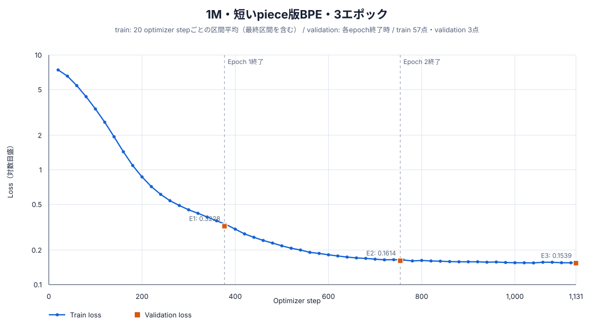
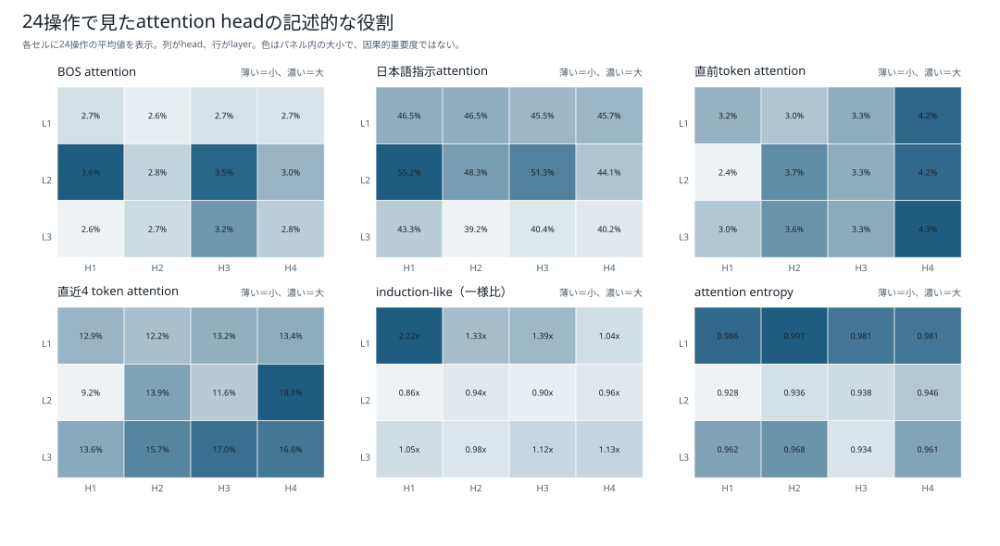
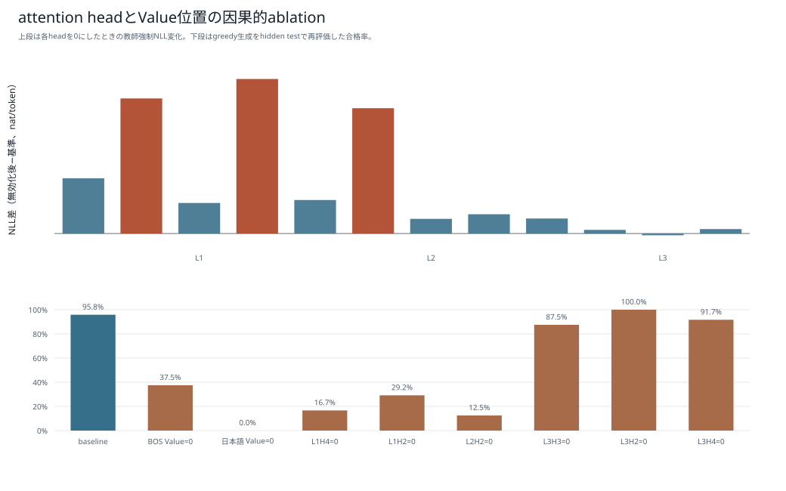

# 1M・短いpiece版BPE・3エポック：学習・評価報告

## 結論

1,016,704パラメータのDecoder-only Transformerを、短いpiece版BPE（語彙数2,048、`min_frequency=2`、`max_token_length=8`）でランダム初期値から3エポック学習した。固定5テストでは83,890 / 84,550件に合格し、pass@1は99.2194%、最終validation lossは0.153865だった。

## モデルとトークナイザー

| 項目 | 値 |
|---|---:|
| 総パラメータ数 | 1,016,704 |
| 語彙数 | 2,048 |
| hidden size | 128 |
| 層数 | 3 |
| Attention head数 | 4 |
| 1 head当たりの次元数 | 32 |
| FFN size | 256 |
| 最大系列長 | 256 |
| 位置表現 | RoPE |
| 正規化 / 活性化 | RMSNorm / SwiGLU |
| 入出力embedding共有 | なし |
| tokenizer最小頻度 / 最大piece長 | 2 / 8 |
| tokenizer SHA-256 | `f09f3d7eccbca2ab1224c662064b71e572d64147147b8b559ebdb428eb035dbf` |
| seed | 20260925 |
| dtype / device | bfloat16 / cuda |
| micro / effective batch size | 512 / 512 |

## 学習結果

| 項目 | 結果 |
|---|---:|
| エポック | 3 |
| optimizer step | 1,131 |
| 1エポックの系列token | 17,281,995 |
| 全エポックの系列token | 51,845,985 |
| 1エポックのloss対象token | 10,233,836 |
| 全エポックのloss対象token | 30,701,508 |
| 学習時間 | 54.874秒 |
| モデルSHA-256 | `216cc2ce080131455705af5a6589653d090f4d5ee42d031cf97cc15d796a4d7d` |

| Epoch | 終了step | train記録step | 最終train loss | Validation loss | Validation perplexity |
|---:|---:|---:|---:|---:|---:|
| 1 | 377 | 360 | 0.359948 | 0.322824 | 1.381022 |
| 2 | 754 | 740 | 0.164832 | 0.161426 | 1.175186 |
| 3 | 1,131 | 1,131 | 0.154775 | 0.153865 | 1.166333 |

train lossは原則として直近20 optimizer stepの区間平均であり、validation lossは各epoch終了時に固定validation 24,040件全体で計算した値である。縦軸は初期と収束後を同じ図で読めるよう対数目盛にしている。



## 固定5テストの評価

`greedy`生成、最大160 token、bfloat16で評価した。参照コードとの文字列一致ではなく、構文、安全AST、`solve(xs, k)`、入力非変更、各問のhidden testをすべて満たした場合を合格とした。

| テスト | 合格 | 不合格 | pass@1 |
|---|---:|---:|---:|
| 通常テスト | 23,891 / 24,040 | 149 | 99.3802% |
| 組合せ汎化テスト | 13,337 / 13,400 | 63 | 99.5299% |
| 日本語言い換えテスト | 22 / 30 | 8 | 73.3333% |
| 同一操作反復テスト | 22,749 / 23,040 | 291 | 98.7370% |
| 境界値テスト | 23,891 / 24,040 | 149 | 99.3802% |
| **合計・参考値** | **83,890 / 84,550** | **660** | **99.2194%** |

| 段階別指標 | 件数 | 率 |
|---|---:|---:|
| Syntax-valid | 84,545 / 84,550 | 99.9941% |
| Safe-AST | 84,545 / 84,550 | 99.9941% |
| Signature-valid | 84,545 / 84,550 | 99.9941% |
| Executable | 84,545 / 84,550 | 99.9941% |
| pass@1 | 83,890 / 84,550 | 99.2194% |
| 組合せ汎化率 | 13,337 / 13,400 | 99.5299% |

### 不合格の分類

| 分類 | 件数 |
|---|---:|
| hidden testで意味不一致 | 655 |
| 構文・安全AST・signatureの静的不合格 | 5 |
| 実行時例外またはtimeout | 0 |
| timeout（上段との重複内数） | 0 |

## attention解析

このモデルは24単独操作診断と生成step解析まで実施済みである。正式な固定5テストとはpromptと目的が異なるため、attention診断の合格数を正式pass@1と同一視しない。






- [24操作解析JSON](../attention_3epoch/boku_nano_1m_bpe_2048_minfreq2_maxlen8_3epoch/analysis.json)
- [生成step解析JSON](../attention_3epoch/boku_nano_1m_bpe_2048_minfreq2_maxlen8_3epoch/detail_analysis.json)

## 成果物と再現情報

- [モデル本体](../../../data/models/boku_nano_1m_bpe_2048_minfreq2_maxlen8_3epoch/model.safetensors)
- [モデル設定](../../../data/models/boku_nano_1m_bpe_2048_minfreq2_maxlen8_3epoch/model_config.json)
- [学習設定](../../../data/models/boku_nano_1m_bpe_2048_minfreq2_maxlen8_3epoch/training_config.yaml)
- [学習manifest](../../../data/models/boku_nano_1m_bpe_2048_minfreq2_maxlen8_3epoch/training_manifest.json)
- [学習metrics](../../../data/models/boku_nano_1m_bpe_2048_minfreq2_maxlen8_3epoch/training_metrics.jsonl)
- 評価生データ: `data/evaluations/boku_nano_1m_bpe_2048_minfreq2_maxlen8_3epoch/`（Git管理対象外）

```bash
scripts/model/run_boku_nano_experiment_nohup.sh \
  --model-size 1m --epochs 3 \
  --tokenizer bpe_2048_minfreq2_maxlen8

uv run --group model-training --python 3.12.12 python \
  scripts/model/evaluate_boku_nano.py \
  --config config/boku_nano_1m_bpe_2048_minfreq2_maxlen8_1epoch_evaluation.yaml \
  --model-directory data/models/boku_nano_1m_bpe_2048_minfreq2_maxlen8_3epoch \
  --output-directory data/evaluations/boku_nano_1m_bpe_2048_minfreq2_maxlen8_3epoch
```
