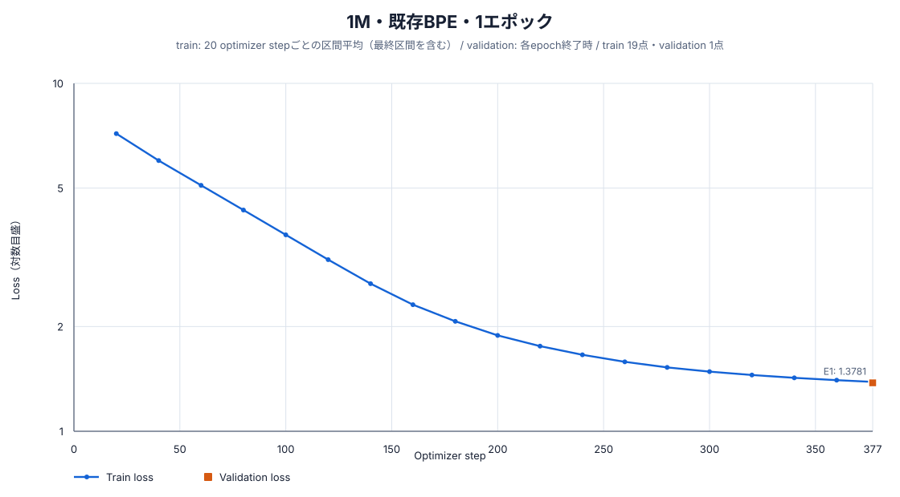
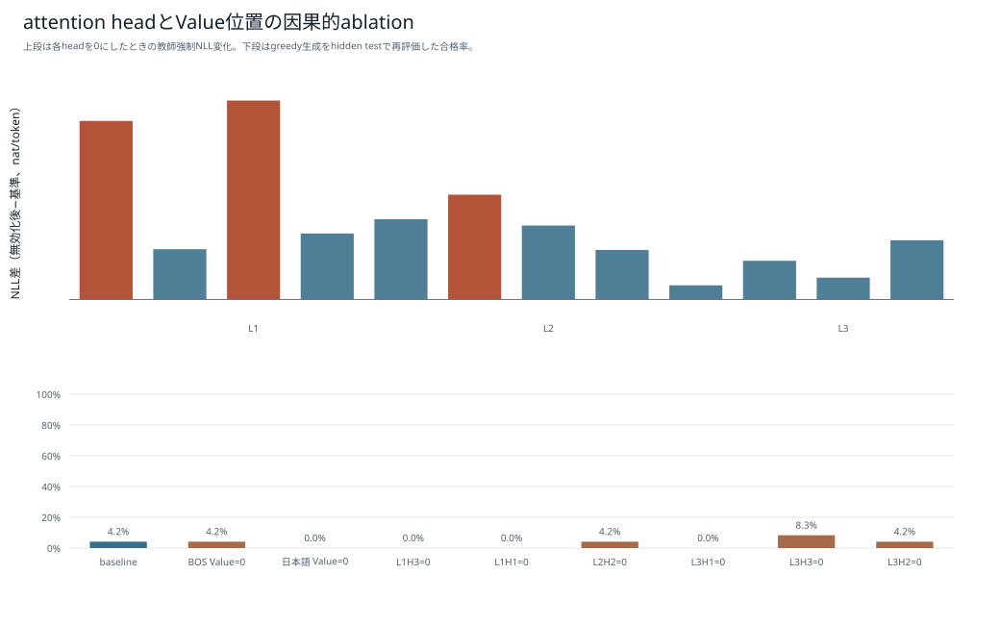

# 1M・既存BPE・1エポック：学習・評価報告

## 結論

1,016,704パラメータのDecoder-only Transformerを、既存BPE（語彙数2,048、`min_frequency=5`、`max_token_length=24`）でランダム初期値から1エポック学習した。固定5テストでは1,467 / 84,550件に合格し、pass@1は1.7351%、最終validation lossは1.378111だった。

## モデルとトークナイザー

| 項目 | 値 |
|---|---:|
| 総パラメータ数 | 1,016,704 |
| 語彙数 | 2,048 |
| hidden size | 128 |
| 層数 | 3 |
| Attention head数 | 4 |
| 1 head当たりの次元数 | 32 |
| FFN size | 256 |
| 最大系列長 | 256 |
| 位置表現 | RoPE |
| 正規化 / 活性化 | RMSNorm / SwiGLU |
| 入出力embedding共有 | なし |
| tokenizer最小頻度 / 最大piece長 | 5 / 24 |
| tokenizer SHA-256 | `6840a392e8fcae1083be06842774fa912a1797217c7033944ba2d87f1c227293` |
| seed | 20260925 |
| dtype / device | bfloat16 / cuda |
| micro / effective batch size | 512 / 512 |

## 学習結果

| 項目 | 結果 |
|---|---:|
| エポック | 1 |
| optimizer step | 377 |
| 1エポックの系列token | 6,939,466 |
| 全エポックの系列token | 6,939,466 |
| 1エポックのloss対象token | 3,746,067 |
| 全エポックのloss対象token | 3,746,067 |
| 学習時間 | 36.665秒 |
| モデルSHA-256 | `c4774c30963d00fee31f52ffc2201f85713cc941832b0c412161ce46541c2b0a` |

| Epoch | 終了step | train記録step | 最終train loss | Validation loss | Validation perplexity |
|---:|---:|---:|---:|---:|---:|
| 1 | 377 | 377 | 1.386624 | 1.378111 | 3.967401 |

train lossは原則として直近20 optimizer stepの区間平均であり、validation lossは各epoch終了時に固定validation 24,040件全体で計算した値である。縦軸は初期と収束後を同じ図で読めるよう対数目盛にしている。



## 固定5テストの評価

`greedy`生成、最大160 token、bfloat16で評価した。参照コードとの文字列一致ではなく、構文、安全AST、`solve(xs, k)`、入力非変更、各問のhidden testをすべて満たした場合を合格とした。

| テスト | 合格 | 不合格 | pass@1 |
|---|---:|---:|---:|
| 通常テスト | 446 / 24,040 | 23,594 | 1.8552% |
| 組合せ汎化テスト | 103 / 13,400 | 13,297 | 0.7687% |
| 日本語言い換えテスト | 2 / 30 | 28 | 6.6667% |
| 同一操作反復テスト | 508 / 23,040 | 22,532 | 2.2049% |
| 境界値テスト | 408 / 24,040 | 23,632 | 1.6972% |
| **合計・参考値** | **1,467 / 84,550** | **83,083** | **1.7351%** |

| 段階別指標 | 件数 | 率 |
|---|---:|---:|
| Syntax-valid | 76,978 / 84,550 | 91.0444% |
| Safe-AST | 76,978 / 84,550 | 91.0444% |
| Signature-valid | 76,978 / 84,550 | 91.0444% |
| Executable | 57,872 / 84,550 | 68.4471% |
| pass@1 | 1,467 / 84,550 | 1.7351% |
| 組合せ汎化率 | 103 / 13,400 | 0.7687% |

### 不合格の分類

| 分類 | 件数 |
|---|---:|
| hidden testで意味不一致 | 56,405 |
| 構文・安全AST・signatureの静的不合格 | 7,572 |
| 実行時例外またはtimeout | 19,106 |
| timeout（上段との重複内数） | 1 |

## attention解析

このモデルは24単独操作診断と生成step解析まで実施済みである。正式な固定5テストとはpromptと目的が異なるため、attention診断の合格数を正式pass@1と同一視しない。





- [24操作解析JSON](../attention_1epoch/boku_nano_1m_bpe_2048_minfreq5_maxlen24_1epoch/analysis.json)
- [生成step解析JSON](../attention_1epoch/boku_nano_1m_bpe_2048_minfreq5_maxlen24_1epoch/detail_analysis.json)

## 成果物と再現情報

- [モデル本体](../../../data/models/boku_nano_1m_bpe_2048_minfreq5_maxlen24_1epoch/model.safetensors)
- [モデル設定](../../../data/models/boku_nano_1m_bpe_2048_minfreq5_maxlen24_1epoch/model_config.json)
- [学習設定](../../../data/models/boku_nano_1m_bpe_2048_minfreq5_maxlen24_1epoch/training_config.yaml)
- [学習manifest](../../../data/models/boku_nano_1m_bpe_2048_minfreq5_maxlen24_1epoch/training_manifest.json)
- [学習metrics](../../../data/models/boku_nano_1m_bpe_2048_minfreq5_maxlen24_1epoch/training_metrics.jsonl)
- 評価生データ: `data/evaluations/boku_nano_1m_bpe_2048_1epoch/`（Git管理対象外）

```bash
scripts/model/run_boku_nano_experiment_nohup.sh \
  --model-size 1m --epochs 1 \
  --tokenizer bpe_2048_minfreq5_maxlen24

uv run --group model-training --python 3.12.12 python \
  scripts/model/evaluate_boku_nano.py \
  --config config/boku_nano_1m_bpe_2048_1epoch_evaluation.yaml \
  --model-directory data/models/boku_nano_1m_bpe_2048_minfreq5_maxlen24_1epoch \
  --output-directory data/evaluations/boku_nano_1m_bpe_2048_1epoch
```
