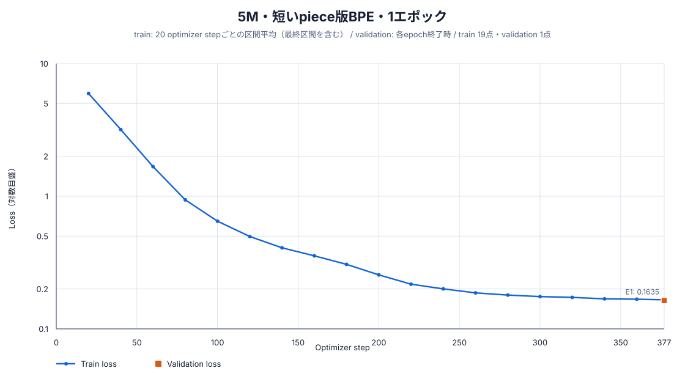
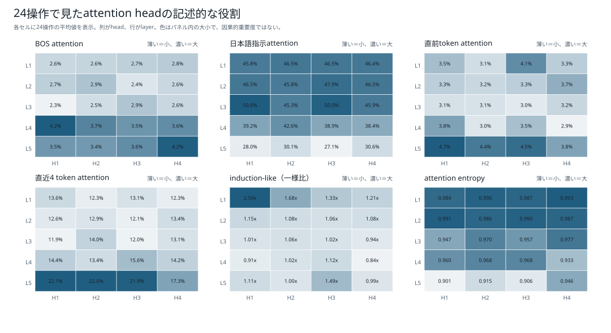
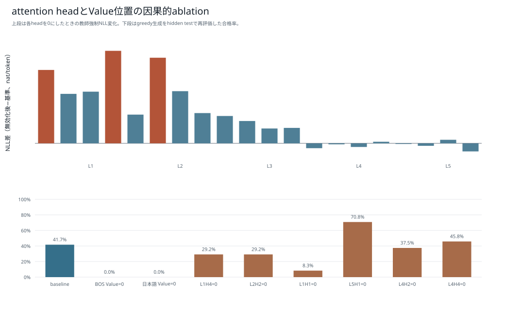

# 5M・短いpiece版BPE・1エポック：学習・評価報告

## 結論

5,065,472パラメータのDecoder-only Transformerを、短いpiece版BPE（語彙数2,048、`min_frequency=2`、`max_token_length=8`）でランダム初期値から1エポック学習した。固定5テストでは82,353 / 84,550件に合格し、pass@1は97.4015%、最終validation lossは0.163488だった。

## モデルとトークナイザー

| 項目 | 値 |
|---|---:|
| 総パラメータ数 | 5,065,472 |
| 語彙数 | 2,048 |
| hidden size | 256 |
| 層数 | 5 |
| Attention head数 | 4 |
| 1 head当たりの次元数 | 64 |
| FFN size | 704 |
| 最大系列長 | 256 |
| 位置表現 | RoPE |
| 正規化 / 活性化 | RMSNorm / SwiGLU |
| 入出力embedding共有 | なし |
| tokenizer最小頻度 / 最大piece長 | 2 / 8 |
| tokenizer SHA-256 | `f09f3d7eccbca2ab1224c662064b71e572d64147147b8b559ebdb428eb035dbf` |
| seed | 20260925 |
| dtype / device | bfloat16 / cuda |
| micro / effective batch size | 512 / 512 |

## 学習結果

| 項目 | 結果 |
|---|---:|
| エポック | 1 |
| optimizer step | 377 |
| 1エポックの系列token | 17,281,995 |
| 全エポックの系列token | 17,281,995 |
| 1エポックのloss対象token | 10,233,836 |
| 全エポックのloss対象token | 10,233,836 |
| 学習時間 | 51.329秒 |
| モデルSHA-256 | `0c2ad06d34004ffeae122409b6aa355d08e41b39e7303d3fd0cca8a4984eb5f9` |

| Epoch | 終了step | train記録step | 最終train loss | Validation loss | Validation perplexity |
|---:|---:|---:|---:|---:|---:|
| 1 | 377 | 377 | 0.165699 | 0.163488 | 1.177611 |

train lossは原則として直近20 optimizer stepの区間平均であり、validation lossは各epoch終了時に固定validation 24,040件全体で計算した値である。縦軸は初期と収束後を同じ図で読めるよう対数目盛にしている。



## 固定5テストの評価

`greedy`生成、最大160 token、bfloat16で評価した。参照コードとの文字列一致ではなく、構文、安全AST、`solve(xs, k)`、入力非変更、各問のhidden testをすべて満たした場合を合格とした。

| テスト | 合格 | 不合格 | pass@1 |
|---|---:|---:|---:|
| 通常テスト | 23,557 / 24,040 | 483 | 97.9908% |
| 組合せ汎化テスト | 12,999 / 13,400 | 401 | 97.0075% |
| 日本語言い換えテスト | 20 / 30 | 10 | 66.6667% |
| 同一操作反復テスト | 22,221 / 23,040 | 819 | 96.4453% |
| 境界値テスト | 23,556 / 24,040 | 484 | 97.9867% |
| **合計・参考値** | **82,353 / 84,550** | **2,197** | **97.4015%** |

| 段階別指標 | 件数 | 率 |
|---|---:|---:|
| Syntax-valid | 84,549 / 84,550 | 99.9988% |
| Safe-AST | 84,549 / 84,550 | 99.9988% |
| Signature-valid | 84,549 / 84,550 | 99.9988% |
| Executable | 84,549 / 84,550 | 99.9988% |
| pass@1 | 82,353 / 84,550 | 97.4015% |
| 組合せ汎化率 | 12,999 / 13,400 | 97.0075% |

### 不合格の分類

| 分類 | 件数 |
|---|---:|
| hidden testで意味不一致 | 2,196 |
| 構文・安全AST・signatureの静的不合格 | 1 |
| 実行時例外またはtimeout | 0 |
| timeout（上段との重複内数） | 0 |

## attention解析

このモデルは24単独操作診断と生成step解析まで実施済みである。正式な固定5テストとはpromptと目的が異なるため、attention診断の合格数を正式pass@1と同一視しない。






- [24操作解析JSON](../attention_1epoch/boku_nano_5m_bpe_2048_minfreq2_maxlen8_1epoch/analysis.json)
- [生成step解析JSON](../attention_1epoch/boku_nano_5m_bpe_2048_minfreq2_maxlen8_1epoch/detail_analysis.json)

## 成果物と再現情報

- [モデル本体](../../../data/models/boku_nano_5m_bpe_2048_minfreq2_maxlen8_1epoch/model.safetensors)
- [モデル設定](../../../data/models/boku_nano_5m_bpe_2048_minfreq2_maxlen8_1epoch/model_config.json)
- [学習設定](../../../data/models/boku_nano_5m_bpe_2048_minfreq2_maxlen8_1epoch/training_config.yaml)
- [学習manifest](../../../data/models/boku_nano_5m_bpe_2048_minfreq2_maxlen8_1epoch/training_manifest.json)
- [学習metrics](../../../data/models/boku_nano_5m_bpe_2048_minfreq2_maxlen8_1epoch/training_metrics.jsonl)
- 評価生データ: `data/evaluations/boku_nano_5m_bpe_2048_minfreq2_maxlen8_1epoch/`（Git管理対象外）

```bash
scripts/model/run_boku_nano_experiment_nohup.sh \
  --model-size 5m --epochs 1 \
  --tokenizer bpe_2048_minfreq2_maxlen8

uv run --group model-training --python 3.12.12 python \
  scripts/model/evaluate_boku_nano.py \
  --config config/boku_nano_5m_bpe_2048_minfreq2_maxlen8_1epoch_evaluation.yaml \
  --model-directory data/models/boku_nano_5m_bpe_2048_minfreq2_maxlen8_1epoch \
  --output-directory data/evaluations/boku_nano_5m_bpe_2048_minfreq2_maxlen8_1epoch
```
