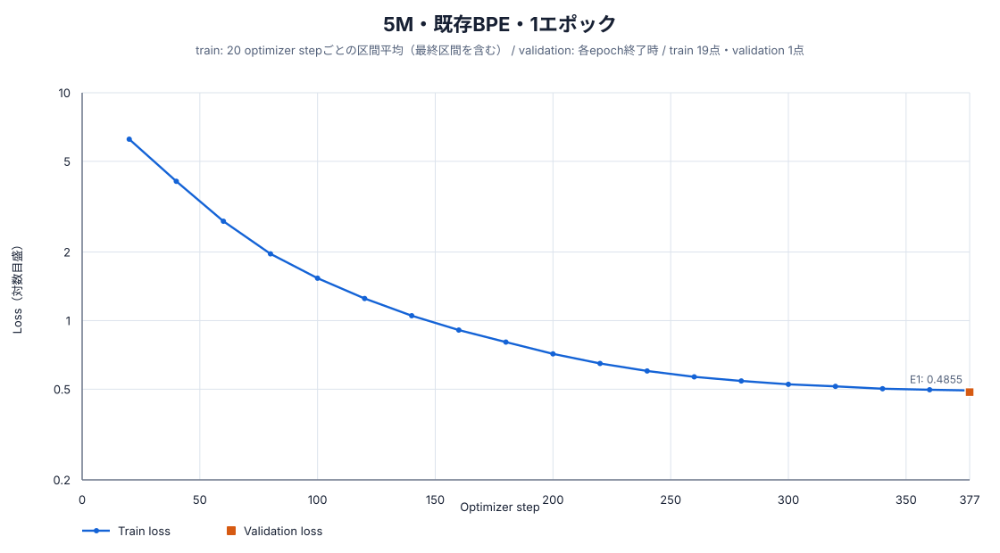
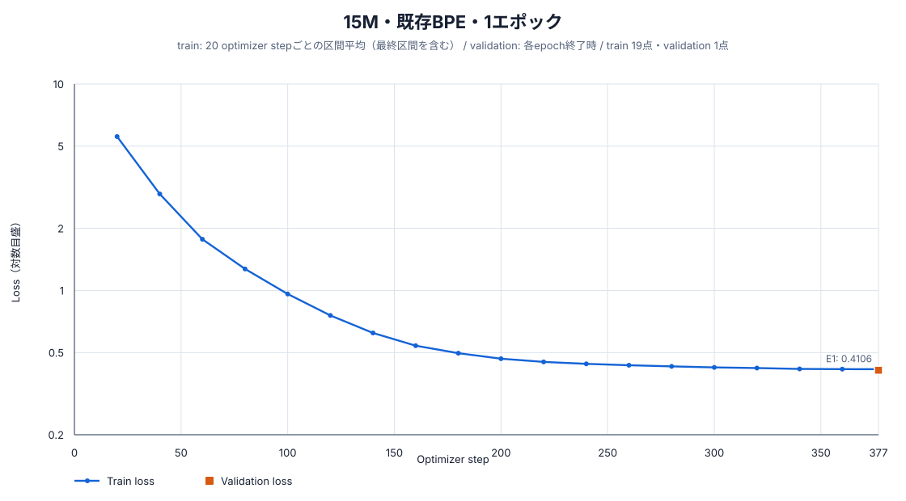
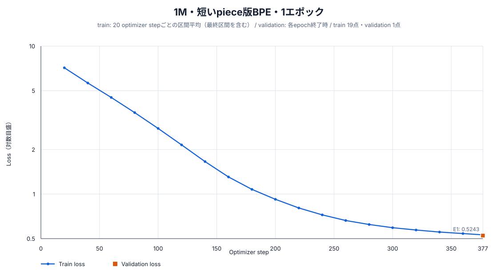
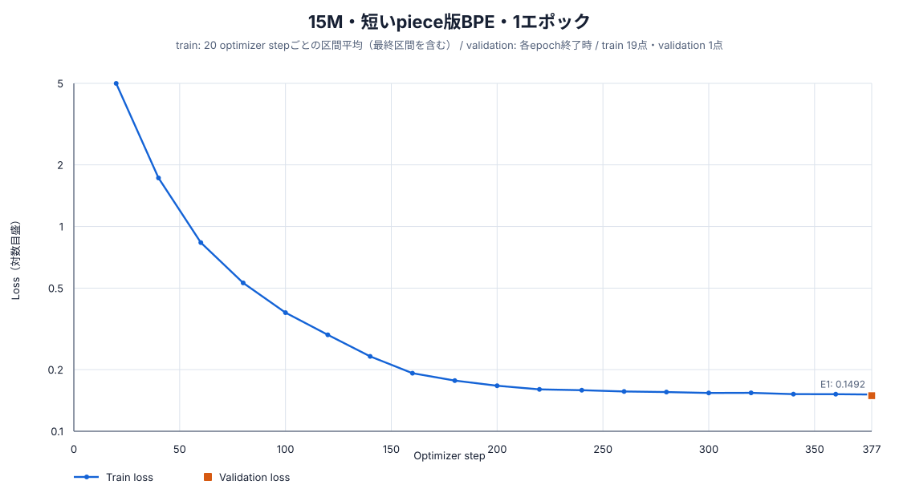

# 全学習済みモデルの20 stepごとのloss推移

## 図の読み方

保存済みの`training_metrics.jsonl`がある全10モデルについて、train lossの全ログ点と各epoch終了時のvalidation lossを示す。

- 青線は原則として直近20 optimizer stepのtrain loss平均である。
- 各epoch末に20未満の残りstepがある場合、その区間は次のログ点へ含まれる。学習最終stepだけは残り区間も記録される。
- オレンジの四角は、各epoch終了時にvalidation全件で計算したlossである。
- 初期の大きなlossと収束後の小さな変化を同じ図で読めるよう、縦軸は対数目盛にした。
- トークナイザーが異なるとtoken分割単位も変わるため、lossの絶対値だけでトークナイザーの優劣を判定しない。

## 既存BPE（`min_frequency=5`、`max_token_length=24`）

### 1M・1エポック


### 1M・3エポック


### 5M・1エポック



### 15M・1エポック



### 15M・3エポック


### 15M・10エポック


## 短いpiece版BPE（`min_frequency=2`、`max_token_length=8`）

### 1M・1エポック



### 1M・3エポック


### 5M・1エポック


### 15M・1エポック



## 再生成方法

各図は次の形式で再生成できる。

```bash
python3 scripts/model/plot_training_loss_every_20_steps.py \
  --metrics data/models/<model>/training_metrics.jsonl \
  --output docs/results/figures/training_loss_20step/<model>.svg \
  --title "表示するモデル名"
```
